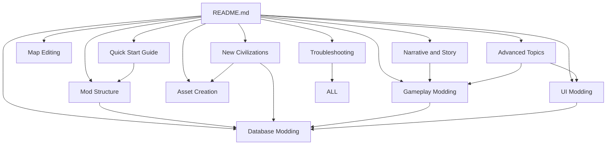

# Civilization VII Modding Documentation

Welcome to the unofficial documentation for modding Civilization VII. This comprehensive resource will guide you through all aspects of modding, from basic concepts to advanced techniques.

> [!TIP]
> Game version 1.1.0 (Information based on available data as of 2025-03-08)

> [!WARNING]
> There is no guarantee on the accuracy of this documentation or the template examples provided. If you come across a mistake or have a suggestion, please fork the repo and make a PR to correct it.

## Getting Started

If you're new to modding Civilization VII, we recommend starting with these guides:

- [Quick Start Guide](./quick-start-guide.md) - Create your first mod in under 30 minutes
- [Mod Structure](./mod-structure.md) - Learn how mods are organized and loaded
- [Troubleshooting](./troubleshooting.md) - Common issues and their solutions

## Example Templates

To help you get started quickly, we've provided several template projects:

- [Basic Database Mod Template](./Templates/basic-database-mod/) - For simple database modifications
- [UI Enhancement Mod Template](./Templates/ui-enhancement-mod/) - For customizing the user interface
- [New Civilization Mod Template](./Templates/new-civilization-mod/) - For creating new civilizations
- [Map Script Mod Template](./Templates/mapscript-mod/) - For creating custom map generation scripts
- [Gameplay Balance Mod Template](./Templates/gameplay-balance-mod/) - For balancing gameplay elements
- [Custom Resource Mod Template](./Templates/custom-resource-mod/) - For adding new resources to the game
- [UI Lens Mod Template](./Templates/ui-lens-mod/) - For creating custom map lenses

## Core Modding Guides

These guides cover the main areas of modding:

- [Database Modding](./database-modding.md) - Modify the game's database (units, buildings, techs, etc.)
- [UI Modding](./ui-modding.md) - Customize the user interface with HTML, CSS, and JavaScript
- [Asset Creation](./asset-creation.md) - Create and implement visual and audio assets
- [Gameplay Modding](./gameplay-modding.md) - Change game rules and mechanics
- [Map Editing](./map-editing.md) - Create custom maps and scenarios

## Creating Content

These guides focus on creating specific content for Civilization VII:

- [New Civilizations](./new-civilizations.md) - Add fully-featured civilizations to the game
- [Narrative and Story](./narrative-and-story.md) - Create quests, events, and narrative elements

## Advanced Topics

For experienced modders looking to push the boundaries:

- [Advanced Topics](./advanced-topics.md) - Complex systems, AI customization, and more

## Navigation Guide

The documentation is designed to be interconnected. Key relationships between guides:

- **For adding gameplay systems**: Start with [Gameplay Modding](./gameplay-modding.md), then reference [Database Modding](./database-modding.md) for implementation details.
- **For creating new civilizations**: Begin with [New Civilizations](./new-civilizations.md), which will direct you to relevant sections in [Database Modding](./database-modding.md) and [Asset Creation](./asset-creation.md).
- **For custom user interfaces**: Start with [UI Modding](./ui-modding.md), then see [Database Modding](./database-modding.md) for connecting UI to game data.
- **For story-driven content**: Begin with [Narrative and Story](./narrative-and-story.md) and refer to [Gameplay Modding](./gameplay-modding.md) for game rule integration.
- **For troubleshooting**: [Troubleshooting](./troubleshooting.md) contains sections for each type of modding, with cross-references to the specialized guides.

## Documentation Map

## Community Resources

The Civilization VII modding community has additional resources that complement this documentation:

- [Civfanatics Tutorial Forums](https://forums.civfanatics.com/forums/tutorials.659/)
- [Civilization Modding Discord](https://discord.gg/F9ehXUu9Qk)
- [Official Civilization Discord](https://discord.gg/KMSVXuhwP6)
- [Civilization VII Mod Downloads (Civfanatics)](https://forums.civfanatics.com/resources/categories/civilization-vii-downloads.181/)

## Contributing

This documentation is continuously being improved. If you have suggestions or find errors, please share them with the community. Consider forking the repo and making a PR to make contributions.

---

*Experience history's greatest gaming series like never before and create your own worlds, civilizations, and stories through the power of modding.* 