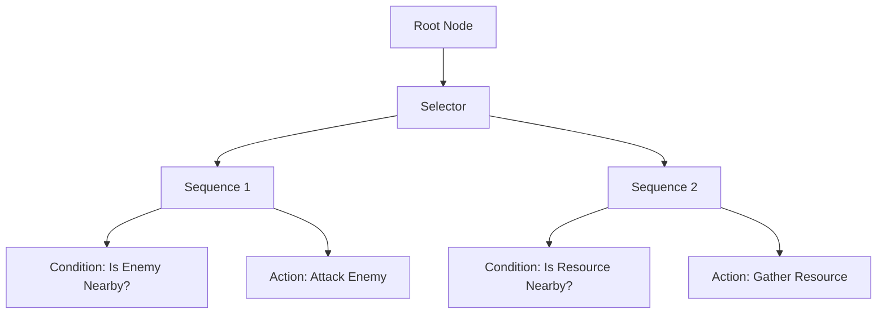

# Advanced Modding Topics for Civilization VII

This guide covers advanced modding techniques and specialized systems in Civilization VII. These topics are intended for experienced modders who are already familiar with the basics of modding and wish to delve deeper into the game's systems.

## Table of Contents
- [Behavior Tree System](#behavior-tree-system)
- [AI Modding](#ai-modding)
- [Performance Optimization](#performance-optimization)
- [Multiplayer Compatibility](#multiplayer-compatibility)
- [Event System Integration](#event-system-integration)
- [Custom Game Rules](#custom-game-rules)
- [Lua Scripting Advanced Techniques](#lua-scripting-advanced-techniques)
- [Debugging Tools and Techniques](#debugging-tools-and-techniques)
- [Modding the World Builder](#modding-the-world-builder)
- [Working with DLC](#working-with-dlc)
- [Mod Compatibility](#mod-compatibility)
- [Advanced Asset Management](#advanced-asset-management)
- [Related Documentation](#related-documentation)

## Behavior Tree System

Civilization VII uses behavior trees to control AI decision-making and complex game systems. Understanding this architecture allows for deep customization of game behavior.

### Behavior Tree Basics

Behavior trees are hierarchical structures that determine how entities make decisions. They consist of:

1. **Nodes**: Basic building blocks (selectors, sequences, actions, conditions)
2. **Selectors**: Choose one child node to execute
3. **Sequences**: Execute all child nodes in order
4. **Actions**: Perform concrete behaviors
5. **Conditions**: Test if certain conditions are met



### Database Structure

The behavior tree system is supported by several core database tables:

1. **BehaviorTree**: Contains the basic tree definition
   - TreeName (primary key)
   - Must exist before any node references
   - Handles trigger connections

2. **BehaviorTreeNode**: Defines the tree structure
   - TreeName: Links to base tree
   - NodeId: Sequential ordering
   - JumpTo: Flow control (defaults to 0)
   - NodeType: Links to node definition
   - PrimaryKey: Unique identifier

3. **TreeData**: Stores node configuration data
   - DefnId: Links to NodeDataDefinition
   - NodeId: References BehaviorTreeNode
   - Tag/DefaultData: Core configuration
   - ParentTag: Data flow control
   - UniqueId: System tracking

4. **Supporting Tables**:
   - NodeDefinition: Defines behavior types
   - ShapeDefinition: Controls node structure (child limits)
   - NodeDataDefinition: Manages configuration requirements

### Accessing Behavior Trees

Behavior tree definitions are stored in XML files in the game's asset system. To access and modify them:

1. Create an XML file in your mod directory
2. Locate the relevant behavior tree files
3. Copy them to your mod's directory maintaining the same file structure
4. Make your modifications within these files

### Example: Modifying AI City Placement

Original city placement behavior tree (simplified):

```xml
<BehaviorTree ID="AI_CITY_PLACEMENT">
  <Selector>
    <Sequence>
      <!-- Find optimal city location -->
      <Condition Type="HasAvailableOptimalLocations" />
      <Action Type="SettleAtOptimalLocation" />
    </Sequence>
    <Sequence>
      <!-- Fall back to any valid location -->
      <Condition Type="HasAvailableValidLocations" />
      <Action Type="SettleAtValidLocation" />
    </Sequence>
  </Selector>
</BehaviorTree>
```

Modified to prioritize coastal locations:

```xml
<BehaviorTree ID="AI_CITY_PLACEMENT">
  <Selector>
    <Sequence>
      <!-- Look for coastal locations first -->
      <Condition Type="HasAvailableCoastalLocations" />
      <Action Type="SettleAtCoastalLocation" />
    </Sequence>
    <Sequence>
      <!-- Then try optimal locations -->
      <Condition Type="HasAvailableOptimalLocations" />
      <Action Type="SettleAtOptimalLocation" />
    </Sequence>
    <Sequence>
      <!-- Fall back to any valid location -->
      <Condition Type="HasAvailableValidLocations" />
      <Action Type="SettleAtValidLocation" />
    </Sequence>
  </Selector>
</BehaviorTree>
```

### Creating New Behavior Trees

To create completely new behavior trees:

1. Define the tree in your XML file
2. Register it in the database
3. Connect it to the appropriate game systems

Example of registering a behavior tree:

```sql
-- Register the behavior tree
INSERT INTO BehaviorTrees (TreeName)
VALUES ('BEHAVIOR_TREE_CUSTOM_SETTLER_AI');

-- Connect it to the settler unit
INSERT INTO UnitAiBehaviorTrees (UnitType, BehaviorTreeType)
VALUES ('UNIT_SETTLER', 'BEHAVIOR_TREE_CUSTOM_SETTLER_AI');
```

### Practical Implementation Steps

When creating or modifying behavior trees, follow these steps:

1. Register the tree in BehaviorTree table
2. Create the node structure in BehaviorTreeNode
3. Add required TreeData entries
4. Validate all references

For example:

```sql
-- Register the tree
INSERT INTO BehaviorTrees (TreeName) 
VALUES ('CustomUnitBehavior');

-- Add nodes (in sequence)
INSERT INTO BehaviorTreeNodes (TreeName, NodeId, NodeType, JumpTo)
VALUES 
    ('CustomUnitBehavior', 0, 'Sequence', 5),
    ('CustomUnitBehavior', 1, 'Condition', 0),
    ('CustomUnitBehavior', 2, 'Action', 0),
    ('CustomUnitBehavior', 3, 'Condition', 0),
    ('CustomUnitBehavior', 4, 'Action', 0),
    ('CustomUnitBehavior', 5, 'Fallback', 0);

-- Add data for nodes
INSERT INTO TreeData (DefnId, NodeId, Tag, DefaultData)
VALUES
    (0, 1, 'ConditionType', 'IsEnemyNearby'),
    (0, 2, 'ActionType', 'AttackEnemy'),
    (0, 3, 'ConditionType', 'IsResourceNearby'),
    (0, 4, 'ActionType', 'GatherResource');
```

### Common Pitfalls

Be aware of these common issues when working with behavior trees:

1. TreeName consistency must be maintained across all tables
2. NodeId sequence must be valid
3. JumpTo values must point to valid nodes
4. Type mismatches can cause nodes to fail silently
5. Required TreeData entries must exist for nodes to function

> **Note:** For troubleshooting behavior tree issues, see the [Troubleshooting Guide](./troubleshooting.md#database-errors) for database error resolution techniques.

## AI Modding

Modifying AI behavior can dramatically change gameplay. Civilization VII's AI consists of several interconnected systems.

### AI Personality Traits

AI personalities define how leaders behave. You can modify existing traits or create new ones:

```sql
-- Modify an existing leader's AI traits
UPDATE LeaderTraits
SET Aggression = 8, -- More aggressive (scale 1-10)
    Loyalty = 5,
    Competitiveness = 7
WHERE LeaderType = 'LEADER_ALEXANDER';

-- Create a new AI personality trait
INSERT INTO Types (Type, Kind)
VALUES ('TRAIT_AI_ISOLATIONIST', 'KIND_TRAIT');

INSERT INTO Traits (TraitType, Name, Description)
VALUES (
    'TRAIT_AI_ISOLATIONIST',
    'LOC_TRAIT_AI_ISOLATIONIST_NAME',
    'LOC_TRAIT_AI_ISOLATIONIST_DESCRIPTION'
);

-- Attach the trait to a leader
INSERT INTO LeaderTraits (LeaderType, TraitType)
VALUES ('LEADER_GANDHI', 'TRAIT_AI_ISOLATIONIST');
```

### AI Weights and Flavors

AI decision-making is heavily influenced by "flavors" - weighted values that determine priorities:

```sql
-- Make AI value science more in its decisions
INSERT INTO AiFlavors (ObjectType, FlavorType, Value)
VALUES ('LEADER_SEONDEOK', 'FLAVOR_SCIENCE', 9);

-- Make a specific leader focus less on religion
UPDATE AiFlavors
SET Value = 2
WHERE ObjectType = 'LEADER_SALADIN' AND FlavorType = 'FLAVOR_RELIGION';
```

### Strategic AI

For deeper AI modifications, you can alter the strategic decision-making processes:

```lua
-- In a custom Lua script
function OnAISelectNextResearch(playerID)
	local player = Players[playerID];
	if player:GetLeaderTypeName() == "LEADER_CUSTOM_LEADER" then
		-- Custom tech selection logic for your leader
		local techManager = player:GetTechs();
		local possibleTechs = GetPossibleTechsToResearch(player);
		
		-- Prioritize military technologies
		for _, techType in ipairs(possibleTechs) do
			if IsMilitaryTech(techType) then
				techManager:SetResearchingTech(techType);
				return true;
			end
		end
	end
	return false; -- Fall back to default AI behavior
end

GameEvents.PlayerResearchTechSelect.Add(OnAISelectNextResearch);
```

### Complete AI Overhaul Example

For a comprehensive AI overhaul, you'll need to modify multiple systems:

1. **Diplomatic Behavior**:
```sql
-- Adjust how likely an AI is to declare friendship
UPDATE DiploActions 
SET BaseScore = BaseScore + 20
WHERE ActionType = 'DIPLOACTION_DECLARE_FRIENDSHIP';

-- Make an AI less likely to declare war
UPDATE DiploActions 
SET BaseScore = BaseScore - 30
WHERE ActionType = 'DIPLOACTION_DECLARE_WAR';
```

2. **Economic Decision Making**:
```sql
-- Change build priorities
UPDATE AiOperationDefs
SET Priority = Priority + 2
WHERE OperationType = 'OPERATION_BUILDER_IMPROVEMENT';
```

3. **Military Strategy**:
```sql
-- Make AI build more balanced armies
UPDATE AiOperationDefs
SET MeleePct = 40, RangedPct = 40, CavalryPct = 20
WHERE OperationType = 'OPERATION_CITY_DEFENSE';
```

> **See Also:** For more basic AI modifications and gameplay adjustments, check the [Gameplay Modding Guide](./gameplay-modding.md#ai-behavior-modifications).

## Performance Optimization

Optimizing your mods ensures they run smoothly even on lower-end systems.

### Database Optimization

1. **Minimize Query Complexity**:
   - Use direct references rather than subqueries where possible
   - Avoid multiple joins if not necessary

2. **Indexing**:
   When creating new tables, include proper index definitions:
   ```sql
   CREATE TABLE CustomUnitStats (
       UnitType TEXT NOT NULL PRIMARY KEY,
       Bonus INTEGER,
       SpecialAbility TEXT
   );
   
   CREATE INDEX idx_CustomUnitStats_UnitType ON CustomUnitStats(UnitType);
   ```

3. **Batch Operations**:
   Combine multiple similar operations into a single query:
   ```sql
   -- Less efficient
   UPDATE Units SET Combat = Combat + 1 WHERE UnitType = 'UNIT_WARRIOR';
   UPDATE Units SET Combat = Combat + 1 WHERE UnitType = 'UNIT_SPEARMAN';
   
   -- More efficient
   UPDATE Units SET Combat = Combat + 1 WHERE UnitType IN ('UNIT_WARRIOR', 'UNIT_SPEARMAN');
   ```

### Lua Script Optimization

1. **Minimize Event Handlers**:
   Only register events you absolutely need.

2. **Cache Frequent Calculations**:
   ```lua
   -- Inefficient
   function OnUnitMove(playerID, unitID)
       local player = Players[playerID];
       local unit = player:GetUnits():FindID(unitID);
       -- Perform calculation every time
       local result = ExpensiveCalculation(unit);
   end
   
   -- Optimized
   local calculationCache = {};
   function OnUnitMove(playerID, unitID)
       local cacheKey = playerID .. "_" .. unitID;
       if not calculationCache[cacheKey] then
           local player = Players[playerID];
           local unit = player:GetUnits():FindID(unitID);
           calculationCache[cacheKey] = ExpensiveCalculation(unit);
       end
       local result = calculationCache[cacheKey];
   end
   ```

3. **Use Local Variables**:
   Local variables are faster than global variables.
   ```lua
   -- Less efficient
   function ProcessUnits()
       for i = 1, 100 do
           globalVar = i * 2;
           -- Use globalVar
       end
   end
   
   -- More efficient
   function ProcessUnits()
       local localVar;
       for i = 1, 100 do
           localVar = i * 2;
           -- Use localVar
       end
   end
   ```

### Asset Optimization

1. **Texture Size**:
   Use appropriately sized textures for different purposes.

2. **Mesh Complexity**:
   Keep polygon count reasonable, especially for frequently used models.

3. **Audio Compression**:
   Use appropriate compression for audio files based on importance.

> **Note:** For specific performance-related troubleshooting, refer to the [Troubleshooting Guide](./troubleshooting.md#performance-problems).

## Multiplayer Compatibility

Ensuring your mods work in multiplayer requires special considerations.

### Synchronization Issues

Multiplayer games must stay synchronized across all players. To avoid desyncs:

1. **Avoid Client-Side Only Changes**:
   All gameplay changes must be identical for all players.

2. **Use Safe Random Number Generation**:
   ```lua
   -- DON'T do this in multiplayer
   local randomValue = math.random(1, 10);
   
   -- DO this instead - game-managed RNG that syncs across clients
   local randomValue = Game.GetRandNum(10, "My mod random roll");
   ```

3. **Careful with Events**:
   Ensure events are triggered consistently for all players.

### Multiplayer Testing

Thoroughly test your mod in multiplayer scenarios:

1. Set up a local network game with at least one other player
2. Test all features of your mod
3. Pay special attention to any features that trigger events
4. Look for log reports of synchronization errors

### Making Mods Multiplayer-Optional

For mods that won't work in multiplayer, make them selectable only in single-player:

```xml
<ActionCriteria>
	<Criteria id="single-player-only">
		<IsSinglePlayer></IsSinglePlayer>
	</Criteria>
</ActionCriteria>

<ActionGroups>
	<ActionGroup id="gameplay-changes" scope="game" criteria="single-player-only">
		<!-- Actions that only apply in single-player -->
	</ActionGroup>
</ActionGroups>
```

> **See Also:** For UI-specific multiplayer considerations, see the [UI Modding Guide](./ui-modding.md#communication-between-ui-and-game).

## Event System Integration

The event system allows your mod to react to game events and create custom event chains.

### Registering for Game Events

```lua
function Initialize()
	-- Register for the UnitPromoted event
	GameEvents.UnitPromoted.Add(OnUnitPromoted);
	
	-- Register for a custom event
	GameEvents.RegisterEvent("MyCustomEvent");
	GameEvents.MyCustomEvent.Add(OnMyCustomEvent);
end

function OnUnitPromoted(playerID, unitID, promotionType)
	-- Do something when a unit is promoted
	local player = Players[playerID];
	local unit = player:GetUnits():FindID(unitID);
	
	if unit:GetType() == GameInfo.Units["UNIT_GIANT_DEATH_ROBOT"].Index then
		-- Special handling for GDR units
		GameEvents.MyCustomEvent.Call(playerID, unitID);
	end
end

function OnMyCustomEvent(playerID, unitID)
	-- Handle the custom event
	-- ...
end

Initialize();
```

### Creating Complex Event Chains

For narrative or gameplay flow, you can create sequences of events:

```lua
local eventStates = {};

function Initialize()
	GameEvents.CityBuilt.Add(OnCityBuilt);
	GameEvents.BuildingConstructed.Add(OnBuildingConstructed);
	GameEvents.RegisterEvent("QuestCompleted");
	GameEvents.QuestCompleted.Add(OnQuestCompleted);
end

function OnCityBuilt(playerID, cityID, x, y)
	local player = Players[playerID];
	if not player:IsHuman() then return; end
	
	if not eventStates[playerID] then
		eventStates[playerID] = { questStage = 1 };
		-- Start the quest chain
		ShowQuestPopup(playerID, "Build your first Wonder");
	end
end

function OnBuildingConstructed(playerID, cityID, buildingType, plotX, plotY)
	if not eventStates[playerID] or eventStates[playerID].questStage ~= 1 then return; end
	
	local buildingInfo = GameInfo.Buildings[buildingType];
	if buildingInfo and buildingInfo.IsWonder then
		eventStates[playerID].questStage = 2;
		GameEvents.QuestCompleted.Call(playerID, 1);
		ShowQuestPopup(playerID, "Now build a Campus district");
	end
end

function OnQuestCompleted(playerID, questID)
	-- Handle quest completion rewards
	-- ...
end
```

> **Related Topic:** The [Narrative and Story Guide](./narrative-and-story.md) contains additional information on leveraging events for storytelling.

## Custom Game Rules

Create customizable rules that players can select when starting a game.

### Defining Game Rules

```sql
-- Add a new game rule
INSERT INTO Types (Type, Kind)
VALUES ('GAMERULE_DISABLE_NUCLEAR_WEAPONS', 'KIND_GAMERULE');

INSERT INTO GameRules (RuleType, Name, Description, Category, UIOnly)
VALUES (
	'GAMERULE_DISABLE_NUCLEAR_WEAPONS',
	'LOC_GAMERULE_DISABLE_NUCLEAR_WEAPONS_NAME',
	'LOC_GAMERULE_DISABLE_NUCLEAR_WEAPONS_DESCRIPTION',
	'LOC_GAMERULE_CATEGORY_MILITARY',
	0
);

-- Define the rule's possible values
INSERT INTO GameRuleValues (RuleType, Value, Name, Description, SortIndex)
VALUES
	('GAMERULE_DISABLE_NUCLEAR_WEAPONS', 0, 'LOC_GAMERULE_OPTION_ENABLED', 'LOC_GAMERULE_DISABLE_NUCLEAR_WEAPONS_ENABLED_DESCRIPTION', 0),
	('GAMERULE_DISABLE_NUCLEAR_WEAPONS', 1, 'LOC_GAMERULE_OPTION_DISABLED', 'LOC_GAMERULE_DISABLE_NUCLEAR_WEAPONS_DISABLED_DESCRIPTION', 1);

-- Set the default value
INSERT INTO GameRuleDefaults (RuleType, Value)
VALUES ('GAMERULE_DISABLE_NUCLEAR_WEAPONS', 0);
```

### Implementing Game Rules

```lua
function Initialize()
	GameEvents.UnitAddedToMap.Add(OnUnitAddedToMap);
end

function OnUnitAddedToMap(playerID, unitID)
	-- Check if nuclear weapons are disabled
	local isNukesDisabled = GameConfiguration.GetValue("GAMERULE_DISABLE_NUCLEAR_WEAPONS") == 1;
	
	if isNukesDisabled then
		local player = Players[playerID];
		local unit = player:GetUnits():FindID(unitID);
		local unitType = unit:GetType();
		local unitTypeName = GameInfo.Units[unitType].UnitType;
		
		-- Check if the unit is a nuclear weapon
		if unitTypeName == "UNIT_NUCLEAR_DEVICE" or unitTypeName == "UNIT_THERMONUCLEAR_DEVICE" then
			-- Remove the unit and refund production
			local city = Cities.GetCity(unit:GetSourceCity());
			if city then
				city:GetBuildQueue():AddGoldRefund(GameInfo.Units[unitType].Cost);
			end
			player:GetUnits():Destroy(unitID);
			
			-- Notify the player
			if player:IsHuman() then
				Game.AddWorldViewText(playerID, Locale.Lookup("LOC_NOTIFICATION_NUCLEAR_WEAPONS_DISABLED"), unit:GetX(), unit:GetY());
			end
		end
	end
end

Initialize();
```

> **See Also:** For basic rule modifications, check the [Gameplay Modding Guide](./gameplay-modding.md#modifying-game-rules).

## Lua Scripting Advanced Techniques

### Module Pattern

Organize your code using the module pattern for better maintainability:

```lua
-- MyMod.lua
local MyMod = {};

-- Private variables (not accessible outside this file)
local privateVar = "hidden";

-- Public function
function MyMod.Initialize()
	print("Initializing MyMod");
	GameEvents.PlayerTurnStarted.Add(MyMod.OnPlayerTurnStarted);
end

-- Private function (not accessible outside this file)
local function PrivateHelper()
	print("Private helper called");
	return privateVar;
end

-- Public function
function MyMod.OnPlayerTurnStarted(playerID)
	local result = PrivateHelper();
	print("Player " .. playerID .. " turn started. Private data: " .. result);
end

-- Return the public interface
return MyMod;
```

Then in your main file:

```lua
-- main.lua
local MyMod = require("MyMod");
MyMod.Initialize();
```

### Metatable Magic

Use Lua metatables for advanced functionality:

```lua
-- Create a custom unit data tracker
local UnitTracker = {};
local unitData = {};

-- Define the metatable
local mt = {
	__index = function(t, unitID)
		if not unitData[unitID] then
			unitData[unitID] = { 
				kills = 0,
				damageDone = 0,
				healingReceived = 0,
				lastPosition = nil
			};
		end
		return unitData[unitID];
	end,
	
	__newindex = function(t, unitID, value)
		unitData[unitID] = value;
	end
};

-- Apply the metatable
setmetatable(UnitTracker, mt);

-- Usage example
function OnUnitDamageDealt(attackerPlayerID, attackerUnitID, defenderPlayerID, defenderUnitID, damage)
	UnitTracker[attackerUnitID].damageDone = UnitTracker[attackerUnitID].damageDone + damage;
	
	if UnitTracker[defenderUnitID].health <= 0 then
		UnitTracker[attackerUnitID].kills = UnitTracker[attackerUnitID].kills + 1;
	end
end
```

### Closures for State Management

Use closures to maintain state without global variables:

```lua
function CreateUnitTracker()
	local unitKills = {};
	
	-- Return a bundle of related functions that share the private state
	return {
		RecordKill = function(unitID)
			if not unitKills[unitID] then
				unitKills[unitID] = 0;
			end
			unitKills[unitID] = unitKills[unitID] + 1;
		end,
		
		GetKills = function(unitID)
			return unitKills[unitID] or 0;
		end,
		
		ResetKills = function(unitID)
			unitKills[unitID] = 0;
		end
	};
end

-- Usage
local unitTracker = CreateUnitTracker();
unitTracker.RecordKill(123); -- Record a kill
local kills = unitTracker.GetKills(123); -- Get the kill count
```

> **Note:** For debugging Lua scripts, see the [Troubleshooting Guide](./troubleshooting.md#lua-script-issues).

## Debugging Tools and Techniques

### In-Game Console

The in-game console provides powerful debugging tools that allow you to inspect game state, modify values, and test functionality. To enable the in-game console:

1. Locate your game's AppOptions.txt file:
   - **Windows**: `C:\Users\[YourUsername]\AppData\Local\Firaxis Games\Sid Meier's Civilization VII\AppOptions.txt`
   - **MacOS**: `~/Library/Application Support/Civilization VII/AppOptions.txt`
   - **Linux**: `~/.local/share/Civilization VII/AppOptions.txt`

2. Open the file in any text editor

3. Find the following lines (they may be commented out with semicolons):
   ```
   ;Enable Debug Panels. 1 : Enable, 0 : Disable, -1 : Default
   ;EnableDebugPanels -1
   ```

4. Change it to:
   ```
   EnableDebugPanels 1
   ```

5. Save the file and restart the game

6. The console can now be accessed in-game using the tilde key (~)

Common console commands:
```
reveal all       -- Reveals the entire map
unitdata         -- Shows data about selected unit
debugculture     -- Shows culture borders clearly
fow off          -- Turns off fog of war
yield icons      -- Toggles yield icons
killunit         -- Destroys the selected unit
addgold 1000     -- Adds gold to current player
addscience 500   -- Adds science to current player
boost <techname> -- Boosts the specified tech
victory          -- Shows victory progress screen
debug report     -- Generates a debug report
```

For a complete list of console commands, enter `help` in the console.

> **Note:** Using the console commands is considered "cheating" in normal gameplay. Only use it for debugging and testing purposes.

### FireTuner Debug Tool

For more advanced debugging capabilities, you can use the FireTuner tool:

- **Enhanced Debugging**: FireTuner provides a more powerful interface for debugging than the in-game console
- **Live Code Execution**: Execute JavaScript/Lua code in the running game environment
- **Custom Debug Panels**: Access specialized panels for various game systems
- **Autoplay Testing**: Run automated game sessions for testing

For detailed instructions on setting up and using FireTuner with Civilization VII, see the [FireTuner documentation](./firetuner.md).

### Debug Output

Add debug logging to your mod:

```lua
-- Set to true for development, false for release
local DEBUG_MODE = true;

function DebugLog(message)
	if DEBUG_MODE then
		print("MyMod Debug: " .. tostring(message));
	end
end

function OnSomething()
	DebugLog("OnSomething triggered");
	-- function logic
	DebugLog("Value calculated: " .. someValue);
end
```

### Crash Debugging

For investigating crashes:

1. Enable crash dumps in the game settings
2. After a crash, check the generated files in the game's crash folder
3. Use the debug database to investigate state at the time of crash:
   ```sql
   -- In the debug database
   SELECT * FROM GameCrashState WHERE CrashID = 'specific_crash_id';
   ```

> **See Also:** For a complete list of debugging techniques, check the [Troubleshooting Guide](./troubleshooting.md#debugging-tips-and-tools).

## Modding the World Builder

Extend the World Builder tool with custom functionality.

### Adding Custom Tools

```lua
-- Create a custom tool for the World Builder
function RegisterCustomWorldBuilderTools()
	-- Register a new brush tool
	WorldBuilder.RegisterTool({
		ID = "TOOL_CUSTOM_FOREST_PAINTER",
		Name = "Forest Painter",
		Tooltip = "Paints forests with varied density",
		Icon = "Art/Tools/ForestPainter.dds",
		ActivateFunction = OnForestPainterActivated,
		DeactivateFunction = OnForestPainterDeactivated,
		MouseDownFunction = OnForestPainterMouseDown,
		MouseMoveFunction = OnForestPainterMouseMove
	});
end

function OnForestPainterActivated()
	-- Tool activation logic
end

function OnForestPainterMouseDown(x, y)
	-- Handle painting forests
	local plot = Map.GetPlot(x, y);
	if plot and plot:IsLand() then
		plot:SetFeatureType(GameInfo.Features["FEATURE_FOREST"].Index);
	end
end

-- Register tools when World Builder loads
Events.WorldBuilderModeEntered.Add(RegisterCustomWorldBuilderTools);
```

### Custom Map Generation Scripts

Create specialized scripts for the World Builder:

```lua
-- Register a custom map script
function RegisterCustomMapScripts()
	WorldBuilder.RegisterMapScript({
		ID = "MAPSCRIPT_CUSTOM_ARCHIPELAGO",
		Name = "Custom Archipelago",
		Description = "Generates a map with many small, varied islands",
		ExecuteFunction = GenerateCustomArchipelago
	});
end

function GenerateCustomArchipelago(parameters)
	-- Map generation logic
	local width, height = Map.GetGridSize();
	
	-- Set everything to ocean first
	for x = 0, width - 1 do
		for y = 0, height - 1 do
			local plot = Map.GetPlot(x, y);
			plot:SetTerrainType(GameInfo.Terrains["TERRAIN_OCEAN"].Index);
		end
	end
	
	-- Then generate islands
	local numIslands = math.floor(width * height / 300);
	GenerateIslands(numIslands, width, height);
	
	return true; -- Success
end

Events.WorldBuilderModeEntered.Add(RegisterCustomMapScripts);
```

> **Related Topic:** See the [Map Editing Guide](./map-editing.md) for additional information on map creation and editing.

## Working with DLC

Ensure your mods work properly with DLC content.

### DLC Detection

```lua
function Initialize()
	-- Check if a specific DLC is active
	local isDLCActive = GameConfiguration.IsDLCActive("DLC_EXPANSION_1");
	
	if isDLCActive then
		-- Use DLC-specific features
		EnableDLCFeatures();
	else
		-- Use base game alternatives
		EnableBaseGameFeatures();
	end
end

function EnableDLCFeatures()
	-- DLC-specific initialization
end

function EnableBaseGameFeatures()
	-- Base game initialization
end

Initialize();
```

### Conditional Content Based on DLC

In your modinfo file:

```xml
<ActionCriteria>
	<Criteria id="has-expansion-1">
		<ActiveDLC>DLC_EXPANSION_1</ActiveDLC>
	</Criteria>
	<Criteria id="base-game-only">
		<InactiveDLC>DLC_EXPANSION_1</InactiveDLC>
	</Criteria>
</ActionCriteria>

<ActionGroups>
	<ActionGroup id="expansion-content" scope="game" criteria="has-expansion-1">
		<Actions>
			<UpdateDatabase>
				<Item>data/expansion_features.sql</Item>
			</UpdateDatabase>
		</Actions>
	</ActionGroup>
	
	<ActionGroup id="base-game-content" scope="game" criteria="base-game-only">
		<Actions>
			<UpdateDatabase>
				<Item>data/base_game_alternative.sql</Item>
			</UpdateDatabase>
		</Actions>
	</ActionGroup>
</ActionGroups>
```

### Extending DLC Content

To add your own content that builds on DLC:

```sql
-- Add a new unit that requires DLC concepts
INSERT INTO Requirements (RequirementId, RequirementType)
VALUES ('REQ_PLAYER_HAS_DLC', 'REQUIREMENT_PLAYER_HAS_ACTIVE_DLC');

INSERT INTO RequirementArguments (RequirementId, Name, Value)
VALUES ('REQ_PLAYER_HAS_DLC', 'DLCType', 'DLC_EXPANSION_1');

INSERT INTO RequirementSets (RequirementSetId, RequirementSetType)
VALUES ('REQSET_PLAYER_HAS_DLC', 'REQUIREMENTSET_TEST_ALL');

INSERT INTO RequirementSetRequirements (RequirementSetId, RequirementId)
VALUES ('REQSET_PLAYER_HAS_DLC', 'REQ_PLAYER_HAS_DLC');

-- Now use this requirement for your content
INSERT INTO Modifiers (ModifierId, ModifierType, SubjectRequirementSetId)
VALUES ('MODIFIER_MY_DLC_FEATURE', 'MODIFIER_PLAYER_CITIES_ADJUST_YIELD', 'REQSET_PLAYER_HAS_DLC');
```

> **See Also:** For handling DLC-specific assets, check the [Asset Creation Guide](./asset-creation.md#working-with-dlc-assets).

## Mod Compatibility

Ensure your mod works alongside other mods.

### Load Order Management

Control how your mod loads relative to others:

```xml
<ActionGroups>
	<ActionGroup id="early-loading" scope="game">
		<Properties>
			<LoadOrder>5</LoadOrder> <!-- Lower numbers load first -->
		</Properties>
		<Actions>
			<!-- Core changes that other mods might depend on -->
		</Actions>
	</ActionGroup>
	
	<ActionGroup id="normal-loading" scope="game">
		<Properties>
			<LoadOrder>50</LoadOrder> <!-- Standard priority -->
		</Properties>
		<Actions>
			<!-- Main mod content -->
		</Actions>
	</ActionGroup>
	
	<ActionGroup id="late-loading" scope="game">
		<Properties>
			<LoadOrder>150</LoadOrder> <!-- Higher numbers load later, can override other mods -->
		</Properties>
		<Actions>
			<!-- Final tweaks that should override conflicting mods -->
		</Actions>
	</ActionGroup>
</ActionGroups>
```

### Namespace Your Content

To avoid conflicts, use unique identifiers for your content:

```sql
-- Instead of generic names like "BUILDING_LIBRARY"
INSERT INTO Types (Type, Kind)
VALUES ('BUILDING_MOD_MYUSERNAME_SPECIAL_LIBRARY', 'KIND_BUILDING');

-- For UI elements, use namespaced IDs
-- MyMod_SpecialPanel instead of just SpecialPanel
```

### Compatibility Patches

Create specific patches for known popular mods:

```xml
<ActionCriteria>
	<Criteria id="mod-x-active">
		<ActiveMod>mod-x-id</ActiveMod>
	</Criteria>
</ActionCriteria>

<ActionGroups>
	<ActionGroup id="mod-x-compatibility" scope="game" criteria="mod-x-active">
		<Actions>
			<UpdateDatabase>
				<Item>data/mod_x_compatibility.sql</Item>
			</UpdateDatabase>
		</Actions>
	</ActionGroup>
</ActionGroups>
```

> **Note:** For resolving mod conflicts, refer to the [Troubleshooting Guide](./troubleshooting.md#compatibility-with-other-mods).

## Advanced Asset Management

### Dynamic Asset Loading

Load assets conditionally based on game state:

```lua
function OnLeaderSelected(leaderType)
	if leaderType == "LEADER_CUSTOM" then
		-- Dynamically load assets for this leader
		UIManager.LoadAssets({
			"LeaderScenes/CustomLeader_Background.dds",
			"LeaderScenes/CustomLeader_Foreground.dds"
		});
	end
end
```

### Asset Streaming

For large mods with many assets, implement streaming to reduce memory usage:

```lua
local assetGroups = {
	AncientEra = {
		"Units/AncientUnits/Warrior.dds",
		"Units/AncientUnits/Archer.dds",
		-- More ancient era assets
	},
	ClassicalEra = {
		"Units/ClassicalUnits/Swordsman.dds",
		"Units/ClassicalUnits/Catapult.dds",
		-- More classical era assets
	}
	-- More era groups
};

function OnEraChanged(playerID, eraID)
	local player = Players[playerID];
	if player:IsHuman() then
		local eraType = GameInfo.Eras[eraID].EraType;
		
		-- Unload previous era assets
		for era, assets in pairs(assetGroups) do
			if era ~= eraType then
				UnloadAssetGroup(assets);
			end
		end
		
		-- Load current era assets
		if assetGroups[eraType] then
			LoadAssetGroup(assetGroups[eraType]);
		end
	end
end

function LoadAssetGroup(assets)
	for _, asset in ipairs(assets) do
		ResourceManager.LoadResource(asset);
	end
end

function UnloadAssetGroup(assets)
	for _, asset in ipairs(assets) do
		ResourceManager.UnloadResource(asset);
	end
end

GameEvents.PlayerEraChanged.Add(OnEraChanged);
```

### Custom Asset Formats

For specialized needs, you can create custom asset formats:

1. Define a custom asset format spec in XML
2. Create a parser/loader for the format
3. Register the format with the game's resource system

Example of a custom data format definition:
```xml
<AssetFormat ID="CUSTOM_UNIT_DATA">
	<Properties>
		<Property Name="DataType" Type="String" />
		<Property Name="Version" Type="Integer" />
		<Property Name="Entries" Type="Array">
			<ItemType>
				<Property Name="ID" Type="String" />
				<Property Name="Values" Type="Dictionary">
					<KeyType>String</KeyType>
					<ValueType>Number</ValueType>
				</Property>
			</ItemType>
		</Property>
	</Properties>
</AssetFormat>
```

> **Related Topic:** For detailed asset creation workflows, see the [Asset Creation Guide](./asset-creation.md).

## Related Documentation

For additional information on topics covered in this guide, refer to these related documents:

- [Gameplay Modding](./gameplay-modding.md) - For simpler gameplay modifications
- [Database Modding](./database-modding.md) - For database structure and modification techniques
- [UI Modding](./ui-modding.md) - For user interface customization
- [Troubleshooting](./troubleshooting.md) - For debugging and resolving common issues
- [Narrative and Story](./narrative-and-story.md) - For event-based storytelling systems
- [Map Editing](./map-editing.md) - For custom map creation
- [Asset Creation](./asset-creation.md) - For creating and managing game assets

---

*This guide will continue to evolve as new advanced modding techniques are discovered and shared by the community.* 