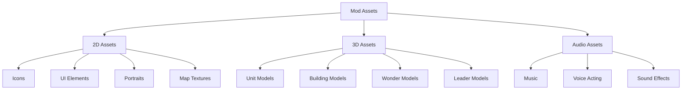

# Asset Creation for Civilization VII Modding

This comprehensive guide explains how to create, modify, and implement visual and audio assets for Civilization VII mods.

## Table of Contents
- [Introduction](#introduction)
- [Asset Types Overview](#asset-types-overview)
- [Tools and Software](#tools-and-software)
- [Icon Creation](#icon-creation)
- [2D Art Assets](#2d-art-assets)
- [3D Models](#3d-models)
- [Textures](#textures)
- [Animation](#animation)
- [Audio Assets](#audio-assets)
- [Implementing Assets in Mods](#implementing-assets-in-mods)
- [Asset Organization](#asset-organization)
- [Optimization and Best Practices](#optimization-and-best-practices)
- [Common Issues and Solutions](#common-issues-and-solutions)
- [Examples](#examples)

## Introduction

Creating custom assets is one of the most powerful ways to enhance a Civilization VII mod. From new civilization icons to completely new unit models, custom assets can dramatically improve the visual and audio experience of your mod. This guide will cover:

- What types of assets you can create for Civilization VII
- Which tools to use for different asset types
- Step-by-step instructions for creating various assets
- How to properly implement assets in your mod
- Best practices for optimization and compatibility

Whether you're an experienced artist or a beginner looking to create basic icons for your mod, this guide will help you understand the asset creation pipeline for Civilization VII modding.

## Asset Types Overview

Civilization VII mods can include various types of assets:



### Common Asset Types and Formats

| Asset Type | Common Formats | Typical Dimensions | Notes |
|------------|---------------|-------------------|-------|
| Icons | PNG, DDS | 256x256, 128x128, 64x64 | Often require versions at multiple resolutions |
| UI Elements | PNG, DDS | Varies | Should match UI style |
| Leader Portraits | PNG, DDS | 512x512 or larger | High detail recommended |
| Unit Models | FBX, DAE | Varies | Low-poly with good texturing |
| Building Models | FBX, DAE | Varies | Balance detail with performance |
| Textures | PNG, DDS | Powers of 2 (512x512, 1024x1024, etc.) | DDS preferred for game |
| Audio | WAV, OGG | N/A | OGG for compressed audio |

## Tools and Software

### Recommended Software

#### For 2D Assets:
- **Adobe Photoshop** - Professional standard for image editing
- **GIMP** - Free alternative to Photoshop
- **Affinity Photo** - Cost-effective Photoshop alternative
- **Krita** - Free, open-source painting program
- **Paint.NET** - Lightweight free option for simple edits

#### For 3D Assets:
- **Blender** - Free, powerful 3D modeling and animation software
- **Maya** - Industry standard for 3D (subscription)
- **3ds Max** - Another professional option (subscription)
- **ZBrush** - For high-detail sculpting

#### For Textures:
- **Substance Painter** - Industry standard for texturing
- **Substance Designer** - For creating materials and textures
- **ArmorPaint** - Open-source alternative to Substance Painter

#### For Audio:
- **Audacity** - Free audio editing software
- **Adobe Audition** - Professional audio editing
- **REAPER** - Cost-effective DAW with powerful features
- **FMOD Studio** - Game audio middleware (free for small projects)

### Format Conversion Tools
- **Nvidia Texture Tools** - For creating and converting DDS files
- **Intel Texture Works** - Alternative DDS converter
- **XnConvert** - Batch image converter
- **FFmpeg** - Command-line audio/video converter

## Icon Creation

Icons are among the most basic yet essential assets for any mod. They represent your custom civilizations, units, buildings, and other game elements.

### Icon Specifications

| Icon Type | Dimensions | Format | Notes |
|-----------|------------|--------|-------|
| Civilization Icons | 256x256, 80x80, 50x50, 30x30 | PNG/DDS | Multiple sizes needed |
| Leader Icons | 256x256, 64x64 | PNG/DDS | Should be recognizable at small sizes |
| Unit Icons | 256x256, 80x80 | PNG/DDS | Clear silhouette important |
| Building Icons | 256x256, 80x80 | PNG/DDS | Should match art style |
| Technology Icons | 214x214, 80x80 | PNG/DDS | Should suggest the technology |

### Creating an Icon in GIMP (Free Option)

1. **Start with Research**: Find historical references for authenticity
2. **Create a New Document**: 
   - File → New → 512x512 pixels (work at larger size, then scale down)
   - Resolution: 72 DPI
   - Color space: RGB

3. **Set Up Layers**:
   ```
   - Background (solid color or subtle pattern)
   - Base Shape
   - Details
   - Highlights
   - Border/Frame
   ```

4. **Create Icon Design**:
   - Start with a strong silhouette
   - Use colors that match Civilization VII's palette
   - Ensure readability at small sizes
   - Add appropriate lighting (usually top-left light source)

5. **Export for Different Sizes**:
   - File → Export As → [your_icon_name]_256.png
   - Resize to 80x80, 64x64, etc. and export each size

### Icon Style Guidelines

- **Match the Game's Style**: Study existing Civilization VII icons
- **Use Clear Silhouettes**: Icons should be recognizable from their outline
- **Consistent Lighting**: Top-left light source is standard
- **Limited Color Palette**: Don't use too many colors
- **Scalability**: Test your icon at different sizes for readability

### Converting to DDS Format

While PNG works for many mods, DDS is the native format used by the game:

1. Install the Nvidia Texture Tools plugin for Photoshop or use a standalone converter
2. Open your PNG icon
3. Save as DDS with these settings:
   - Format: DXT5 (if it has transparency) or DXT1 (if no transparency)
   - Generate Mipmaps: Yes
   - Compression Quality: High

## 2D Art Assets

### Leader Portraits

Leader portraits require more detail than regular icons and often need multiple expressions.

#### Portrait Specifications
- **Dimensions**: Minimum 512x512 pixels, ideally 1024x1024
- **Format**: PNG during development, DDS for final implementation
- **Requirements**: 
  - Neutral expression (default)
  - Speaking expressions (2-3 variations)
  - Background image (separate)

#### Creating a Leader Portrait

1. **Reference Gathering**:
   - Find historical references for the leader
   - Study existing Civilization VII leader portraits for style

2. **Composition**:
   - Leaders are typically shown from shoulders up
   - Face should be the focal point
   - Include characteristic clothing/headwear

3. **Multiple Expressions**:
   - Create base portrait with neutral expression
   - Create variations with slightly different mouth positions for speaking
   - Subtle differences work better than exaggerated expressions

4. **Background**:
   - Create a separate background image
   - Usually period-appropriate architecture or landscapes
   - Slightly blurred to maintain focus on the leader

5. **File Organization**:
   ```
   leader_name_neutral.png
   leader_name_happy.png
   leader_name_angry.png
   leader_name_background.png
   ```

### UI Elements

Custom UI elements should match the game's existing style for a consistent experience.

#### Creating UI Elements

1. **Study Existing UI**:
   - Take screenshots of similar UI elements
   - Note the color schemes, borders, and effects

2. **Design Principles**:
   - Maintain the game's color palette
   - Use similar corner treatments (rounded, beveled, etc.)
   - Match text styles and sizes

3. **Common UI Elements to Create**:
   - Buttons
   - Panels
   - Headers
   - Dividers
   - Scroll bars
   - Tooltips

4. **Implementation**:
   - Save as PNG with transparency
   - Consider creating 9-slice compatible images for scalable elements

## 3D Models

Creating 3D models is more complex but allows for completely new units, buildings, and wonders.

### Model Specifications

| Model Type | Polygon Range | Texture Size | Notes |
|------------|---------------|--------------|-------|
| Units | 3,000-8,000 | 512x512 - 1024x1024 | Animation required |
| Buildings | 5,000-15,000 | 1024x1024 | Static, but may have simple animations |
| Wonders | 10,000-30,000 | 2048x2048 | Higher detail allowed |

### Creating a Basic Unit Model in Blender

1. **Setup**:
   - Download and install Blender (free from blender.org)
   - Set up a reference grid

2. **Modeling Basics**:
   ```
   - Start with a basic shape (cube, cylinder, etc.)
   - Use Edit mode to add details
   - Keep polygon count low while maintaining recognizable features
   - Focus on silhouette clarity
   ```

3. **UV Mapping**:
   - Unwrap your model (U key in Edit mode)
   - Create a clean UV layout for texturing
   - Export UV layout as a template for texturing

4. **Rigging (for Units)**:
   - Create a simple armature
   - Parent mesh to armature
   - Set up weight painting for proper deformation

5. **Basic Animations (for Units)**:
   - Idle stance
   - Walking/movement
   - Combat action
   - Death animation

6. **Exporting**:
   - File → Export → FBX
   - Settings:
     - Scale: 1.0
     - Apply Modifiers: Yes
     - Include: Armatures, Mesh, Animation
     - Forward: -Z Forward
     - Up: Y Up

### Model Optimization

- **Use Level of Detail (LOD)**: Create lower-poly versions for distance viewing
- **Efficient Topology**: Avoid unnecessary geometry
- **Reuse Parts**: Share geometry between similar models
- **Instance When Possible**: For repeated elements like trees
- **Minimize Bone Count**: Keep skeletons simple
- **Optimize Edge Loops**: Focus detail where it matters

## Textures

Good texturing can make even a low-poly model look impressive.

### Texture Creation Workflow

1. **Prepare UV Layout**:
   - Export UV layout from your 3D software
   - Use as a template in your image editor

2. **Create Texture Maps**:
   - **Diffuse/Albedo**: Base color information
   - **Normal**: Surface detail without extra geometry
   - **Specular/Roughness**: Surface reflectivity
   - **Metallic**: For PBR workflows
   - **Ambient Occlusion**: Baked shadowing detail

3. **Texture Painting Techniques**:
   - Start with base colors
   - Add details with layers
   - Include weathering and wear for realism
   - Pay attention to material properties (metal, cloth, skin, etc.)

4. **Atlas Texturing**:
   - Combine multiple textures into a single atlas
   - More efficient for game performance
   - Organize similar elements together

5. **Export Formats**:
   - Development: PNG (lossless)
   - Implementation: DDS
     - BC7/BC5 for high-quality normal maps
     - BC3 (DXT5) for textures with alpha
     - BC1 (DXT1) for textures without alpha

### Using Substance Painter (Commercial Option)

1. **Import Model**:
   - File → New → Import your FBX model
   - Set appropriate texture size

2. **Layer-Based Workflow**:
   - Create material layers
   - Add fill layers for base materials
   - Use generators for wear, dirt, and damage
   - Paint details manually where needed

3. **Export Maps**:
   - File → Export Textures
   - Select "Unreal Engine 4" preset (works well with Civ)
   - Export all texture maps (Diffuse, Normal, etc.)

### Using GIMP (Free Option)

1. **Import UV Layout**:
   - File → Open → Your UV layout
   - Add a new layer for painting

2. **Manual Texture Painting**:
   - Create a layer structure for materials
   - Use brushes to paint directly on UV layout
   - Add details with pattern overlays and filters

3. **Export**:
   - Export as PNG initially
   - Convert to DDS using a separate tool

## Animation

Animations bring units and certain buildings to life.

### Animation Types for Civilization VII

- **Unit Animations**:
  - Idle
  - Movement (Walk/Run)
  - Attack
  - Defense
  - Death
  - Special abilities

- **Building/Wonder Animations**:
  - Construction
  - Working/Active state
  - Damaged state

### Creating Basic Animations in Blender

1. **Set Up Animation Workspace**:
   - Switch to Animation workspace
   - Open Timeline and Dope Sheet

2. **Key Frame Animation**:
   ```
   - Set key frame at frame 1 (starting pose)
   - Move to frame 15, adjust pose, set another key
   - Continue adding key frames for full animation
   - Use Graph Editor to smooth transitions
   ```

3. **Animation Principles to Follow**:
   - Anticipation before action
   - Follow-through after action
   - Proper timing and spacing
   - Arcs of movement
   - Squash and stretch for weight

4. **Looping Animations**:
   - Ensure start and end frames match for seamless loops
   - For walk cycles, mind foot placement

5. **Export Settings**:
   - Include Animation in export options
   - Bake Animations option for complex rigs
   - Sample Animation to reduce file size

## Audio Assets

Audio adds significant depth and immersion to your mod.

### Types of Audio in Civilization VII

- **Music**:
  - Civilization themes
  - Era-specific ambient music
  - Combat music

- **Voice Acting**:
  - Leader speeches
  - Advisor commentary
  - Unit acknowledgments

- **Sound Effects**:
  - Unit movements
  - Building construction
  - Combat sounds
  - UI feedback

### Creating Audio with Audacity (Free)

1. **Recording Voice Acting**:
   - Use a good microphone in a quiet room
   - Record at 44.1kHz, 16-bit depth
   - Use pop filters for cleaner recording
   - Record multiple takes

2. **Editing Process**:
   ```
   - Trim silence from beginning and end
   - Remove background noise (Effect → Noise Reduction)
   - Apply light compression (Effect → Compressor)
   - Normalize audio (Effect → Normalize)
   ```

3. **Exporting Voice Lines**:
   - File → Export → WAV (highest quality)
   - For final implementation: OGG (smaller file size)

### Music Creation Guidelines

- **Theme Music**:
  - 2-3 minute loops are ideal
  - Match musical style to civilization's culture
  - Include recognizable motifs

- **Ambient Music**:
  - Longer loops (5+ minutes)
  - Subtle, non-distracting
  - Era-appropriate instrumentation

- **Technical Specifications**:
  - 44.1kHz, 16-bit stereo
  - OGG format for game implementation
  - Use compression (target -16 LUFS for consistent levels)

## Implementing Assets in Mods

Once you've created your assets, you need to properly implement them in your mod.

### Directory Structure

```
YourMod/
├── art/
│   ├── civilizations/
│   │   └── icons/
│   ├── leaders/
│   │   └── portraits/
│   ├── units/
│   │   ├── models/
│   │   ├── textures/
│   │   └── animations/
│   └── buildings/
│       ├── models/
│       └── textures/
├── audio/
│   ├── music/
│   ├── voice/
│   └── sfx/
└── YourMod.modinfo
```

### Registering Assets in ModInfo

```xml
<Mod id="com.example.yourmod" version="1" xmlns="ModInfo">
    <!-- Other mod info -->
    <ActionGroups>
        <ActionGroup id="ModGroup" scope="game">
            <Actions>
                <!-- Import art assets -->
                <ImportFiles>
                    <Items>
                        <File>art/civilizations/icons/your_civ_icon.dds</File>
                        <File>art/leaders/portraits/your_leader_neutral.dds</File>
                        <File>art/units/models/your_unit.fbx</File>
                        <File>art/units/textures/your_unit_diffuse.dds</File>
                        <!-- More files -->
                    </Items>
                </ImportFiles>
                
                <!-- Import audio assets -->
                <ImportFiles>
                    <Items>
                        <File>audio/music/your_theme.ogg</File>
                        <File>audio/voice/your_leader_greeting.ogg</File>
                        <!-- More files -->
                    </Items>
                </ImportFiles>
            </Actions>
        </ActionGroup>
    </ActionGroups>
</Mod>
```

### Database Entries for Assets

To reference your assets in the game, you need to create appropriate database entries:

#### For Icons:

```sql
-- Register a civilization icon
INSERT INTO CivilizationIcons (CivilizationType, IconType, IconName)
VALUES 
    ('CIVILIZATION_YOUR_CIV', 'ICON_CIVILIZATION_LARGE', 'art/civilizations/icons/your_civ_icon_256.dds'),
    ('CIVILIZATION_YOUR_CIV', 'ICON_CIVILIZATION_MEDIUM', 'art/civilizations/icons/your_civ_icon_80.dds'),
    ('CIVILIZATION_YOUR_CIV', 'ICON_CIVILIZATION_SMALL', 'art/civilizations/icons/your_civ_icon_50.dds');

-- Register a unit icon
INSERT INTO UnitIcons (UnitType, IconType, IconName)
VALUES 
    ('UNIT_YOUR_UNIT', 'ICON_UNIT_LARGE', 'art/units/icons/your_unit_icon_256.dds'),
    ('UNIT_YOUR_UNIT', 'ICON_UNIT_MEDIUM', 'art/units/icons/your_unit_icon_80.dds');
```

#### For 3D Models:

```sql
-- Register a unit model
INSERT INTO UnitArtInfo (UnitType, UnitModelPath, AnimationPaths)
VALUES (
    'UNIT_YOUR_UNIT', 
    'art/units/models/your_unit.fbx',
    'art/units/animations/your_unit_animations.fbx'
);

-- Register building model
INSERT INTO BuildingArtInfo (BuildingType, ModelPath, TextureBasePath)
VALUES (
    'BUILDING_YOUR_BUILDING',
    'art/buildings/models/your_building.fbx',
    'art/buildings/textures/your_building'
);
```

#### For Audio:

```sql
-- Register civilization music
INSERT INTO CivilizationMusic (CivilizationType, MusicType, AudioPath)
VALUES
    ('CIVILIZATION_YOUR_CIV', 'MUSIC_PEACE', 'audio/music/your_peace_theme.ogg'),
    ('CIVILIZATION_YOUR_CIV', 'MUSIC_WAR', 'audio/music/your_war_theme.ogg');

-- Register leader speech
INSERT INTO LeaderSpeech (LeaderType, ScenarioType, AudioPath)
VALUES
    ('LEADER_YOUR_LEADER', 'FIRSTMEET', 'audio/voice/your_leader_greeting.ogg'),
    ('LEADER_YOUR_LEADER', 'DECLARE_WAR', 'audio/voice/your_leader_war.ogg');
```

## Asset Organization

Proper organization is crucial for maintainable mods, especially those with many assets.

### Naming Conventions

Follow consistent naming conventions to keep your assets organized:

```
civilization_[civname]_icon_[size].dds
leader_[leadername]_[expression].dds
unit_[unitname]_[variant].fbx
unit_[unitname]_[texturetype].dds
building_[buildingname].fbx
music_[civname]_[type].ogg
voice_[leadername]_[scenario].ogg
```

### Version Control for Assets

When working with a team or over time:

1. **Separate Large Assets**: Keep large binary files separate from code
2. **Use Git LFS**: If using Git, configure Git Large File Storage
3. **Maintain Backups**: Regular backups of source files (PSD, Blender, etc.)
4. **Document Changes**: Keep a changelog for significant asset revisions

## Optimization and Best Practices

### Performance Considerations

1. **Texture Sizes**: Use appropriate sizes for each asset type
2. **Polygon Count**: Keep models as low-poly as possible
3. **Texture Atlas**: Combine related textures to reduce draw calls
4. **Mipmaps**: Enable mipmaps for distance scaling
5. **Audio Compression**: Balance quality and file size

### Art Style Consistency

1. **Study Base Game**: Understand Civilization VII's art style
2. **Create Style Guide**: Document color palettes, proportions, and stylistic choices
3. **Feedback Loop**: Get community feedback on assets
4. **Iteration**: Be prepared to revise and refine

### Testing Assets In-Game

1. **Check Different Zoom Levels**: Assets should look good at all zoom levels
2. **Test Performance Impact**: Monitor frame rates with your assets
3. **Check Different Systems**: Test on minimum spec systems if possible
4. **Verify Animations**: Ensure smooth animation playback

## Common Issues and Solutions

### Troubleshooting Asset Problems

| Issue | Possible Causes | Solutions |
|-------|----------------|-----------|
| Assets not showing | Incorrect file paths | Double-check paths in SQL and modinfo |
| | Format incompatibility | Verify file formats and conversion |
| | Missing database entries | Ensure all necessary DB entries exist |
| Texture problems | Wrong compression format | Use appropriate DDS compression |
| | Missing mipmaps | Enable mipmap generation |
| | UV mapping issues | Check and fix UV unwrapping |
| Models appear wrong | Scale issues | Adjust export scale settings |
| | Axis orientation | Use correct UP and FORWARD axes |
| | Missing textures | Verify texture paths |
| Animations not working | Not included in export | Check animation export settings |
| | Wrong bone names | Verify skeleton compatibility |
| | Animation speed | Adjust timing in animation editor |
| Audio not playing | Format issues | Use supported audio formats |
| | Wrong database references | Check audio file paths |
| | Volume levels | Normalize audio appropriately |

## Examples

### Example 1: Creating a Civilization Icon

This example demonstrates creating a simple civilization icon for "The Atlantean Empire":

1. **Research and Concept**:
   - Imagined civilization based on myths of Atlantis
   - Key symbols: trident, waves, circular city

2. **Design Process**:
   ```
   - Create 512x512 document in GIMP
   - Draw circular motif representing the concentric rings of Atlantis
   - Add trident in center
   - Use blue and teal color palette for water theme
   - Add gold accents for wealth and technology
   ```

3. **Save for Different Resolutions**:
   - 256x256 for large icon
   - 80x80 for medium icon
   - 50x50 for small icon
   - 30x30 for mini icon

4. **Implementation**:
   - Convert all to DDS format
   - Add to mod directory
   - Create database entries

### Example 2: Basic Unit Model Workflow

Creating a "Royal Guard" unit model:

1. **Modeling in Blender**:
   - Start with humanoid base (~5000 polygons)
   - Model uniform details and equipment
   - Create distinctive helmet and weapon

2. **UV Mapping**:
   - Unwrap model with Atlas mapping
   - Pack UVs efficiently
   - Export UV layout

3. **Texturing**:
   - Create diffuse, normal, and specular maps
   - Add uniform details with gold trim
   - Paint face and hands with special attention
   - Add wear and tear at edges

4. **Rigging and Animation**:
   - Simple humanoid rig with IK controls
   - Create standard animations (idle, move, attack)
   - Ensure smooth weight painting

5. **Export**:
   - FBX format with embedded textures
   - Include animations

6. **Implementation**:
   - Database entries linking model to unit
   - Test in-game at different zoom levels

### Example 3: Leader Theme Music

Creating music for a fictional leader:

1. **Research**:
   - Determine historical period and region
   - Identify authentic instruments
   - Study existing Civilization themes

2. **Composition**:
   - Create 2:30 piece with clear A and B sections
   - Use period-appropriate scales and motifs
   - Ensure theme is memorable but not distracting

3. **Production**:
   - Record live instruments where possible
   - Mix for clarity
   - Master to appropriate levels

4. **Implementation**:
   - Convert to OGG format
   - Create database entries for peace and war variants

## Conclusion

Creating assets for Civilization VII mods requires a combination of technical knowledge and artistic skill. By following the guidelines in this document, you can create assets that integrate seamlessly with the base game while adding your unique creative vision.

Remember that asset creation is often iterative - expect to revise and improve your assets based on feedback and testing. Start simple and gradually build up your skills and the complexity of your assets.

Most importantly, share your knowledge with the modding community. The Civilization modding scene thrives when creators help each other by sharing techniques, assets, and solutions to common problems.

---

*For additional asset creation resources, sample files, and community-provided templates, visit the CivFanatics forums or the official Civilization modding Discord server.* 