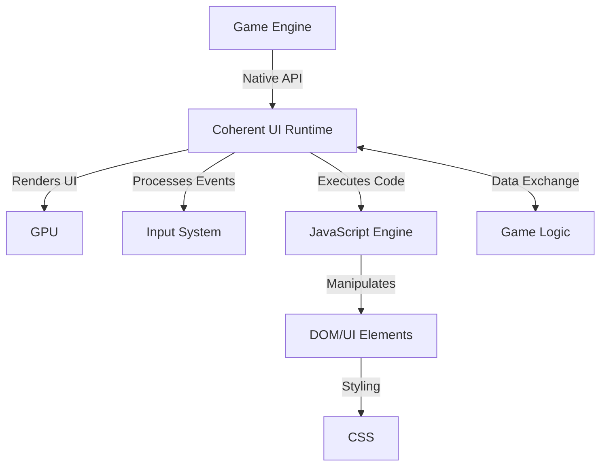

# Coherent UI in Civilization VII

This guide provides a comprehensive overview of Coherent UI, the middleware technology used to create user interfaces in Civilization VII. Understanding Coherent UI is essential for creating and modifying UI elements in your mods.

## Table of Contents
- [Introduction to Coherent UI](#introduction-to-coherent-ui)
- [Architecture Overview](#architecture-overview)
- [Setup and Integration](#setup-and-integration)
- [Core Concepts](#core-concepts)
- [JavaScript API](#javascript-api)
- [Communication Patterns](#communication-patterns)
- [Performance Considerations](#performance-considerations)
- [Debugging Tools](#debugging-tools)
- [Examples](#examples)
- [Related Documentation](#related-documentation)

## Introduction to Coherent UI

Coherent UI is a middleware solution that allows game developers to create user interfaces using web technologies (HTML, CSS, and JavaScript). For modders, this means you can use familiar web development techniques to create and customize UI elements in Civilization VII.

### Key Benefits

- **Web Standards**: Uses HTML5, CSS3, and modern JavaScript
- **Responsive Design**: Easily create UIs that scale across different resolutions
- **Modern Features**: Supports animations, transitions, flexbox, and other modern web features
- **Performance**: Optimized for game environments with minimal overhead
- **Debugging**: Includes powerful debugging and profiling tools

### How Coherent UI Fits into Civilization VII

Coherent UI powers the entire user interface of Civilization VII, from menus and panels to in-game HUD elements. The game's UI is essentially a collection of web pages rendered within the game environment, communicating with the underlying game systems.

## Architecture Overview

Understanding Coherent UI's architecture is crucial for effective UI modding.



### Multiprocess Design

Coherent UI uses a multiprocess architecture for stability and performance:

1. **Host Process**: Manages communication between the game and UI processes
2. **Render Process**: Handles layout and JavaScript execution (one per UI view)
3. **GPU Process**: Manages rendering and compositing

This architecture means that if one UI view crashes, it won't affect other parts of the game interface.

## Setup and Integration

To start modding Civilization VII's UI with Coherent UI, you'll need to understand how UI mods are structured and loaded.

### File Structure

A typical UI mod follows this structure:

```
MyUIMod/
├── ui/
│   ├── Panels/
│   │   └── MyCustomPanel.xml
│   ├── Styles/
│   │   └── MyCustomStyle.css
│   └── Scripts/
│       └── MyCustomLogic.js
└── MyUIMod.modinfo
```

### Mod Registration

Your `.modinfo` file needs to properly register UI changes:

```xml
<?xml version="1.0" encoding="utf-8"?>
<Mod id="your.unique.mod.id" version="1">
  <Properties>
    <Name>My Custom UI Mod</Name>
    <Description>Enhances the game UI with custom features.</Description>
    <Authors>Your Name</Authors>
  </Properties>
  <ActionGroups>
    <ActionGroup>
      <Actions>
        <!-- Replace an existing UI panel -->
        <ReplaceUIScript id="replace-panel">
          <File>ui/Panels/MyCustomPanel.xml</File>
        </ReplaceUIScript>
        
        <!-- Add a new style -->
        <AddUIScript id="add-style">
          <File>ui/Styles/MyCustomStyle.css</File>
        </AddUIScript>
        
        <!-- Add custom logic -->
        <AddUIScript id="add-logic">
          <File>ui/Scripts/MyCustomLogic.js</File>
        </AddUIScript>
      </Actions>
    </ActionGroup>
  </ActionGroups>
</Mod>
```

## Core Concepts

### View Types

Coherent UI supports different types of views for different purposes:

1. **Standard Views**: Regular UI views used for most interface elements
2. **Transparent Views**: Views that allow parts of the game to show through
3. **Offscreen Views**: Views rendered to textures for use in the 3D world

Example of creating a view in JavaScript:

```javascript
// This would be part of the game's core, not directly accessible to modders
const view = Coherent.UI.View.create("MyView", 800, 600);
view.load("ui/MyView.html");
```

### DOM Structure

Coherent UI uses a standard Document Object Model (DOM) similar to web browsers. You can manipulate UI elements using standard JavaScript DOM methods:

```javascript
// Get an element
const element = document.getElementById("MyElement");

// Modify its properties
element.textContent = "New Text";
element.classList.add("highlighted");

// Add event listeners
element.addEventListener("click", function() {
  GameEvents.SendMessage("ElementClicked", { id: "MyElement" });
});
```

### Input Handling

Coherent UI provides several ways to handle user input:

```javascript
// Mouse events
element.addEventListener("click", handleClick);
element.addEventListener("mouseover", handleMouseOver);

// Keyboard events
document.addEventListener("keydown", function(event) {
  if (event.key === "Escape") {
    closePanel();
  }
});

// Touch events (for mobile platforms)
element.addEventListener("touchstart", handleTouchStart);
```

## JavaScript API

Coherent UI extends the standard JavaScript API with game-specific functionality.

### Engine Communication

Communicate between UI and game:

```javascript
// Send a message to the game
GameEvents.SendMessage("BuildUnit", {
  unitType: "UNIT_WARRIOR",
  cityID: 42
});

// Listen for messages from the game
GameEvents.RegisterListener("UnitCreated", function(data) {
  updateUnitPanel(data.unitID, data.unitType);
});
```

### View Manipulation

Control UI views:

```javascript
// This functionality is typically handled by the game's core systems
// and isn't directly accessible to modders
Coherent.UI.View.resize(800, 600);
Coherent.UI.View.focus();
```

### UI State Management

Manage the state of your UI:

```javascript
// Global state object
window.UIState = {
  selectedUnit: null,
  activePanel: "none",
  resources: {}
};

// Update state
function updateState(changes) {
  Object.assign(window.UIState, changes);
  renderUI();
}

// Render based on state
function renderUI() {
  document.getElementById("GoldAmount").textContent = window.UIState.resources.gold || 0;
  document.getElementById("UnitPanel").style.display = 
    window.UIState.selectedUnit ? "block" : "none";
}
```

## Communication Patterns

### Game to UI Communication

The game can send data to the UI in several ways:

```javascript
// Direct function call (from game code)
// This is what happens behind the scenes
window.updateResourceDisplay = function(resources) {
  document.getElementById("GoldDisplay").textContent = resources.gold;
  document.getElementById("FoodDisplay").textContent = resources.food;
};

// Event-based communication
GameEvents.RegisterListener("ResourcesUpdated", function(resources) {
  document.getElementById("GoldDisplay").textContent = resources.gold;
  document.getElementById("FoodDisplay").textContent = resources.food;
});
```

### UI to Game Communication

Send data from the UI to the game:

```javascript
// Send a simple message
function onResearchButtonClicked() {
  GameEvents.SendMessage("SelectResearch", { techType: "TECH_WRITING" });
}

// Request data from the game
async function loadCityDetails(cityID) {
  const cityData = await GameEvents.RequestData("GetCityDetails", { cityID });
  populateCityPanel(cityData);
}
```

## Performance Considerations

Coherent UI is optimized for games, but certain practices can help maintain good performance:

### DOM Manipulation

Minimize DOM changes:

```javascript
// Inefficient - causes multiple reflows
for (let i = 0; i < items.length; i++) {
  const element = document.createElement("div");
  element.textContent = items[i].name;
  container.appendChild(element); // Causes reflow each time
}

// Better - use document fragment
const fragment = document.createDocumentFragment();
for (let i = 0; i < items.length; i++) {
  const element = document.createElement("div");
  element.textContent = items[i].name;
  fragment.appendChild(element);
}
container.appendChild(fragment); // Only one reflow
```

### Event Handling

Use event delegation for better performance:

```javascript
// Inefficient - attaches many event listeners
items.forEach(item => {
  item.addEventListener("click", handleItemClick);
});

// Better - use event delegation
container.addEventListener("click", function(event) {
  if (event.target.classList.contains("item")) {
    handleItemClick(event);
  }
});
```

### CSS Optimizations

Optimize CSS for performance:

```css
/* Inefficient - complex selectors */
.panel .content .item .label {
  color: gold;
}

/* Better - simpler selectors */
.item-label {
  color: gold;
}

/* Use transforms for animations (GPU-accelerated) */
.animating-element {
  transform: translateX(100px);
  transition: transform 0.3s ease;
}
```

## Debugging Tools

Coherent UI includes powerful debugging tools to help identify and resolve issues.

### Browser-Like Developer Tools

Access developer tools by pressing F12 while in the game (if debugging is enabled):

- **Elements Panel**: Inspect and modify DOM elements
- **Console**: Execute JavaScript and view error messages
- **Network**: Monitor network requests
- **Performance**: Analyze performance bottlenecks

### Logging

Use console logging for debugging:

```javascript
// Basic logging
console.log("Loading city panel");

// Structured logging
console.log("City data:", cityData);

// Error logging
try {
  processData();
} catch (error) {
  console.error("Error processing data:", error);
}
```

### Element Inspection

Highlight and identify elements:

```javascript
// Temporarily highlight an element for debugging
function debugHighlight(elementId) {
  const element = document.getElementById(elementId);
  if (!element) {
    console.error("Element not found:", elementId);
    return;
  }
  
  const originalStyle = element.style.outline;
  element.style.outline = "2px solid red";
  
  setTimeout(() => {
    element.style.outline = originalStyle;
  }, 3000);
}
```

## Examples

### Basic Panel Replacement

This example shows how to replace a standard panel with a customized version:

**MyCustomPanel.xml**:
```xml
<Panel>
  <Stack ID="ResourcePanel" StackGrowth="Right" Padding="10,5">
    <Container Size="32,32" Texture="GoldIcon.dds" ID="GoldIcon" />
    <Label ID="GoldAmount" Style="ResourceText" String="0" />
    
    <Container Size="32,32" Texture="ScienceIcon.dds" ID="ScienceIcon" />
    <Label ID="ScienceAmount" Style="ResourceText" String="0" />
    
    <!-- Added a new resource display -->
    <Container Size="32,32" Texture="FaithIcon.dds" ID="FaithIcon" />
    <Label ID="FaithAmount" Style="ResourceText" String="0" />
  </Stack>
</Panel>
```

**MyCustomStyle.css**:
```css
.ResourceText {
  font-size: 18px;
  color: #F5F5F5;
  text-shadow: 1px 1px 2px rgba(0, 0, 0, 0.7);
  margin-right: 15px;
  font-weight: bold;
}

#GoldAmount {
  color: #FFD700;
}

#ScienceAmount {
  color: #00BFFF;
}

#FaithAmount {
  color: #E066FF;
}
```

**MyCustomLogic.js**:
```javascript
(function() {
  // Update resource displays when resource values change
  GameEvents.RegisterListener("ResourcesUpdated", function(data) {
    document.getElementById("GoldAmount").textContent = data.gold || 0;
    document.getElementById("ScienceAmount").textContent = data.science || 0;
    document.getElementById("FaithAmount").textContent = data.faith || 0;
  });
  
  // Initialize resource panel by requesting current values
  function initializeResources() {
    GameEvents.RequestData("GetPlayerResources").then(function(data) {
      document.getElementById("GoldAmount").textContent = data.gold || 0;
      document.getElementById("ScienceAmount").textContent = data.science || 0;
      document.getElementById("FaithAmount").textContent = data.faith || 0;
    });
  }
  
  // Call initialization when the panel loads
  initializeResources();
})();
```

### Custom Unit Information Panel

This example shows a custom panel that displays extended unit information:

**UnitInfoPanel.xml**:
```xml
<Panel ID="ExtendedUnitPanel">
  <Container Size="300,400" Style="MainPanelBG">
    <Stack StackGrowth="Down" Padding="10,10">
      <Label ID="UnitNameLabel" Style="UnitNameText" String="Unit Name" />
      <Container Style="UnitPortraitContainer" Size="280,150" ID="UnitPortrait" />
      
      <Grid Columns="2" Padding="5,5">
        <Label String="Strength:" />
        <Label ID="UnitStrength" String="0" />
        
        <Label String="Movement:" />
        <Label ID="UnitMovement" String="0" />
        
        <Label String="Range:" />
        <Label ID="UnitRange" String="0" />
        
        <Label String="Promotions:" />
        <Label ID="UnitPromotionCount" String="0" />
        
        <!-- Added custom stats -->
        <Label String="Kills:" />
        <Label ID="UnitKills" String="0" />
        
        <Label String="Experience:" />
        <Label ID="UnitExperience" String="0" />
      </Grid>
      
      <Container ID="PromotionsList" Size="280,100" />
      
      <Stack StackGrowth="Right" Padding="5,0">
        <Button ID="PromoteButton" String="Promote" />
        <Button ID="UpgradeButton" String="Upgrade" />
        <Button ID="DisbandButton" String="Disband" />
      </Stack>
    </Stack>
  </Container>
</Panel>
```

**UnitInfoLogic.js**:
```javascript
(function() {
  // When a unit is selected, update the panel
  GameEvents.RegisterListener("UnitSelected", function(data) {
    updateUnitPanel(data);
  });
  
  function updateUnitPanel(unitData) {
    document.getElementById("UnitNameLabel").textContent = unitData.name;
    document.getElementById("UnitStrength").textContent = unitData.strength;
    document.getElementById("UnitMovement").textContent = unitData.movement;
    document.getElementById("UnitRange").textContent = unitData.range || "0";
    document.getElementById("UnitPromotionCount").textContent = unitData.promotions.length;
    document.getElementById("UnitKills").textContent = unitData.kills || "0";
    document.getElementById("UnitExperience").textContent = unitData.experience || "0";
    
    // Update unit portrait
    document.getElementById("UnitPortrait").style.backgroundImage = 
      `url('${unitData.portraitPath}')`;
    
    // Update promotion list
    const promotionsList = document.getElementById("PromotionsList");
    promotionsList.innerHTML = "";
    
    unitData.promotions.forEach(promotion => {
      const promotionElement = document.createElement("div");
      promotionElement.className = "PromotionItem";
      promotionElement.innerHTML = `
        
        <span class="PromotionName">${promotion.name}</span>
      `;
      promotionsList.appendChild(promotionElement);
    });
    
    // Update button states
    document.getElementById("PromoteButton").disabled = !unitData.canPromote;
    document.getElementById("UpgradeButton").disabled = !unitData.canUpgrade;
    
    // Set up button handlers
    document.getElementById("PromoteButton").onclick = function() {
      GameEvents.SendMessage("PromoteUnit", { unitId: unitData.id });
    };
    
    document.getElementById("UpgradeButton").onclick = function() {
      GameEvents.SendMessage("UpgradeUnit", { unitId: unitData.id });
    };
    
    document.getElementById("DisbandButton").onclick = function() {
      GameEvents.SendMessage("DisbandUnit", { unitId: unitData.id });
    };
  }
})();
```

## Related Documentation

For more information on working with Coherent UI in Civilization VII, refer to these resources:

- [UI Modding Guide](./ui-modding.md) - Comprehensive guide to modifying the UI
- [UI Component Reference](./ui-component-reference.md) - Reference for available UI components
- [CSS Styling Guide](./css-styling-guide.md) - Guide to CSS styling in Civilization VII
- [Game Event Reference](./game-event-reference.md) - Reference for game events used in UI scripting

---

*This guide provides an overview of Coherent UI in Civilization VII. For more detailed information on specific UI modding techniques, refer to the [UI Modding Guide](./ui-modding.md).* 