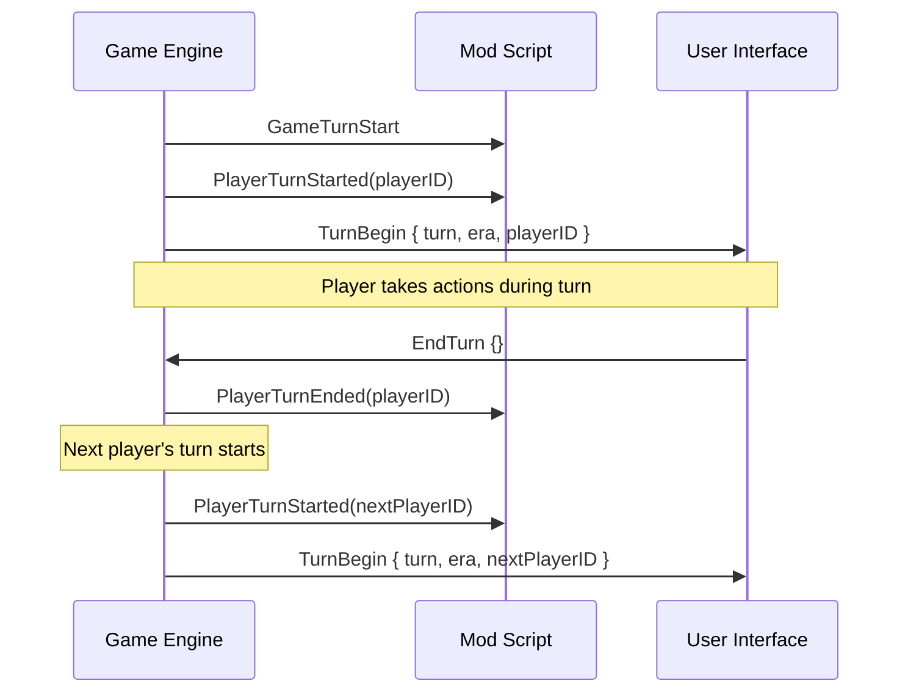
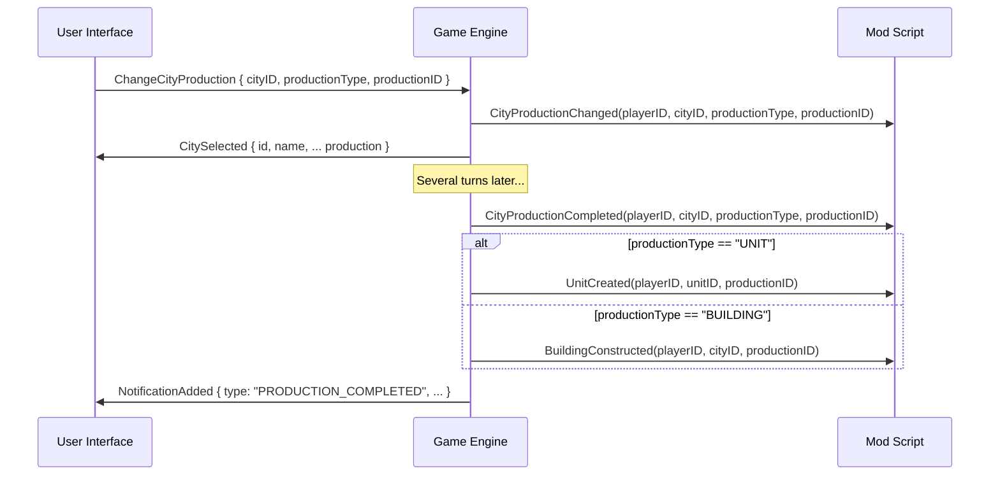

# Game Event Reference for Civilization VII

This reference document catalogs the game events available for modders to use in Civilization VII. Events provide a way for your mod to respond to changes in the game state and for UI components to communicate with the game engine.

## Table of Contents
- [Introduction](#introduction)
- [Using Events](#using-events)
- [UI-to-Game Events](#ui-to-game-events)
- [Game-to-UI Events](#game-to-ui-events)
- [Gameplay Events](#gameplay-events)
  - [Turn Events](#turn-events)
  - [Player Events](#player-events)
  - [City Events](#city-events)
  - [Unit Events](#unit-events)
  - [Combat Events](#combat-events)
  - [Diplomacy Events](#diplomacy-events)
  - [Tech and Civic Events](#tech-and-civic-events)
  - [Natural Events](#natural-events)
- [Event Flow Diagrams](#event-flow-diagrams)
- [Custom Events](#custom-events)
- [Debugging Events](#debugging-events)
- [Related Documentation](#related-documentation)

## Introduction

Events in Civilization VII follow a publisher-subscriber pattern. Game systems publish events when significant actions occur, and your mod can subscribe to these events to respond accordingly. This allows for modular, event-driven programming that can extend the game's functionality without modifying core files.

There are three main categories of events:

1. **UI-to-Game Events**: Sent from the UI to the game engine
2. **Game-to-UI Events**: Sent from the game engine to the UI
3. **Gameplay Events**: Triggered by game systems during play

## Using Events

### Registering Event Listeners in Lua

```lua
-- Basic event registration
function OnCityBuilt(playerID, cityID, x, y)
    print("City built by player " .. playerID .. " at " .. x .. "," .. y);
    -- Your code here
end

-- Register the handler function for the event
GameEvents.CityBuilt.Add(OnCityBuilt);

-- Alternative inline syntax
GameEvents.CityBuilt.Add(function(playerID, cityID, x, y)
    print("City built by player " .. playerID .. " at " .. x .. "," .. y);
    -- Your code here
end);
```

### Registering Event Listeners in JavaScript (UI)

```javascript
// Basic event registration
function onResourcesUpdated(data) {
    console.log("Resources updated:", data);
    document.getElementById("GoldAmount").textContent = data.gold;
    // Update other UI elements
}

// Register the handler function for the event
GameEvents.RegisterListener("ResourcesUpdated", onResourcesUpdated);

// Alternative inline syntax
GameEvents.RegisterListener("ResourcesUpdated", function(data) {
    console.log("Resources updated:", data);
    document.getElementById("GoldAmount").textContent = data.gold;
    // Update other UI elements
});
```

### Sending Events from JavaScript (UI)

```javascript
// Send a simple event to the game
function onResearchButtonClicked() {
    GameEvents.SendMessage("SelectResearch", { techType: "TECH_WRITING" });
}

// Request data from the game
async function loadCityDetails(cityID) {
    try {
        const cityData = await GameEvents.RequestData("GetCityDetails", { cityID: cityID });
        updateCityPanel(cityData);
    } catch (error) {
        console.error("Failed to get city details:", error);
    }
}
```

## UI-to-Game Events

These events are sent from the UI to the game engine.

### Core UI Events

| Event Name | Description | Parameters | Example |
|------------|-------------|------------|---------|
| `SelectUnit` | Select a unit on the map | `unitID`: ID of the unit to select | `GameEvents.SendMessage("SelectUnit", { unitID: 42 });` |
| `MoveUnit` | Request unit movement | `unitID`: ID of the unit<br>`x`: Target X coordinate<br>`y`: Target Y coordinate | `GameEvents.SendMessage("MoveUnit", { unitID: 42, x: 10, y: 15 });` |
| `SelectCity` | Select a city | `cityID`: ID of the city to select | `GameEvents.SendMessage("SelectCity", { cityID: 3 });` |
| `ChangeCityProduction` | Change city production | `cityID`: ID of the city<br>`productionType`: Type of production<br>`productionID`: ID of the item | `GameEvents.SendMessage("ChangeCityProduction", { cityID: 3, productionType: "UNIT", productionID: "UNIT_WARRIOR" });` |
| `SelectResearch` | Change research | `techType`: Technology to research | `GameEvents.SendMessage("SelectResearch", { techType: "TECH_WRITING" });` |
| `SelectCivic` | Change civic research | `civicType`: Civic to research | `GameEvents.SendMessage("SelectCivic", { civicType: "CIVIC_CODE_OF_LAWS" });` |
| `EndTurn` | End the current turn | None | `GameEvents.SendMessage("EndTurn", {});` |

### Data Request Events

| Event Name | Description | Parameters | Example |
|------------|-------------|------------|---------|
| `GetPlayerResources` | Get player resource information | None | `const resources = await GameEvents.RequestData("GetPlayerResources", {});` |
| `GetCityDetails` | Get detailed information about a city | `cityID`: ID of the city | `const cityData = await GameEvents.RequestData("GetCityDetails", { cityID: 3 });` |
| `GetUnitDetails` | Get detailed information about a unit | `unitID`: ID of the unit | `const unitData = await GameEvents.RequestData("GetUnitDetails", { unitID: 42 });` |
| `GetTechData` | Get information about a technology | `techType`: Technology type | `const techData = await GameEvents.RequestData("GetTechData", { techType: "TECH_WRITING" });` |
| `GetDiplomacyStatus` | Get diplomacy status with another player | `otherPlayerID`: ID of the other player | `const diplomacy = await GameEvents.RequestData("GetDiplomacyStatus", { otherPlayerID: 2 });` |

## Game-to-UI Events

These events are sent from the game engine to the UI.

### Core UI Update Events

| Event Name | Description | Data Properties | Example Handler |
|------------|-------------|----------------|----------------|
| `ResourcesUpdated` | Player resources have changed | `gold`, `food`, `production`, `science`, `culture`, `faith` | `function(data) { document.getElementById("GoldAmount").textContent = data.gold; }` |
| `UnitSelected` | A unit has been selected | `id`, `type`, `name`, `combat`, `movement`, `health`, `position`, `promotions` | `function(data) { updateUnitPanel(data); }` |
| `CitySelected` | A city has been selected | `id`, `name`, `owner`, `population`, `health`, `production`, `buildings` | `function(data) { updateCityPanel(data); }` |
| `TechChanged` | Current research changed | `techType`, `name`, `turnsLeft`, `progress`, `boostStatus` | `function(data) { updateResearchPanel(data); }` |
| `CivicChanged` | Current civic changed | `civicType`, `name`, `turnsLeft`, `progress`, `boostStatus` | `function(data) { updateCivicPanel(data); }` |
| `TurnBegin` | A new turn has started | `turn`, `era`, `playerID` | `function(data) { updateTurnDisplay(data.turn); }` |
| `NotificationAdded` | New notification | `type`, `message`, `icon`, `targets` | `function(data) { addNotification(data); }` |

### Game State Events

| Event Name | Description | Data Properties | Example Handler |
|------------|-------------|----------------|----------------|
| `GameOptionsChanged` | Game options changed | `options`: Object with changed options | `function(data) { updateOptionsDisplay(data.options); }` |
| `GameStateChanged` | Overall game state change | `state`: New game state<br>`previousState`: Previous state | `function(data) { handleStateChange(data.state, data.previousState); }` |
| `MapVisibilityChanged` | Map visibility changed | `revealedPlots`: Array of newly revealed plots | `function(data) { updateFogOfWar(data.revealedPlots); }` |
| `PlayerEraChanged` | Player entered new era | `playerID`, `eraType`, `eraName` | `function(data) { showEraTransition(data.eraName); }` |

## Gameplay Events

These events are triggered by the game during play and can be handled in Lua scripts.

### Turn Events

| Event Name | Description | Parameters | Example Usage |
|------------|-------------|------------|--------------|
| `GameTurnStart` | Fired at the start of each game turn | None | `GameEvents.GameTurnStart.Add(function() print("New game turn"); end);` |
| `PlayerTurnStarted` | Fired when a player's turn begins | `playerID`: ID of the player | `GameEvents.PlayerTurnStarted.Add(function(playerID) print("Player " .. playerID .. " turn started"); end);` |
| `PlayerTurnEnded` | Fired when a player's turn ends | `playerID`: ID of the player | `GameEvents.PlayerTurnEnded.Add(function(playerID) print("Player " .. playerID .. " turn ended"); end);` |
| `TurnTimerUpdated` | Fired when the turn timer changes | `remainingSeconds`: Seconds remaining | `GameEvents.TurnTimerUpdated.Add(function(remainingSeconds) print("Timer: " .. remainingSeconds); end);` |

### Player Events

| Event Name | Description | Parameters | Example Usage |
|------------|-------------|------------|--------------|
| `PlayerEraChanged` | Player entered a new era | `playerID`: ID of the player<br>`eraID`: ID of the new era | `GameEvents.PlayerEraChanged.Add(function(playerID, eraID) print("Player " .. playerID .. " entered era " .. eraID); end);` |
| `PlayerResourceChanged` | Player resource amount changed | `playerID`: ID of the player<br>`resourceType`: Type of resource<br>`amount`: New amount<br>`delta`: Change amount | `GameEvents.PlayerResourceChanged.Add(function(playerID, resourceType, amount, delta) print("Player " .. playerID .. " " .. resourceType .. " changed by " .. delta); end);` |
| `PlayerGovernmentChanged` | Player changed government | `playerID`: ID of the player<br>`governmentType`: New government type | `GameEvents.PlayerGovernmentChanged.Add(function(playerID, governmentType) print("Player " .. playerID .. " switched to " .. governmentType); end);` |
| `PlayerPolicyChanged` | Player policy changed | `playerID`: ID of the player<br>`policyType`: Type of policy<br>`applied`: True if applied, false if removed | `GameEvents.PlayerPolicyChanged.Add(function(playerID, policyType, applied) print("Player " .. playerID .. (applied and " adopted " or " removed ") .. policyType); end);` |

### City Events

| Event Name | Description | Parameters | Example Usage |
|------------|-------------|------------|--------------|
| `CityBuilt` | A new city was founded | `playerID`: ID of the player<br>`cityID`: ID of the new city<br>`x`: X coordinate<br>`y`: Y coordinate | `GameEvents.CityBuilt.Add(function(playerID, cityID, x, y) print("New city built at " .. x .. "," .. y); end);` |
| `CityConquered` | A city was conquered | `previousOwnerID`: Previous owner<br>`newOwnerID`: New owner<br>`cityID`: ID of the city | `GameEvents.CityConquered.Add(function(previousOwnerID, newOwnerID, cityID) print("City conquered by player " .. newOwnerID); end);` |
| `CityCaptured` | A city was captured | `previousOwnerID`: Previous owner<br>`newOwnerID`: New owner<br>`cityID`: ID of the city | `GameEvents.CityCaptured.Add(function(previousOwnerID, newOwnerID, cityID) print("City captured by player " .. newOwnerID); end);` |
| `CityDestroyed` | A city was destroyed | `playerID`: ID of the player<br>`cityID`: ID of the city | `GameEvents.CityDestroyed.Add(function(playerID, cityID) print("City " .. cityID .. " destroyed"); end);` |
| `CityPopulationChanged` | City population changed | `playerID`: ID of the player<br>`cityID`: ID of the city<br>`populationNew`: New population<br>`populationOld`: Old population | `GameEvents.CityPopulationChanged.Add(function(playerID, cityID, populationNew, populationOld) print("City population changed from " .. populationOld .. " to " .. populationNew); end);` |
| `CityProductionChanged` | City production changed | `playerID`: ID of the player<br>`cityID`: ID of the city<br>`productionType`: Type of production<br>`productionID`: ID of the item | `GameEvents.CityProductionChanged.Add(function(playerID, cityID, productionType, productionID) print("City production changed to " .. productionType .. ": " .. productionID); end);` |
| `CityProductionCompleted` | City production completed | `playerID`: ID of the player<br>`cityID`: ID of the city<br>`productionType`: Type of production<br>`productionID`: ID of the item | `GameEvents.CityProductionCompleted.Add(function(playerID, cityID, productionType, productionID) print("City completed " .. productionType .. ": " .. productionID); end);` |
| `BuildingConstructed` | Building constructed in a city | `playerID`: ID of the player<br>`cityID`: ID of the city<br>`buildingType`: Type of building | `GameEvents.BuildingConstructed.Add(function(playerID, cityID, buildingType) print("Built " .. buildingType .. " in city " .. cityID); end);` |

### Unit Events

| Event Name | Description | Parameters | Example Usage |
|------------|-------------|------------|--------------|
| `UnitCreated` | A unit was created | `playerID`: ID of the player<br>`unitID`: ID of the unit<br>`unitType`: Type of unit | `GameEvents.UnitCreated.Add(function(playerID, unitID, unitType) print("Player " .. playerID .. " created " .. unitType); end);` |
| `UnitKilled` | A unit was killed | `killerPlayerID`: ID of the killer's player<br>`killerUnitID`: ID of the killer unit<br>`playerID`: ID of the victim's player<br>`unitID`: ID of the killed unit<br>`unitType`: Type of killed unit | `GameEvents.UnitKilled.Add(function(killerPlayerID, killerUnitID, playerID, unitID, unitType) print("Player " .. playerID .. "'s " .. unitType .. " was killed"); end);` |
| `UnitMoved` | A unit moved | `playerID`: ID of the player<br>`unitID`: ID of the unit<br>`x`: New X coordinate<br>`y`: New Y coordinate | `GameEvents.UnitMoved.Add(function(playerID, unitID, x, y) print("Unit moved to " .. x .. "," .. y); end);` |
| `UnitPromoted` | A unit was promoted | `playerID`: ID of the player<br>`unitID`: ID of the unit<br>`promotionType`: Type of promotion | `GameEvents.UnitPromoted.Add(function(playerID, unitID, promotionType) print("Unit promoted with " .. promotionType); end);` |
| `UnitUpgraded` | A unit was upgraded | `playerID`: ID of the player<br>`oldUnitID`: ID of the old unit<br>`oldUnitType`: Type of old unit<br>`newUnitID`: ID of the new unit<br>`newUnitType`: Type of new unit | `GameEvents.UnitUpgraded.Add(function(playerID, oldUnitID, oldUnitType, newUnitID, newUnitType) print("Unit upgraded from " .. oldUnitType .. " to " .. newUnitType); end);` |
| `UnitRangeAttackAvailable` | Unit can perform ranged attack | `playerID`: ID of the player<br>`unitID`: ID of the unit | `GameEvents.UnitRangeAttackAvailable.Add(function(playerID, unitID) print("Unit " .. unitID .. " can perform ranged attack"); end);` |

### Combat Events

| Event Name | Description | Parameters | Example Usage |
|------------|-------------|------------|--------------|
| `CombatBegin` | Combat has begun | `attackerPlayerID`: Attacker's player ID<br>`attackerUnitID`: Attacker's unit ID<br>`defenderPlayerID`: Defender's player ID<br>`defenderUnitID`: Defender's unit ID | `GameEvents.CombatBegin.Add(function(attackerPlayerID, attackerUnitID, defenderPlayerID, defenderUnitID) print("Combat started"); end);` |
| `CombatEnd` | Combat has ended | `attackerPlayerID`: Attacker's player ID<br>`attackerUnitID`: Attacker's unit ID<br>`defenderPlayerID`: Defender's player ID<br>`defenderUnitID`: Defender's unit ID<br>`combatResult`: Result of combat | `GameEvents.CombatEnd.Add(function(attackerPlayerID, attackerUnitID, defenderPlayerID, defenderUnitID, combatResult) print("Combat ended: " .. combatResult); end);` |
| `CombatDamage` | Damage was dealt in combat | `attackerPlayerID`: Attacker's player ID<br>`attackerUnitID`: Attacker's unit ID<br>`defenderPlayerID`: Defender's player ID<br>`defenderUnitID`: Defender's unit ID<br>`damage`: Amount of damage<br>`finalHealth`: Health after damage | `GameEvents.CombatDamage.Add(function(attackerPlayerID, attackerUnitID, defenderPlayerID, defenderUnitID, damage, finalHealth) print("Combat damage: " .. damage); end);` |
| `CityAttacked` | A city was attacked | `attackerPlayerID`: Attacker's player ID<br>`attackerUnitID`: Attacker's unit ID<br>`defenderPlayerID`: Defender's player ID<br>`cityID`: ID of the city<br>`damage`: Amount of damage<br>`finalHealth`: Health after damage | `GameEvents.CityAttacked.Add(function(attackerPlayerID, attackerUnitID, defenderPlayerID, cityID, damage, finalHealth) print("City attacked, damage: " .. damage); end);` |

### Diplomacy Events

| Event Name | Description | Parameters | Example Usage |
|------------|-------------|------------|--------------|
| `DiplomaticStatusChanged` | Diplomatic status changed | `playerID1`: First player ID<br>`playerID2`: Second player ID<br>`oldStatus`: Previous status<br>`newStatus`: New status | `GameEvents.DiplomaticStatusChanged.Add(function(playerID1, playerID2, oldStatus, newStatus) print("Diplomatic status changed from " .. oldStatus .. " to " .. newStatus); end);` |
| `DiplomaticDealAgreed` | Diplomatic deal accepted | `fromPlayerID`: First player ID<br>`toPlayerID`: Second player ID<br>`dealItems`: List of deal items | `GameEvents.DiplomaticDealAgreed.Add(function(fromPlayerID, toPlayerID, dealItems) print("Deal agreed between players " .. fromPlayerID .. " and " .. toPlayerID); end);` |
| `DiplomaticDealRejected` | Diplomatic deal rejected | `fromPlayerID`: First player ID<br>`toPlayerID`: Second player ID<br>`dealItems`: List of deal items | `GameEvents.DiplomaticDealRejected.Add(function(fromPlayerID, toPlayerID, dealItems) print("Deal rejected between players " .. fromPlayerID .. " and " .. toPlayerID); end);` |
| `WarDeclared` | War was declared | `initiatingPlayerID`: Initiating player ID<br>`targetPlayerID`: Target player ID<br>`warType`: Type of war | `GameEvents.WarDeclared.Add(function(initiatingPlayerID, targetPlayerID, warType) print("War declared: " .. warType); end);` |
| `PeaceMade` | Peace was made | `player1ID`: First player ID<br>`player2ID`: Second player ID | `GameEvents.PeaceMade.Add(function(player1ID, player2ID) print("Peace made between players " .. player1ID .. " and " .. player2ID); end);` |
| `AllianceFormed` | Alliance was formed | `player1ID`: First player ID<br>`player2ID`: Second player ID<br>`allianceType`: Type of alliance | `GameEvents.AllianceFormed.Add(function(player1ID, player2ID, allianceType) print("Alliance formed: " .. allianceType); end);` |

### Tech and Civic Events

| Event Name | Description | Parameters | Example Usage |
|------------|-------------|------------|--------------|
| `ResearchChanged` | Research changed | `playerID`: ID of the player<br>`techType`: Type of technology<br>`isCompleted`: Whether it was completed | `GameEvents.ResearchChanged.Add(function(playerID, techType, isCompleted) print("Research changed to " .. techType); end);` |
| `ResearchCompleted` | Research completed | `playerID`: ID of the player<br>`techType`: Type of technology | `GameEvents.ResearchCompleted.Add(function(playerID, techType) print("Research completed: " .. techType); end);` |
| `CivicChanged` | Civic changed | `playerID`: ID of the player<br>`civicType`: Type of civic<br>`isCompleted`: Whether it was completed | `GameEvents.CivicChanged.Add(function(playerID, civicType, isCompleted) print("Civic changed to " .. civicType); end);` |
| `CivicCompleted` | Civic completed | `playerID`: ID of the player<br>`civicType`: Type of civic | `GameEvents.CivicCompleted.Add(function(playerID, civicType) print("Civic completed: " .. civicType); end);` |
| `EurekaTriggered` | Technology boost triggered | `playerID`: ID of the player<br>`techType`: Type of technology | `GameEvents.EurekaTriggered.Add(function(playerID, techType) print("Eureka for " .. techType); end);` |
| `InspirationTriggered` | Civic boost triggered | `playerID`: ID of the player<br>`civicType`: Type of civic | `GameEvents.InspirationTriggered.Add(function(playerID, civicType) print("Inspiration for " .. civicType); end);` |

### Natural Events

| Event Name | Description | Parameters | Example Usage |
|------------|-------------|------------|--------------|
| `ResourceDiscovered` | Resource discovered | `playerID`: ID of the player<br>`resourceType`: Type of resource<br>`x`: X coordinate<br>`y`: Y coordinate | `GameEvents.ResourceDiscovered.Add(function(playerID, resourceType, x, y) print("Resource discovered: " .. resourceType); end);` |
| `FeatureDiscovered` | Map feature discovered | `playerID`: ID of the player<br>`featureType`: Type of feature<br>`x`: X coordinate<br>`y`: Y coordinate | `GameEvents.FeatureDiscovered.Add(function(playerID, featureType, x, y) print("Feature discovered: " .. featureType); end);` |
| `NaturalWonderDiscovered` | Natural wonder discovered | `playerID`: ID of the player<br>`featureType`: Type of wonder<br>`x`: X coordinate<br>`y`: Y coordinate | `GameEvents.NaturalWonderDiscovered.Add(function(playerID, featureType, x, y) print("Natural wonder discovered: " .. featureType); end);` |
| `BarbarianCampSpawned` | Barbarian camp appeared | `campID`: ID of the camp<br>`x`: X coordinate<br>`y`: Y coordinate | `GameEvents.BarbarianCampSpawned.Add(function(campID, x, y) print("Barbarian camp spawned at " .. x .. "," .. y); end);` |
| `BarbarianCampCleared` | Barbarian camp cleared | `playerID`: ID of the player<br>`campID`: ID of the camp<br>`x`: X coordinate<br>`y`: Y coordinate | `GameEvents.BarbarianCampCleared.Add(function(playerID, campID, x, y) print("Barbarian camp cleared at " .. x .. "," .. y); end);` |

## Event Flow Diagrams

Understanding the flow of events during common game processes can help you determine when to hook into the game's systems.

### Turn Sequence Events



### City Production Events



## Custom Events

You can create custom events for your mod to improve modularity and allow other mods to interact with yours.

### Creating Custom Events in Lua

```lua
-- Create a custom event system
MyMod = MyMod or {};
MyMod.Events = MyMod.Events or {};

-- Define an event
MyMod.Events.CustomResourceAdded = {};

-- Event management methods
function MyMod.Events.CustomResourceAdded.Add(func)
    table.insert(MyMod.Events.CustomResourceAdded, func);
end

function MyMod.Events.CustomResourceAdded.Remove(func)
    for i, eventFunc in ipairs(MyMod.Events.CustomResourceAdded) do
        if eventFunc == func then
            table.remove(MyMod.Events.CustomResourceAdded, i);
            break;
        end
    end
end

-- Fire the event
function MyMod.Events.CustomResourceAdded.Fire(playerID, resourceType, amount)
    for _, func in ipairs(MyMod.Events.CustomResourceAdded) do
        func(playerID, resourceType, amount);
    end
end

-- Example usage
function OnPlayerGainsCustomResource(playerID, resourceType, amount)
    print("Player " .. playerID .. " gained " .. amount .. " of " .. resourceType);
end

MyMod.Events.CustomResourceAdded.Add(OnPlayerGainsCustomResource);

-- Later, to trigger the event:
MyMod.Events.CustomResourceAdded.Fire(0, "RESOURCE_MYTHRIL", 5);
```

### Creating Custom Events for UI in JavaScript

```javascript
// Create a custom event system
window.MyModEvents = window.MyModEvents || {};

// Custom event publish/subscribe methods
window.MyModEvents.listeners = {};

window.MyModEvents.subscribe = function(eventName, callback) {
    if (!this.listeners[eventName]) {
        this.listeners[eventName] = [];
    }
    this.listeners[eventName].push(callback);
};

window.MyModEvents.unsubscribe = function(eventName, callback) {
    if (!this.listeners[eventName]) return;
    
    const index = this.listeners[eventName].indexOf(callback);
    if (index !== -1) {
        this.listeners[eventName].splice(index, 1);
    }
};

window.MyModEvents.publish = function(eventName, data) {
    if (!this.listeners[eventName]) return;
    
    this.listeners[eventName].forEach(callback => {
        callback(data);
    });
};

// Example usage
function onCustomResourceUpdated(data) {
    console.log("Custom resource updated:", data);
    document.getElementById("MythrilAmount").textContent = data.amount;
}

window.MyModEvents.subscribe("CustomResourceUpdated", onCustomResourceUpdated);

// Later, to trigger the event:
window.MyModEvents.publish("CustomResourceUpdated", { resourceType: "MYTHRIL", amount: 5 });
```

## Debugging Events

Debugging events can be challenging due to their asynchronous nature. Here are some techniques to help:

### Logging All Events

```lua
-- Lua event logger
function LogAllGameEvents()
    -- Get all available event types from GameEvents
    for eventName, eventObject in pairs(GameEvents) do
        -- Skip anything that's not an event
        if type(eventObject) == "table" and eventObject.Add then
            -- Create a logging function for this event
            local logFunction = function(...)
                local args = {...};
                local logMessage = "Event: " .. eventName .. " - Args: ";
                
                for i, arg in ipairs(args) do
                    logMessage = logMessage .. tostring(arg);
                    if i < #args then logMessage = logMessage .. ", "; end
                end
                
                print(logMessage);
            end
            
            -- Register the logging function
            eventObject.Add(logFunction);
            
            print("Registered logger for event: " .. eventName);
        end
    end
end

-- Call this function at initialization
LogAllGameEvents();
```

```javascript
// JavaScript event logger
function setupEventLogger() {
    // Store the original method
    const originalRegisterListener = GameEvents.RegisterListener;
    
    // Replace with logging version
    GameEvents.RegisterListener = function(eventName, callback) {
        // Create a wrapper that logs before calling the original
        const loggingCallback = function(data) {
            console.log("Event received:", eventName, data);
            callback(data);
        };
        
        // Call the original with our wrapper
        return originalRegisterListener.call(GameEvents, eventName, loggingCallback);
    };
    
    // Store the original method
    const originalSendMessage = GameEvents.SendMessage;
    
    // Replace with logging version
    GameEvents.SendMessage = function(eventName, data) {
        console.log("Event sent:", eventName, data);
        return originalSendMessage.call(GameEvents, eventName, data);
    };
    
    console.log("Event logging initialized");
}

// Call this at initialization
setupEventLogger();
```

### Event Timing Analysis

For performance analysis or debugging complex event chains:

```lua
-- Lua event timing analyzer
function AnalyzeEventTiming(eventName)
    local startTime = 0;
    
    GameEvents[eventName].Add(function(...)
        local currentTime = os.clock();
        local elapsed = currentTime - startTime;
        startTime = currentTime;
        
        print("Event: " .. eventName .. " - Time since last occurrence: " .. elapsed .. "s");
    end);
    
    print("Event timing analysis enabled for: " .. eventName);
end

-- Analyze specific events
AnalyzeEventTiming("PlayerTurnStarted");
AnalyzeEventTiming("CityProductionChanged");
```

## Related Documentation

For more information about working with events in Civilization VII modding, refer to these resources:

- [Advanced Topics](./advanced-topics.md#event-system-integration) - Detailed information on integrating with the event system
- [UI Modding Guide](./ui-modding.md#communication-between-ui-and-game) - UI-Game communication with events
- [Narrative and Story](./narrative-and-story.md) - Using events for narrative sequences
- [Troubleshooting](./troubleshooting.md#lua-script-issues) - Troubleshooting event-related issues

---

*This event reference is based on Civilization VII's event system as of the current game version. Event names and parameters may change with game updates.* 