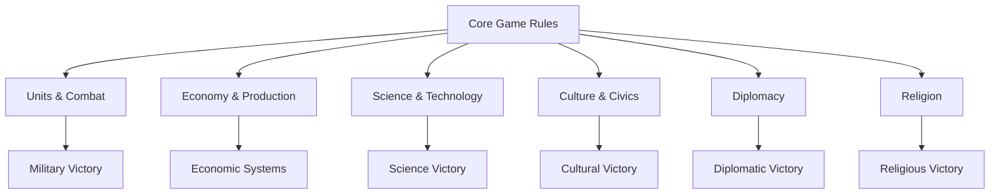

# Gameplay Modding in Civilization VII

This comprehensive guide covers how to modify gameplay systems in Civilization VII, allowing you to change game rules, create new mechanics, and customize the player experience.

## Table of Contents
- [Introduction](#introduction)
- [Understanding Gameplay Systems](#understanding-gameplay-systems)
- [Simple Gameplay Modifications](#simple-gameplay-modifications)
- [Modifying Game Rules](#modifying-game-rules)
- [Unit and Combat Modifications](#unit-and-combat-modifications)
- [Economy and Yield Changes](#economy-and-yield-changes)
- [Diplomacy System Modifications](#diplomacy-system-modifications)
- [Technology and Civic Tree Customization](#technology-and-civic-tree-customization)
- [Government and Policy Modifications](#government-and-policy-modifications)
- [Victory Conditions](#victory-conditions)
- [AI Behavior Modifications](#ai-behavior-modifications)
- [Advanced Gameplay Mechanics](#advanced-gameplay-mechanics)
- [Debugging Gameplay Mods](#debugging-gameplay-mods)
- [Examples](#examples)
- [Related Documentation](#related-documentation)

## Introduction

Gameplay modding allows you to change how Civilization VII plays, from small balance tweaks to complete game overhauls. This guide covers the key systems you can modify and provides examples of common gameplay changes.

### Types of Gameplay Mods

Gameplay mods generally fall into several categories:

1. **Balance Mods**: Adjust game values to change difficulty or improve balance
2. **Rule Changes**: Modify core game rules to create new gameplay dynamics
3. **Content Additions**: Add new gameplay elements like units, buildings, or policies
4. **Overhauls**: Comprehensive changes to multiple game systems
5. **Scenario Mods**: Create specific gameplay scenarios with unique rules

### Essential Tools for Gameplay Modding

To create gameplay mods, you'll need:

- A text editor for modifying XML and SQL files
- Basic understanding of SQL for database modifications
- Knowledge of Lua for more complex gameplay scripts
- Familiarity with the game's data structures and systems

## Understanding Gameplay Systems

Civilization VII's gameplay is built from interconnected systems that can all be modified. Here's an overview of the main systems:



Most gameplay modifications involve changing database values, which control everything from unit stats to technology costs. More complex mods may use Lua scripts to implement custom mechanics.

> **See Also:** For more information on working with the game database, see the [Database Modding Guide](./database-modding.md).

## Simple Gameplay Modifications

Let's start with simple changes that can significantly impact gameplay:

### Modifying Unit Stats

One of the simplest gameplay changes is adjusting unit stats:

```sql
-- Make Warriors stronger
UPDATE Units
SET Combat = 25 -- Default is 20
WHERE UnitType = 'UNIT_WARRIOR';

-- Make Scouts faster
UPDATE Units
SET BaseMoves = 3 -- Default is 2
WHERE UnitType = 'UNIT_SCOUT';

-- Make Settlers more expensive
UPDATE Units
SET Cost = 80 -- Default is 50
WHERE UnitType = 'UNIT_SETTLER';
```

### Adjusting Building Yields

Similarly, you can change building yields:

```sql
-- Increase Library science yield
UPDATE Building_YieldChanges
SET YieldChange = 3 -- Default is 2
WHERE BuildingType = 'BUILDING_LIBRARY' AND YieldType = 'YIELD_SCIENCE';

-- Add culture to Markets
INSERT OR IGNORE INTO Building_YieldChanges
    (BuildingType, YieldType, YieldChange)
VALUES
    ('BUILDING_MARKET', 'YIELD_CULTURE', 1);
```

### Changing Resource Distribution

You can also modify how resources appear on the map:

```sql
-- Make iron more common
UPDATE Resource_SeededRandom
SET OccurrencesPerPercent = 3 -- Default might be 1 or 2
WHERE ResourceType = 'RESOURCE_IRON';

-- Increase the yield from bonus resources
UPDATE Resource_YieldChanges
SET YieldChange = YieldChange + 1
WHERE ResourceType IN (SELECT ResourceType FROM Resources WHERE ResourceClassType = 'RESOURCECLASS_BONUS');
```

> **Related Topic:** For information on modifying graphics for units and buildings, see the [Asset Creation Guide](./asset-creation.md#unit-and-building-assets).

## Modifying Game Rules

For more significant changes, you can modify core game rules:

### Pace of Play

Change how quickly the game progresses:

```sql
-- Speed up research by making technologies cheaper
UPDATE Technologies
SET Cost = CAST(Cost * 0.8 AS INTEGER); -- 20% cheaper

-- Make cities grow faster
UPDATE GlobalParameters
SET Value = 15 -- Default might be 20
WHERE Name = 'CITY_GROWTH_EXPONENT';

-- Increase production speed for units
UPDATE Units
SET Cost = CAST(Cost * 0.9 AS INTEGER); -- 10% cheaper
```

### Starting Conditions

Customize what players start with:

```sql
-- Give players an extra Warrior
INSERT OR REPLACE INTO StartingUnits
    (CivilizationType, Era, UnitType, Count, InitialLevel)
VALUES
    ('CIVILIZATION_AMERICA', 'ERA_ANCIENT', 'UNIT_WARRIOR', 2, 1), -- Instead of default 1
    -- Repeat for other civilizations...
    ('CIVILIZATION_ZULU', 'ERA_ANCIENT', 'UNIT_WARRIOR', 2, 1);

-- Start with an extra technology
INSERT OR REPLACE INTO StartingTechnologies
    (CivilizationType, TechnologyType)
VALUES
    ('CIVILIZATION_AMERICA', 'TECH_ANIMAL_HUSBANDRY'),
    -- Repeat for other civilizations...
    ('CIVILIZATION_ZULU', 'TECH_ANIMAL_HUSBANDRY');
```

### Global Rules

Change fundamental game rules:

```sql
-- Allow cities to be built closer together
UPDATE GlobalParameters
SET Value = 3 -- Default is 4
WHERE Name = 'CITY_MIN_RANGE';

-- Increase the happiness benefit from luxury resources
UPDATE GlobalParameters
SET Value = 5 -- Default is 4
WHERE Name = 'AMENITY_YIELD_PER_LUXURY';

-- Modify war weariness
UPDATE GlobalParameters
SET Value = Value * 0.5 -- Half the default value
WHERE Name LIKE '%WAR_WEARINESS%';
```

> **See Also:** For creating custom game rules with more complex logic, check the [Advanced Topics Guide](./advanced-topics.md#custom-game-rules).

## Unit and Combat Modifications

The combat system can be extensively modified:

### Combat Formulas

Adjust how combat is calculated:

```sql
-- Modify the combat damage formula
UPDATE GlobalParameters
SET Value = 17 -- Default might be 15
WHERE Name = 'COMBAT_BASE_DAMAGE';

-- Change how terrain affects combat
UPDATE Terrains
SET CombatModifier = 5 -- Default might be 3
WHERE TerrainType = 'TERRAIN_HILLS';
```

### Unit Promotion Changes

Customize unit promotions:

```sql
-- Make promotions more powerful
UPDATE UnitPromotions
SET Attack = Attack * 2
WHERE Attack > 0;

-- Add new effects to existing promotions
INSERT OR IGNORE INTO UnitPromotionModifiers
    (UnitPromotionType, ModifierId)
VALUES
    ('PROMOTION_COMMANDO', 'MODIFIER_UNIT_ADJUST_FLANKING_BONUS');

-- Make promotions easier to earn
UPDATE GlobalParameters
SET Value = 4 -- Default might be 5
WHERE Name = 'EXPERIENCE_POINTS_REQUIRED_PER_LEVEL';
```

### Creating a New Unit Class

For more complex changes, you can create entirely new unit classes:

```sql
-- Add a new unit type
INSERT INTO Types (Type, Kind)
VALUES ('UNIT_HEAVY_INFANTRY', 'KIND_UNIT');

-- Define the new unit
INSERT INTO Units
    (UnitType, Name, Description, Cost, Combat, RangedCombat, Range, BaseMoves, BaseSightRange, ZoneOfControl, Domain, FormationClass, PromotionClass, AdvisorType, PrereqTech)
VALUES
    ('UNIT_HEAVY_INFANTRY', 'LOC_UNIT_HEAVY_INFANTRY_NAME', 'LOC_UNIT_HEAVY_INFANTRY_DESCRIPTION', 150, 40, 0, 0, 2, 2, 1, 'DOMAIN_LAND', 'FORMATION_CLASS_LAND_COMBAT', 'PROMOTION_CLASS_MELEE', 'ADVISOR_CONQUEST', 'TECH_IRON_WORKING');

-- Add ability to the unit
INSERT INTO UnitAbilities (UnitAbilityType, Name, Description)
VALUES ('ABILITY_HEAVY_INFANTRY_BONUS', 'LOC_ABILITY_HEAVY_INFANTRY_BONUS_NAME', 'LOC_ABILITY_HEAVY_INFANTRY_BONUS_DESCRIPTION');

INSERT INTO UnitAbilityAttachments (UnitAbilityType, UnitType)
VALUES ('ABILITY_HEAVY_INFANTRY_BONUS', 'UNIT_HEAVY_INFANTRY');

-- Create a modifier for the ability
INSERT INTO Modifiers (ModifierId, ModifierType)
VALUES ('MODIFIER_HEAVY_INFANTRY_DEFENSE_BONUS', 'MODIFIER_UNIT_ADJUST_COMBAT_STRENGTH');

INSERT INTO ModifierArguments (ModifierId, Name, Value)
VALUES
    ('MODIFIER_HEAVY_INFANTRY_DEFENSE_BONUS', 'Amount', 10),
    ('MODIFIER_HEAVY_INFANTRY_DEFENSE_BONUS', 'DefendingOnly', 1);

INSERT INTO UnitAbilityModifiers (UnitAbilityType, ModifierId)
VALUES ('ABILITY_HEAVY_INFANTRY_BONUS', 'MODIFIER_HEAVY_INFANTRY_DEFENSE_BONUS');
```

> **Related Topic:** For creating new unit art assets, see the [Asset Creation Guide](./asset-creation.md#creating-unit-assets).

## Economy and Yield Changes

The economic systems can be extensively modified:

### Yield Generation

Change how yields are generated:

```sql
-- Increase base yields for all terrains
UPDATE Terrains
SET Food = Food + 1, Production = Production + 1
WHERE TerrainType <> 'TERRAIN_OCEAN' AND TerrainType <> 'TERRAIN_COAST';

-- Modify district adjacency bonuses
UPDATE DistrictAdjacencies
SET YieldChangeId = 'District_+2Food'
WHERE DistrictType = 'DISTRICT_FARM' AND AdjacentFeatureType = 'FEATURE_FLOODPLAINS';
```

### City Growth and Production

Modify how cities grow and produce:

```sql
-- Change housing provided by buildings
UPDATE Building_YieldChanges
SET YieldChange = YieldChange + 1
WHERE YieldType = 'YIELD_HOUSING';

-- Modify the production cost scaling
UPDATE GlobalParameters
SET Value = 0.9 -- Default might be 1.0
WHERE Name = 'DISTRICT_PRODUCTION_PERCENT_PER_POP';

-- Change how food translates to growth
UPDATE GlobalParameters
SET Value = 20 -- Default might be 15
WHERE Name = 'FOOD_CONSUMPTION_PER_POPULATION';
```

### Trade Routes

Customize how trade routes work:

```sql
-- Increase gold from trade routes
UPDATE GlobalParameters
SET Value = 1.5 -- Default is 1.0
WHERE Name = 'TRADE_ROUTE_GOLD_PER_DESTINATION_SPECIALTY_DISTRICT';

-- Change trade route duration
UPDATE GlobalParameters
SET Value = 20 -- Default might be 30
WHERE Name = 'TRADE_ROUTE_TURN_LENGTH';
```

> **See Also:** For more complex economic systems, check the [Advanced Topics Guide](./advanced-topics.md#event-system-integration) for event-driven economic mechanics.

## Diplomacy System Modifications

Civilization VII's diplomacy system offers many opportunities for customization:

### Alliance and Relationship Changes

Modify how diplomatic relationships work:

```sql
-- Change alliance benefits
UPDATE Alliance_Bonuses
SET BonusEffect = BonusEffect * 1.5
WHERE AllianceType = 'ALLIANCE_ECONOMIC';

-- Adjust grievance decay rates
UPDATE GlobalParameters
SET Value = 0.8 -- Default might be 0.5
WHERE Name = 'GRIEVANCE_DECAY_RATE';
```

### World Congress Modifications

Customize the World Congress:

```sql
-- Change the World Congress era appearance
UPDATE GlobalParameters
SET Value = 'ERA_CLASSICAL' -- Default might be 'ERA_MEDIEVAL'
WHERE Name = 'WORLD_CONGRESS_INITIAL_ERA';

-- Adjust diplomatic favor generation
UPDATE GlobalParameters
SET Value = Value * 2 -- Double the default value
WHERE Name LIKE '%FAVOR_PER%';
```

### Diplomatic Victory Adjustments

Modify the diplomatic victory path:

```sql
-- Change the number of points needed for diplomatic victory
UPDATE Victories
SET RequiredPoints = 20 -- Default might be 10
WHERE VictoryType = 'VICTORY_DIPLOMATIC';

-- Adjust points from emergencies
UPDATE EmergencyRewards
SET GrantDiplomaticVictoryPoints = 2 -- Default might be 1
WHERE EmergencyType = 'EMERGENCY_CITY_STATE_PROTECTORATE';
```

> **Related Topic:** For story-driven diplomatic scenarios, see the [Narrative and Story Guide](./narrative-and-story.md#diplomatic-events-and-quests).

## Technology and Civic Tree Customization

The tech and civic trees are central to gameplay progression:

### Restructuring the Tech Tree

Modify the technology progression:

```sql
-- Change a technology's prerequisites
DELETE FROM TechnologyPrereqs
WHERE Technology = 'TECH_CURRENCY' AND PrereqTech = 'TECH_WRITING';

INSERT INTO TechnologyPrereqs (Technology, PrereqTech)
VALUES ('TECH_CURRENCY', 'TECH_MINING'); -- New prerequisite

-- Adjust technology costs
UPDATE Technologies
SET Cost = Cost * 1.2 -- 20% more expensive
WHERE EraType = 'ERA_INDUSTRIAL';

-- Change technology bonuses
INSERT OR IGNORE INTO TechnologyModifiers
    (TechnologyType, ModifierId)
VALUES
    ('TECH_SAILING', 'MODIFIER_PLAYER_ADJUST_NAVAL_PRODUCTION');
```

### Civic Tree Modifications

Similarly, you can modify the civic tree:

```sql
-- Reposition civics
UPDATE Civics
SET Cost = Cost * 0.8 -- 20% cheaper
WHERE CivicType LIKE '%GOV%';

-- Change civic unlock effects
INSERT OR IGNORE INTO CivicModifiers
    (CivicType, ModifierId)
VALUES
    ('CIVIC_MILITARY_TRADITION', 'MODIFIER_PLAYER_UNITS_ADJUST_COMBAT_STRENGTH');
```

### Era Scoring and Progression

Modify how players progress through eras:

```sql
-- Change historical moment values
UPDATE HistoricalMoments
SET EraScore = EraScore + 1
WHERE MomentType LIKE '%FIRST%';

-- Modify Golden/Dark Age thresholds
UPDATE GlobalParameters
SET Value = 1.2 -- Default might be 1.0
WHERE Name = 'GOLDEN_AGE_THRESHOLD_MULTIPLIER';
```

> **See Also:** For custom UI for tech and civic trees, refer to the [UI Modding Guide](./ui-modding.md#examples).

## Government and Policy Modifications

The government system provides many opportunities for customization:

### Government Type Changes

Modify available governments:

```sql
-- Change government bonuses
UPDATE Governments
SET InherentBonusDescription = 'LOC_GOVERNMENT_INHERENT_BONUS_CUSTOM'
WHERE GovernmentType = 'GOVERNMENT_MONARCHY';

-- Add new modifiers to governments
INSERT OR IGNORE INTO GovernmentModifiers
    (GovernmentType, ModifierId)
VALUES
    ('GOVERNMENT_DEMOCRACY', 'MODIFIER_PLAYER_CITIES_ADJUST_AMENITY');
```

### Policy Card Modifications

Customize policy cards:

```sql
-- Strengthen a policy card
UPDATE Modifiers
SET ModifierType = 'MODIFIER_PLAYER_CITIES_ADJUST_BUILDING_PRODUCTION'
WHERE ModifierId = 'POLICY_ADJUST_WONDER_PRODUCTION_BONUS';

UPDATE ModifierArguments
SET Value = 30 -- Default might be 15
WHERE ModifierId = 'POLICY_ADJUST_WONDER_PRODUCTION_BONUS' AND Name = 'Amount';

-- Create a new policy card
INSERT INTO Types (Type, Kind)
VALUES ('POLICY_SCIENTIFIC_REVOLUTION', 'KIND_POLICY');

INSERT INTO Policies
    (PolicyType, Name, Description, PrereqCivic, GovernmentSlotType)
VALUES
    ('POLICY_SCIENTIFIC_REVOLUTION', 'LOC_POLICY_SCIENTIFIC_REVOLUTION_NAME', 'LOC_POLICY_SCIENTIFIC_REVOLUTION_DESCRIPTION', 'CIVIC_ENLIGHTENMENT', 'SLOT_ECONOMIC');

-- Add the policy effect
INSERT INTO Modifiers
    (ModifierId, ModifierType)
VALUES
    ('SCIENTIFIC_REVOLUTION_SCIENCE_BONUS', 'MODIFIER_PLAYER_CITIES_ADJUST_CITY_YIELD_CHANGE');

INSERT INTO ModifierArguments
    (ModifierId, Name, Value)
VALUES
    ('SCIENTIFIC_REVOLUTION_SCIENCE_BONUS', 'YieldType', 'YIELD_SCIENCE'),
    ('SCIENTIFIC_REVOLUTION_SCIENCE_BONUS', 'Amount', '5');

INSERT INTO PolicyModifiers
    (PolicyType, ModifierId)
VALUES
    ('POLICY_SCIENTIFIC_REVOLUTION', 'SCIENTIFIC_REVOLUTION_SCIENCE_BONUS');
```

> **Related Topic:** For implementing government-specific narrative events, see the [Narrative and Story Guide](./narrative-and-story.md#government-based-events).

## Victory Conditions

Customize how players can win the game:

### Modifying Existing Victory Conditions

Adjust the requirements for victory:

```sql
-- Change Science Victory requirements
UPDATE Victories
SET RequiredTechs = RequiredTechs + 2 -- Default plus 2 more techs
WHERE VictoryType = 'VICTORY_TECHNOLOGY';

-- Make Domination Victory harder
UPDATE GlobalParameters
SET Value = 1 -- Default might be 0
WHERE Name = 'VICTORY_DOMINATION_REQUIRES_CAPITALS';

-- Adjust Culture Victory thresholds
UPDATE GlobalParameters
SET Value = Value * 1.5
WHERE Name LIKE '%TOURISM%THRESHOLD%';
```

### Creating a New Victory Condition

For more advanced mods, create entirely new ways to win:

```sql
-- First create the victory type
INSERT INTO Types (Type, Kind)
VALUES ('VICTORY_ECONOMIC', 'KIND_VICTORY');

INSERT INTO Victories (VictoryType, Name, Description, Icon, RequiresMultiplayer)
VALUES ('VICTORY_ECONOMIC', 'LOC_VICTORY_ECONOMIC_NAME', 'LOC_VICTORY_ECONOMIC_DESCRIPTION', 'ICON_VICTORY_ECONOMIC', 0);

-- Add victory requirements
INSERT INTO VictoryRequirements (VictoryType, RequirementType, Value)
VALUES 
    ('VICTORY_ECONOMIC', 'REQUIREMENT_PLAYER_TREASURY_ABOVE', 100000),
    ('VICTORY_ECONOMIC', 'REQUIREMENT_PLAYER_HAS_STOCK_EXCHANGE_COUNT', 5);
```

Then implement the custom victory logic in Lua:

```lua
-- economic_victory.lua
function Initialize()
    GameEvents.PlayerTurnStarted.Add(CheckEconomicVictory);
end

function CheckEconomicVictory(playerID)
    local player = Players[playerID];
    if not player or player:IsBarbarian() then return; end
    
    -- Check treasury requirement
    local treasury = player:GetTreasury():GetGoldBalance();
    local stockExchanges = CountStockExchanges(player);
    
    if treasury >= 100000 and stockExchanges >= 5 then
        -- Player has met victory conditions
        Game.SetVictoryPlayer(playerID, "VICTORY_ECONOMIC");
    end
end

function CountStockExchanges(player)
    local count = 0;
    local cities = player:GetCities();
    
    for i = 0, cities:GetCount() - 1 do
        local city = cities:GetAt(i);
        if city:GetBuildings():HasBuilding(GameInfo.Buildings["BUILDING_STOCK_EXCHANGE"].Index) then
            count = count + 1;
        end
    end
    
    return count;
end

Initialize();
```

> **See Also:** For creating story-driven victory scenarios, check the [Narrative and Story Guide](./narrative-and-story.md#victory-narratives).

## AI Behavior Modifications

Changing how the AI plays can dramatically alter the game experience:

### AI Strategy Weights

Adjust AI decision-making:

```sql
-- Make the AI value science more
UPDATE AiFlavors
SET Value = 8 -- Default might be 5
WHERE FlavorType = 'FLAVOR_SCIENCE';

-- Adjust aggression levels by leader
UPDATE LeaderTraits
SET Aggression = 8 -- More aggressive
WHERE LeaderType = 'LEADER_ALEXANDER';

UPDATE LeaderTraits
SET Aggression = 2 -- Less aggressive
WHERE LeaderType = 'LEADER_GANDHI';
```

### AI Build Priorities

Change what the AI builds:

```sql
-- Modify AI district priorities
UPDATE AiDistrictPriorities
SET Priority = Priority + 2
WHERE DistrictType = 'DISTRICT_CAMPUS';

-- Change AI's unit preferences
UPDATE AiUnitBuildPriorities
SET Priority = Priority * 2
WHERE UnitType = 'UNIT_SETTLER' AND YieldAmount < 10;
```

### Diplomatic Behavior

Customize AI diplomatic actions:

```sql
-- Adjust how the AI values friendship
UPDATE AiDiplomacyWeights
SET Weight = Weight + 20
WHERE Type = 'DIPLOMACY_VALUE_FRIENDSHIP';

-- Make the AI less likely to declare war
UPDATE AiDiplomacyWeights
SET Weight = Weight - 30
WHERE Type = 'DIPLOMACY_VALUE_WAR_PREPAREDNESS';
```

> **Related Topic:** For deeper AI customization using behavior trees, see the [Advanced Topics Guide](./advanced-topics.md#behavior-tree-system).

## Advanced Gameplay Mechanics

For more complex mods, you can implement entirely new gameplay systems:

### Custom Resources and Yields

Create new types of resources and yields:

```sql
-- Add a new yield type
INSERT INTO Types (Type, Kind)
VALUES ('YIELD_INNOVATION', 'KIND_YIELD');

INSERT INTO Yields (YieldType, Name, IconString, Color)
VALUES ('YIELD_INNOVATION', 'LOC_YIELD_INNOVATION_NAME', '[ICON_INNOVATION]', 'COLOR_YIELD_INNOVATION');

-- Create a new resource
INSERT INTO Types (Type, Kind)
VALUES ('RESOURCE_URANIUM', 'KIND_RESOURCE');

INSERT INTO Resources (ResourceType, Name, ResourceClassType, Frequency)
VALUES ('RESOURCE_URANIUM', 'LOC_RESOURCE_URANIUM_NAME', 'RESOURCECLASS_STRATEGIC', 2);

-- Add yield to the resource
INSERT INTO Resource_YieldChanges (ResourceType, YieldType, YieldChange)
VALUES ('RESOURCE_URANIUM', 'YIELD_PRODUCTION', 1);
```

Then implement the custom yield effects in Lua:

```lua
-- innovation_yield.lua
function Initialize()
    GameEvents.CityTurnCompleted.Add(ProcessInnovationYield);
end

function ProcessInnovationYield(playerID, cityID)
    local player = Players[playerID];
    local city = CityManager.GetCity(playerID, cityID);
    
    if not player or not city then return; end
    
    -- Calculate innovation yield
    local innovationYield = city:GetYield(GameInfo.Yields["YIELD_INNOVATION"].Index);
    
    -- Apply innovation effects
    if innovationYield > 0 then
        -- Example: Boost science based on innovation
        local scienceBonus = math.floor(innovationYield * 0.5);
        city:ChangeYieldPerTurn(GameInfo.Yields["YIELD_SCIENCE"].Index, scienceBonus);
    end
end

Initialize();
```

### Weather and Climate Systems

Implement dynamic weather systems:

```sql
-- Create weather effect types
INSERT INTO Types (Type, Kind)
VALUES
    ('WEATHER_DROUGHT', 'KIND_WEATHER'),
    ('WEATHER_FLOOD', 'KIND_WEATHER'),
    ('WEATHER_STORM', 'KIND_WEATHER');

-- Create weather effects
INSERT INTO WeatherEffects (WeatherType, Name, Description, Duration, YieldEffects)
VALUES
    ('WEATHER_DROUGHT', 'LOC_WEATHER_DROUGHT_NAME', 'LOC_WEATHER_DROUGHT_DESCRIPTION', 10, 'YIELD_FOOD|-2'),
    ('WEATHER_FLOOD', 'LOC_WEATHER_FLOOD_NAME', 'LOC_WEATHER_FLOOD_DESCRIPTION', 5, 'YIELD_FOOD|-1,YIELD_PRODUCTION|-1'),
    ('WEATHER_STORM', 'LOC_WEATHER_STORM_NAME', 'LOC_WEATHER_STORM_DESCRIPTION', 3, 'YIELD_GOLD|-3');
```

Then implement the weather system in Lua:

```lua
-- weather_system.lua
function Initialize()
    GameEvents.TurnBegin.Add(SimulateWeather);
end

function SimulateWeather()
    -- Weather chance increases with later eras
    local currentEra = Game.GetEras():GetCurrentEra();
    local weatherChance = 0.02 * (currentEra + 1); -- 2% in Ancient Era, increases each era
    
    -- Check for weather events
    if math.random() < weatherChance then
        -- Determine weather type
        local weatherTypes = {"WEATHER_DROUGHT", "WEATHER_FLOOD", "WEATHER_STORM"};
        local weatherType = weatherTypes[math.random(#weatherTypes)];
        
        -- Apply to a random area
        ApplyWeatherToRandomRegion(weatherType);
    end
end

function ApplyWeatherToRandomRegion(weatherType)
    local width, height = Map.GetGridSize();
    local centerX = math.random(0, width-1);
    local centerY = math.random(0, height-1);
    
    -- Apply weather effect to a region
    local radius = 3;
    for x = centerX - radius, centerX + radius do
        for y = centerY - radius, centerY + radius do
            if x >= 0 and y >= 0 and x < width and y < height then
                local plot = Map.GetPlot(x, y);
                if plot and plot:IsLand() then
                    ApplyWeatherToPlot(plot, weatherType);
                end
            end
        end
    end
    
    -- Notify players
    for i = 0, GameDefines.MAX_PLAYERS-1 do
        local player = Players[i];
        if player and player:IsHuman() then
            local weatherName = Locale.Lookup(GameInfo.WeatherEffects[weatherType].Name);
            Game.AddWorldViewText(i, Locale.Lookup("LOC_NOTIFICATION_WEATHER_EVENT", weatherName), centerX, centerY);
        end
    end
end

function ApplyWeatherToPlot(plot, weatherType)
    -- Implementation of weather effects on plots
    -- ...
end

Initialize();
```

> **See Also:** For debugging complex gameplay mechanics, refer to the [Troubleshooting Guide](./troubleshooting.md#lua-script-issues).

## Debugging Gameplay Mods

Testing and troubleshooting gameplay mods is essential:

### Console Commands

Use the in-game console to test your mod:

```
reveal all           -- Reveals the entire map
debugyields          -- Shows yield details
debugresources       -- Shows resource details
player Army 100      -- Gives current player 100 military units
player Gold 10000    -- Gives current player 10,000 gold
tech all             -- Unlocks all technologies
```

For more advanced testing and debugging capabilities, consider using the FireTuner tool:

- Provides deeper access to game objects and systems
- Allows execution of custom JavaScript/Lua code in real-time
- Features automated testing through the Autoplay functionality
- Enables detailed inspection of mod components and game state

See the [FireTuner documentation](./firetuner.md) for setup instructions and usage examples.

### Logging

Add logging to your Lua scripts to diagnose issues:

```lua
function DebugLog(message)
    print("[CustomMod] " .. message);
end

function ProcessFunction()
    DebugLog("Processing started");
    
    -- Your code here
    
    DebugLog("Processing completed");
end
```

### Testing Strategies

Follow these practices for effective testing:

1. **Start with a Small Map**: Test on small maps first for faster games
2. **Use Known Seeds**: Test with the same map seed for consistent results
3. **Compare with Base Game**: Run parallel tests with and without your mod
4. **Test with Different Civilizations**: Ensure your changes work for all civs
5. **Incremental Testing**: Add one feature at a time to isolate issues

> **Related Topic:** For comprehensive troubleshooting techniques, see the [Troubleshooting Guide](./troubleshooting.md).

## Examples

Here are complete examples of common gameplay modifications:

### Rebalanced Tech Costs

This mod gradually increases tech costs by era:

```sql
-- tech_rebalance.sql
-- Ancient Era: 10% cheaper
UPDATE Technologies
SET Cost = CAST(Cost * 0.9 AS INTEGER)
WHERE EraType = 'ERA_ANCIENT';

-- Classical Era: No change
-- Medieval Era: 10% more expensive
UPDATE Technologies
SET Cost = CAST(Cost * 1.1 AS INTEGER)
WHERE EraType = 'ERA_MEDIEVAL';

-- Renaissance Era: 20% more expensive
UPDATE Technologies
SET Cost = CAST(Cost * 1.2 AS INTEGER)
WHERE EraType = 'ERA_RENAISSANCE';

-- Industrial Era: 30% more expensive
UPDATE Technologies
SET Cost = CAST(Cost * 1.3 AS INTEGER)
WHERE EraType = 'ERA_INDUSTRIAL';

-- Modern Era and beyond: 40% more expensive
UPDATE Technologies
SET Cost = CAST(Cost * 1.4 AS INTEGER)
WHERE EraType IN ('ERA_MODERN', 'ERA_ATOMIC', 'ERA_INFORMATION', 'ERA_FUTURE');
```

### Enhanced Naval Combat

This mod improves naval units and combat:

```sql
-- enhanced_naval_combat.sql
-- Increase naval unit movement
UPDATE Units
SET BaseMoves = BaseMoves + 1
WHERE Domain = 'DOMAIN_SEA';

-- Boost naval ranged combat
UPDATE Units
SET RangedCombat = RangedCombat + 10
WHERE Domain = 'DOMAIN_SEA' AND RangedCombat > 0;

-- Add coastal raid ability to ships
INSERT OR IGNORE INTO UnitAbilities (UnitAbilityType, Name, Description)
VALUES ('ABILITY_COASTAL_RAIDER', 'LOC_ABILITY_COASTAL_RAIDER_NAME', 'LOC_ABILITY_COASTAL_RAIDER_DESCRIPTION');

-- Attach ability to naval units
INSERT OR IGNORE INTO UnitAbilityAttachments (UnitAbilityType, UnitType)
SELECT 'ABILITY_COASTAL_RAIDER', UnitType
FROM Units
WHERE Domain = 'DOMAIN_SEA' AND Combat > 0;

-- Create modifier for coastal raiding
INSERT INTO Modifiers (ModifierId, ModifierType)
VALUES ('MODIFIER_COASTAL_RAIDER_PLUNDER', 'MODIFIER_PLAYER_UNIT_ADJUST_COASTAL_RAID_GOLD');

INSERT INTO ModifierArguments (ModifierId, Name, Value)
VALUES ('MODIFIER_COASTAL_RAIDER_PLUNDER', 'Amount', 50);

INSERT INTO UnitAbilityModifiers (UnitAbilityType, ModifierId)
VALUES ('ABILITY_COASTAL_RAIDER', 'MODIFIER_COASTAL_RAIDER_PLUNDER');
```

### New Government System

This mod adds a new government type:

```sql
-- new_government.sql
-- Add new government type
INSERT INTO Types (Type, Kind)
VALUES ('GOVERNMENT_TECHNOCRACY', 'KIND_GOVERNMENT');

-- Define the government
INSERT INTO Governments (
    GovernmentType,
    Name,
    Description,
    PrereqCivic,
    PolicySlots,
    InherentBonusDescription
)
VALUES (
    'GOVERNMENT_TECHNOCRACY',
    'LOC_GOVERNMENT_TECHNOCRACY_NAME',
    'LOC_GOVERNMENT_TECHNOCRACY_DESCRIPTION',
    'CIVIC_SUFFRAGE', -- When it becomes available
    8, -- Total policy slots
    'LOC_GOVERNMENT_TECHNOCRACY_INHERENT_BONUS'
);

-- Set policy slots
INSERT INTO Government_PolicySlots (GovernmentType, PolicySlotType, NumSlots)
VALUES
    ('GOVERNMENT_TECHNOCRACY', 'POLICY_SLOT_MILITARY', 1),
    ('GOVERNMENT_TECHNOCRACY', 'POLICY_SLOT_ECONOMIC', 3),
    ('GOVERNMENT_TECHNOCRACY', 'POLICY_SLOT_DIPLOMATIC', 1),
    ('GOVERNMENT_TECHNOCRACY', 'POLICY_SLOT_WILDCARD', 3);

-- Add government bonuses
INSERT INTO Modifiers (ModifierId, ModifierType)
VALUES 
    ('TECHNOCRACY_SCIENCE_BONUS', 'MODIFIER_PLAYER_CITIES_ADJUST_CITY_YIELD_CHANGE'),
    ('TECHNOCRACY_CAMPUS_BONUS', 'MODIFIER_PLAYER_DISTRICTS_ADJUST_YIELD_CHANGE');

INSERT INTO ModifierArguments (ModifierId, Name, Value)
VALUES 
    ('TECHNOCRACY_SCIENCE_BONUS', 'YieldType', 'YIELD_SCIENCE'),
    ('TECHNOCRACY_SCIENCE_BONUS', 'Amount', 2),
    ('TECHNOCRACY_CAMPUS_BONUS', 'DistrictType', 'DISTRICT_CAMPUS'),
    ('TECHNOCRACY_CAMPUS_BONUS', 'YieldType', 'YIELD_SCIENCE'),
    ('TECHNOCRACY_CAMPUS_BONUS', 'Amount', 3);

INSERT INTO GovernmentModifiers (GovernmentType, ModifierId)
VALUES 
    ('GOVERNMENT_TECHNOCRACY', 'TECHNOCRACY_SCIENCE_BONUS'),
    ('GOVERNMENT_TECHNOCRACY', 'TECHNOCRACY_CAMPUS_BONUS');

-- Add localization
INSERT OR REPLACE INTO LocalizedText (Tag, Language, Text)
VALUES
    ('LOC_GOVERNMENT_TECHNOCRACY_NAME', 'en_US', 'Technocracy'),
    ('LOC_GOVERNMENT_TECHNOCRACY_DESCRIPTION', 'en_US', 'A form of government where decision-makers are selected based on their technical expertise.'),
    ('LOC_GOVERNMENT_TECHNOCRACY_INHERENT_BONUS', 'en_US', 'All cities receive +2 [ICON_Science] Science. Campus districts provide +3 [ICON_Science] Science.');
```

> **See Also:** For examples of how these modifications interact with UI elements, check the [UI Modding Guide](./ui-modding.md#examples).

## Related Documentation

For more information on topics related to gameplay modding, refer to these guides:

- [Database Modding](./database-modding.md) - For understanding and modifying the game database
- [Advanced Topics](./advanced-topics.md) - For more complex gameplay systems and AI behavior 
- [UI Modding](./ui-modding.md) - For creating interfaces for your gameplay changes
- [Narrative and Story](./narrative-and-story.md) - For event-driven gameplay experiences
- [Asset Creation](./asset-creation.md) - For creating visual assets for new gameplay elements
- [Troubleshooting](./troubleshooting.md) - For resolving issues with gameplay mods
- [Map Editing](./map-editing.md) - For creating custom maps that showcase your gameplay changes

## Additional Resources

- [Database Modding Guide](./database-modding.md) - For detailed database structure information
- [UI Modding Guide](./ui-modding.md) - For creating UI elements that support gameplay features
- [Advanced Topics](./advanced-topics.md) - For more complex gameplay systems
- [Gameplay Balance Mod Template](./templates/gameplay-balance-mod/) - A ready-to-use template for gameplay balance modifications

## Conclusion

Gameplay modding allows you to create unique, customized Civilization VII experiences. Whether you're making small balance tweaks or introducing entirely new systems, the tools and techniques in this guide will help you bring your ideas to life.

Remember to test your modifications thoroughly and incrementally, as gameplay changes can have far-reaching effects on the game experience.

See the [Database Modding](./database-modding.md) guide for more detailed information on working with database entries, and the [Advanced Topics](./advanced-topics.md) guide for more complex scripting techniques.

---

*Gameplay modding is where you can truly make Civilization VII your own. Whether you're tweaking existing systems or creating entirely new ones, the possibilities are endless!* 