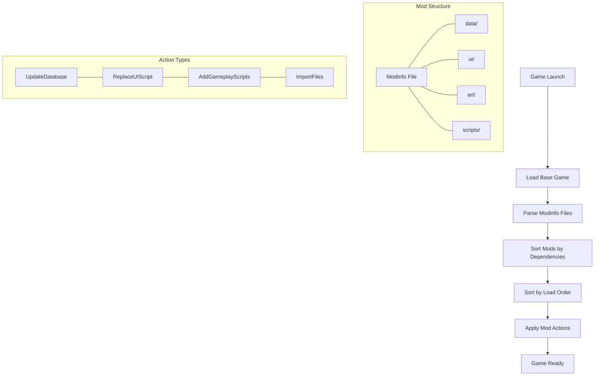

# Civilization VII Mod Structure

This document explains the structure and organization of Civilization VII mods, including how to properly set up your mod files and directories.

## Table of Contents
- [Overview](#overview)
- [Mod Directory Location](#mod-directory-location)
- [Basic Mod Structure](#basic-mod-structure)
- [The ModInfo File](#the-modinfo-file)
- [Folder Organization](#folder-organization)
- [Load Order](#load-order)
- [Dependencies](#dependencies)
- [Action Criteria](#action-criteria)
- [Mermaid Visualization](#mermaid-visualization)

## Overview

A Civilization VII mod consists of:
1. A unique folder in the game's Mods directory
2. A `.modinfo` XML file that defines the mod and its properties
3. Various content files organized into subdirectories

## Mod Directory Location

Your mods should be placed in the following directory:

| Platform | Path |
|----------|------|
| Windows | `C:\Users\[YourUsername]\Documents\My Games\Civilization VII\Mods` |
| macOS | `/Users/[YourUsername]/Library/Application Support/Civilization VII/Mods` |
| Linux | `~/.local/share/Civilization VII/Mods` |

## Basic Mod Structure

Here's a typical mod directory structure:

```
MyAwesomeMod/
├── myawesomemod.modinfo
├── data/
│   ├── gameplay_changes.sql
│   └── text_additions.sql
├── ui/
│   ├── Panels/
│   │   └── CustomPanel.xml
│   ├── Styles/
│   │   └── CustomStyle.css
│   └── Scripts/
│       └── CustomLogic.js
├── art/
│   ├── Icons/
│   │   └── custom_icon.png
│   └── Leaders/
│       └── custom_leader.png
└── scripts/
    └── custom_script.lua
```

## The ModInfo File

The `.modinfo` file is an XML file that defines your mod to the game. It must be placed in the root directory of your mod and should have the same name as your mod folder (with `.modinfo` extension).

### Basic Structure

```xml
<?xml version="1.0" encoding="utf-8"?>
<Mod id="com.example.myawesomemod" version="1"
	xmlns="ModInfo">
	<Properties>
		<Name>My Awesome Mod</Name>
		<Description>Description of what your mod does.</Description>
		<Authors>Your Name</Authors>
		<Package>Mod</Package>
	</Properties>
	<Dependencies>
		<Mod id="base-standard" title="LOC_MODULE_BASE_STANDARD_NAME"/>
	</Dependencies>
	<ActionCriteria>
		<Criteria id="always">
			<AlwaysMet></AlwaysMet>
		</Criteria>
	</ActionCriteria>
	<ActionGroups>
		<ActionGroup id="base-game-main" scope="game" criteria="always">
			<Properties>
				<LoadOrder>10</LoadOrder>
			</Properties>
			<Actions>
				<UpdateDatabase>
					<Item>data/gameplay_changes.sql</Item>
					<Item>data/text_additions.sql</Item>
				</UpdateDatabase>
				<ReplaceUIScript id="custom-panel">
					<File>ui/Panels/CustomPanel.xml</File>
				</ReplaceUIScript>
			</Actions>
		</ActionGroup>
	</ActionGroups>
</Mod>
```

### Key Elements

1. **Mod ID**: A unique identifier for your mod. Use reverse domain notation (e.g., `com.yourusername.modname`).
2. **Version**: The version number of your mod.
3. **Properties**:
   - `<Name>`: The display name of your mod.
   - `<Description>`: A brief description of what your mod does.
   - `<Authors>`: The mod creator's name.
   - `<Package>`: The type of package (usually "Mod").
4. **Dependencies**: Other mods or game modules that your mod requires.
5. **ActionCriteria**: Conditions for when actions should be performed.
6. **ActionGroups**: Groups of actions that your mod will perform.

## Folder Organization

### data/
Contains SQL files that modify the game's database. Common changes include:
- Adjusting unit stats
- Modifying building costs
- Adding new technologies
- Changing terrain yields

### ui/
Contains files for modifying the user interface. Civilization VII uses Coherent UI, which supports:
- XML: For UI layout
- CSS: For styling
- JavaScript: For interactive behavior

Subdirectories typically include:
- `Panels/`: UI layout definitions
- `Styles/`: CSS styling
- `Scripts/`: JavaScript logic

### art/
Contains visual assets such as:
- Icons for new units, buildings, or technologies
- Leader portraits
- Unit models
- Textures
- Animations

### scripts/
Contains Lua scripts for custom gameplay logic, such as:
- Custom events
- Special abilities
- Unique gameplay mechanics

## Load Order

The `<LoadOrder>` tag in your `.modinfo` file determines when your mod loads relative to other mods. Lower numbers load earlier, higher numbers load later.

Guidelines:
- `1-9`: Core system modifications
- `10-99`: Gameplay changes
- `100+`: UI and cosmetic changes

If your mod needs to override changes made by another mod, give it a higher load order number.

## Dependencies

The `<Dependencies>` section lists other mods that must be loaded before your mod.

Example:
```xml
<Dependencies>
	<Mod id="base-standard" title="LOC_MODULE_BASE_STANDARD_NAME"/>
	<Mod id="another-mod-id" title="Another Required Mod"/>
</Dependencies>
```

Always include a dependency on `base-standard` for most mods.

## Action Criteria

Action criteria define conditions for when mod actions should be performed. Common criteria include:

```xml
<ActionCriteria>
	<!-- Always applied -->
	<Criteria id="always">
		<AlwaysMet></AlwaysMet>
	</Criteria>
	
	<!-- Only for single player games -->
	<Criteria id="single-player">
		<IsSinglePlayer></IsSinglePlayer>
	</Criteria>
	
	<!-- Only for multiplayer games -->
	<Criteria id="multiplayer">
		<IsMultiplayer></IsMultiplayer>
	</Criteria>
</ActionCriteria>
```

## Mermaid Visualization

Here is a visualization of the mod structure and loading process:



This diagram shows how mods are loaded and processed by the game, from launch to application.

## Common Mistakes to Avoid

1. **Incorrect Mod ID**: Ensure your mod ID is unique and follows the recommended format.
2. **Missing Dependencies**: Always include necessary dependencies.
3. **Wrong Load Order**: Incorrect load order can cause conflicts with other mods.
4. **Invalid File Paths**: Ensure all file paths in your `.modinfo` file are correct.
5. **XML Formatting Errors**: Validate your XML files to catch syntax errors.

## Additional Resources

- [Database Modding Guide](./database-modding.md)
- [UI Modding Guide](./ui-modding.md)
- [Asset Creation Guide](./asset-creation.md)

---

*Remember: A well-organized mod structure makes development, debugging, and maintenance much easier!* 