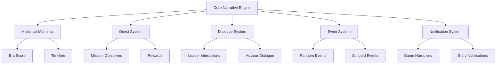

# Narrative and Storytelling Systems in Civilization VII

This guide covers the narrative systems in Civilization VII, including how to create custom scenarios, add storytelling elements, and modify existing narrative content.

## Table of Contents
- [Introduction to Narrative Systems](#introduction-to-narrative-systems)
- [Narrative Architecture Overview](#narrative-architecture-overview)
- [Creating Historical Moments](#creating-historical-moments)
- [Custom Quests and Missions](#custom-quests-and-missions)
- [Scenario Creation](#scenario-creation)
- [Dialogue and Leader Interactions](#dialogue-and-leader-interactions)
- [Civilization Narrative Elements](#civilization-narrative-elements)
- [Event-Driven Storytelling](#event-driven-storytelling)
- [Narrative Triggers and Conditions](#narrative-triggers-and-conditions)
- [Localization Techniques](#localization-techniques)
- [Examples](#examples)

## Introduction to Narrative Systems

Civilization VII continues the series tradition of both emergent and scripted narrative elements. The narrative systems allow modders to:

- Create custom historical scenarios
- Add new historical moments and golden ages
- Define quest structures and missions
- Script custom dialogue for leaders
- Add unique narrative events tied to gameplay
- Create dynamic story elements that respond to player actions

Narratives in Civilization VII blend gameplay with storytelling, reinforcing the game's historical themes and adding personality to civilizations and leaders.

## Narrative Architecture Overview

Civilization VII's narrative systems are divided into several interconnected components:



The key database tables involved in narrative include:
- `HistoricalMoments`
- `Quests`
- `QuestObjectives`
- `Dialogues`
- `NarrativeEvents`
- `NarrativeTriggers`
- `NarrativeResponses`

## Creating Historical Moments

Historical Moments are significant achievements that generate Era Score and appear in the game's timeline. To create custom Historical Moments:

1. Create an SQL file (e.g., `custom_moments.sql`) in your mod's `data/` directory
2. Add entries to the appropriate tables:

```sql
-- Add a new Historical Moment Type
INSERT INTO Types (Type, Kind)
VALUES ('MOMENT_DISCOVERED_ANCIENT_RUINS', 'KIND_MOMENT');

-- Add the Historical Moment details
INSERT INTO HistoricalMoments (
    MomentType,
    Name,
    Description,
    InstanceDescription,
    IconAsset,
    EraScore,
    Visibility
)
VALUES (
    'MOMENT_DISCOVERED_ANCIENT_RUINS',
    'LOC_MOMENT_DISCOVERED_ANCIENT_RUINS_NAME',
    'LOC_MOMENT_DISCOVERED_ANCIENT_RUINS_DESCRIPTION',
    'LOC_MOMENT_DISCOVERED_ANCIENT_RUINS_INSTANCE_DESCRIPTION',
    'ICON_MOMENT_DISCOVERED_ANCIENT_RUINS',
    3, -- Era Score value
    'Civilization' -- Visibility: Player, Civilization, or Global
);

-- Add triggers for when this moment occurs
INSERT INTO MomentIllustrations (
    MomentType,
    MomentAsset,
    GameDataType,
    Texture
)
VALUES (
    'MOMENT_DISCOVERED_ANCIENT_RUINS',
    'MOMENT_ASSET_DISCOVERED_ANCIENT_RUINS',
    'GAMEDATA_CIVILIZATION',
    'moment_discovered_ancient_ruins.dds'
);

-- Add localization
INSERT OR REPLACE INTO LocalizedText (Tag, Language, Text)
VALUES
    ('LOC_MOMENT_DISCOVERED_ANCIENT_RUINS_NAME', 'en_US', 'Ancient Ruins Discovered'),
    ('LOC_MOMENT_DISCOVERED_ANCIENT_RUINS_DESCRIPTION', 'en_US', 'Your explorers have discovered the remains of an ancient civilization.'),
    ('LOC_MOMENT_DISCOVERED_ANCIENT_RUINS_INSTANCE_DESCRIPTION', 'en_US', 'Explorers from {1_Civilization} have discovered ancient ruins, providing valuable insights into the past.');
```

3. Register the SQL file in your `.modinfo`:

```xml
<UpdateDatabase>
    <File>data/custom_moments.sql</File>
</UpdateDatabase>
```

## Custom Quests and Missions

Quests provide players with optional objectives and rewards. To create custom quests:

```sql
-- Add a new Quest Type
INSERT INTO Types (Type, Kind)
VALUES ('QUEST_DISCOVER_THREE_NATURAL_WONDERS', 'KIND_QUEST');

-- Add the Quest details
INSERT INTO Quests (
    QuestType,
    Name,
    Description,
    InstanceDescription,
    Rewards,
    RequiresOcean,
    RequiresNoOcean,
    MinimumGameTurn,
    MaximumGameTurn,
    TargetNumberRequired
)
VALUES (
    'QUEST_DISCOVER_THREE_NATURAL_WONDERS',
    'LOC_QUEST_DISCOVER_THREE_NATURAL_WONDERS_NAME',
    'LOC_QUEST_DISCOVER_THREE_NATURAL_WONDERS_DESCRIPTION',
    'LOC_QUEST_DISCOVER_THREE_NATURAL_WONDERS_INSTANCE',
    'LOC_QUEST_DISCOVER_THREE_NATURAL_WONDERS_REWARDS',
    0, -- Requires Ocean
    0, -- Requires No Ocean
    30, -- Minimum Game Turn
    150, -- Maximum Game Turn
    3 -- Target Number Required
);

-- Add Quest Rewards
INSERT INTO QuestRewards (QuestType, RewardType, Amount)
VALUES 
    ('QUEST_DISCOVER_THREE_NATURAL_WONDERS', 'REWARD_GOLD', 250),
    ('QUEST_DISCOVER_THREE_NATURAL_WONDERS', 'REWARD_FAITH', 100),
    ('QUEST_DISCOVER_THREE_NATURAL_WONDERS', 'REWARD_INSPIRATION', 1);

-- Add Localization
INSERT OR REPLACE INTO LocalizedText (Tag, Language, Text)
VALUES
    ('LOC_QUEST_DISCOVER_THREE_NATURAL_WONDERS_NAME', 'en_US', 'Natural Wonders Expedition'),
    ('LOC_QUEST_DISCOVER_THREE_NATURAL_WONDERS_DESCRIPTION', 'en_US', 'Discover three Natural Wonders anywhere in the world.'),
    ('LOC_QUEST_DISCOVER_THREE_NATURAL_WONDERS_INSTANCE', 'en_US', '{1_Civilization} has discovered {2_Count} out of 3 Natural Wonders.'),
    ('LOC_QUEST_DISCOVER_THREE_NATURAL_WONDERS_REWARDS', 'en_US', 'Receive 250 Gold, 100 Faith, and a random Inspiration.');
```

Then, create a Lua script to handle the quest logic:

```lua
-- custom_quests.lua
function OnNaturalWonderDiscovered(playerID, wonderID)
    local player = Players[playerID];
    if not player then return; end
    
    local questManager = Game.GetQuestManager();
    local questInstance = questManager:GetActiveQuestInstance(playerID, "QUEST_DISCOVER_THREE_NATURAL_WONDERS");
    
    if questInstance then
        local progress = questInstance:GetProgress();
        questInstance:SetProgress(progress + 1);
        
        if progress + 1 >= 3 then
            questInstance:Complete();
            -- Apply rewards
            player:AddGold(250);
            player:AddFaith(100);
            -- Grant random inspiration
            local techManager = player:GetTechs();
            -- Implementation for granting inspiration...
        end
    end
end

-- Register event handler
GameEvents.NaturalWonderDiscovered.Add(OnNaturalWonderDiscovered);
```

Register the script in your `.modinfo`:

```xml
<AddGameplayScripts>
    <File>scripts/custom_quests.lua</File>
</AddGameplayScripts>
```

## Scenario Creation

Scenarios are custom, narrative-driven gameplay experiences with specific win conditions, starting positions, and historical context. Creating a complete scenario involves several components:

### 1. Define the Basic Scenario Structure

```sql
-- Scenario definition
INSERT INTO Scenarios (ScenarioType, Name, Description, StartTurn, EndTurn)
VALUES (
    'SCENARIO_AMERICAN_CIVIL_WAR',
    'LOC_SCENARIO_AMERICAN_CIVIL_WAR_NAME',
    'LOC_SCENARIO_AMERICAN_CIVIL_WAR_DESCRIPTION',
    1861, -- Start Year
    1865  -- End Year
);

-- Scenario Civilizations
INSERT INTO ScenarioCivilizations (ScenarioType, CivilizationType, LeaderType)
VALUES 
    ('SCENARIO_AMERICAN_CIVIL_WAR', 'CIVILIZATION_AMERICA', 'LEADER_ABRAHAM_LINCOLN'),
    ('SCENARIO_AMERICAN_CIVIL_WAR', 'CIVILIZATION_CONFEDERACY', 'LEADER_JEFFERSON_DAVIS');

-- Scenario Victory Conditions
INSERT INTO ScenarioVictoryConditions (ScenarioType, VictoryType)
VALUES ('SCENARIO_AMERICAN_CIVIL_WAR', 'VICTORY_DOMINATION');

-- Scenario Player Data
INSERT INTO ScenarioPlayers (
    ScenarioType, 
    CivilizationType, 
    LeaderType, 
    CityName, 
    StartingX, 
    StartingY
)
VALUES
    ('SCENARIO_AMERICAN_CIVIL_WAR', 'CIVILIZATION_AMERICA', 'LEADER_ABRAHAM_LINCOLN', 'Washington', 52, 60),
    ('SCENARIO_AMERICAN_CIVIL_WAR', 'CIVILIZATION_CONFEDERACY', 'LEADER_JEFFERSON_DAVIS', 'Richmond', 54, 57);
```

### 2. Create a Custom Map for the Scenario

Use WorldBuilder to create a historical map of the United States during the Civil War era, or create a map script as described in the [Map Editing](./map-editing.md) documentation.

### 3. Create Scenario-Specific Units and Buildings

```sql
-- Add Confederate-specific units
INSERT INTO Types (Type, Kind)
VALUES ('UNIT_CONFEDERATE_CAVALRY', 'KIND_UNIT');

INSERT INTO Units (
    UnitType,
    Name,
    Description,
    Cost,
    Combat,
    BaseMoves,
    TraitType
)
VALUES (
    'UNIT_CONFEDERATE_CAVALRY',
    'LOC_UNIT_CONFEDERATE_CAVALRY_NAME',
    'LOC_UNIT_CONFEDERATE_CAVALRY_DESCRIPTION',
    150,
    45,
    4,
    'TRAIT_CIVILIZATION_UNIT_CONFEDERATE_CAVALRY'
);
```

### 4. Create Narrative Events for the Scenario

```sql
-- Add narrative events
INSERT INTO NarrativeEvents (
    EventType,
    Name,
    Description,
    TriggeredBy,
    Image
)
VALUES (
    'NARRATIVE_EVENT_GETTYSBURG',
    'LOC_NARRATIVE_EVENT_GETTYSBURG_NAME',
    'LOC_NARRATIVE_EVENT_GETTYSBURG_DESCRIPTION',
    'TRIGGER_TURN_STARTED',
    'gettysburg_battle.dds'
);

-- Add event triggers
INSERT INTO NarrativeEventTriggers (
    EventType,
    TriggerType,
    TurnNumber,
    Value
)
VALUES ('NARRATIVE_EVENT_GETTYSBURG', 'TRIGGER_TURN_STARTED', 1863, NULL);

-- Add event choices
INSERT INTO NarrativeEventChoices (
    EventType,
    ChoiceNumber,
    Description,
    Outcome
)
VALUES
    ('NARRATIVE_EVENT_GETTYSBURG', 1, 'LOC_NARRATIVE_EVENT_GETTYSBURG_CHOICE1', 'LOC_NARRATIVE_EVENT_GETTYSBURG_OUTCOME1'),
    ('NARRATIVE_EVENT_GETTYSBURG', 2, 'LOC_NARRATIVE_EVENT_GETTYSBURG_CHOICE2', 'LOC_NARRATIVE_EVENT_GETTYSBURG_OUTCOME2');

-- Add choice effects
INSERT INTO NarrativeEventEffects (
    EventType,
    ChoiceNumber,
    EffectType,
    Value
)
VALUES
    ('NARRATIVE_EVENT_GETTYSBURG', 1, 'EFFECT_GRANT_UNIT', 'UNIT_INFANTRY'),
    ('NARRATIVE_EVENT_GETTYSBURG', 2, 'EFFECT_GRANT_COMBAT_BONUS', '5');
```

### 5. Create Scenario-Specific Objectives

```sql
-- Add scenario objectives
INSERT INTO ScenarioObjectives (
    ScenarioType,
    ObjectiveType,
    Name,
    Description,
    CompletionReward
)
VALUES (
    'SCENARIO_AMERICAN_CIVIL_WAR',
    'OBJECTIVE_CAPTURE_CAPITAL',
    'LOC_OBJECTIVE_CAPTURE_CAPITAL_NAME',
    'LOC_OBJECTIVE_CAPTURE_CAPITAL_DESCRIPTION',
    'LOC_OBJECTIVE_CAPTURE_CAPITAL_REWARD'
);
```

### 6. Register All Files in modinfo

```xml
<AddGameplayScripts>
    <File>scripts/civilwar_scenario.lua</File>
</AddGameplayScripts>
<AddUserInterfaces>
    <File>ui/Scenarios/CivilWarScenario.xml</File>
</AddUserInterfaces>
<UpdateDatabase>
    <File>data/civilwar_scenario.sql</File>
    <File>data/civilwar_units.sql</File>
    <File>data/civilwar_narrative.sql</File>
</UpdateDatabase>
```

## Dialogue and Leader Interactions

Civilization VII uses a dialogue system for leader interactions. You can modify or add custom dialogue:

```sql
-- Add new diplomatic dialogue
INSERT INTO DiplomaticDialogues (DialogueType, LeaderType, Mood, Text)
VALUES 
    ('DIALOGUE_GREETING', 'LEADER_SULEIMAN', 'MOOD_FRIENDLY', 'LOC_DIPLOMACY_GREETING_SULEIMAN_FRIENDLY'),
    ('DIALOGUE_GREETING', 'LEADER_SULEIMAN', 'MOOD_NEUTRAL', 'LOC_DIPLOMACY_GREETING_SULEIMAN_NEUTRAL'),
    ('DIALOGUE_GREETING', 'LEADER_SULEIMAN', 'MOOD_HOSTILE', 'LOC_DIPLOMACY_GREETING_SULEIMAN_HOSTILE');

-- Add diplomatic responses
INSERT INTO DiplomaticResponses (DialogueType, ResponseType, LeaderType, Text)
VALUES
    ('DIALOGUE_GREETING', 'RESPONSE_POSITIVE', 'LEADER_SULEIMAN', 'LOC_DIPLOMACY_RESPONSE_POSITIVE_SULEIMAN'),
    ('DIALOGUE_GREETING', 'RESPONSE_NEUTRAL', 'LEADER_SULEIMAN', 'LOC_DIPLOMACY_RESPONSE_NEUTRAL_SULEIMAN'),
    ('DIALOGUE_GREETING', 'RESPONSE_NEGATIVE', 'LEADER_SULEIMAN', 'LOC_DIPLOMACY_RESPONSE_NEGATIVE_SULEIMAN');

-- Add localization
INSERT OR REPLACE INTO LocalizedText (Tag, Language, Text)
VALUES
    ('LOC_DIPLOMACY_GREETING_SULEIMAN_FRIENDLY', 'en_US', 'Greetings, friend! The Ottoman court welcomes you with open arms. Let us discuss matters of state in a cordial manner.'),
    ('LOC_DIPLOMACY_GREETING_SULEIMAN_NEUTRAL', 'en_US', 'The Ottoman Empire acknowledges your presence. State your business, and we shall see if there is common ground between us.'),
    ('LOC_DIPLOMACY_GREETING_SULEIMAN_HOSTILE', 'en_US', 'Your audacity in approaching the Sublime Porte after your transgressions shows either bravery or foolishness. Which is it, I wonder?');
```

## Civilization Narrative Elements

Each civilization has unique narrative elements that give it character and historical context:

```sql
-- Add civilization historical info
INSERT INTO CivilizationHistoricalInfo (
    CivilizationType,
    ShortDescription,
    LongDescription
)
VALUES (
    'CIVILIZATION_ZULU',
    'LOC_CIVILIZATION_ZULU_SHORT_DESCRIPTION',
    'LOC_CIVILIZATION_ZULU_LONG_DESCRIPTION'
);

-- Add Civilization quotes for technologies and civics
INSERT INTO CivilizationQuotes (
    CivilizationType,
    QuoteType,
    QuotedObject,
    Text
)
VALUES
    ('CIVILIZATION_ZULU', 'QUOTE_TECH', 'TECH_MILITARY_TACTICS', 'LOC_QUOTE_ZULU_MILITARY_TACTICS'),
    ('CIVILIZATION_ZULU', 'QUOTE_CIVIC', 'CIVIC_MILITARY_TRADITION', 'LOC_QUOTE_ZULU_MILITARY_TRADITION');

-- Add localization
INSERT OR REPLACE INTO LocalizedText (Tag, Language, Text)
VALUES
    ('LOC_CIVILIZATION_ZULU_SHORT_DESCRIPTION', 'en_US', 'The Zulu Kingdom rose to prominence in the early 19th century under the leadership of Shaka, transforming from a small clan into a formidable empire.'),
    ('LOC_CIVILIZATION_ZULU_LONG_DESCRIPTION', 'en_US', 'The Zulu Kingdom was one of the most powerful states in southern Africa during the 19th century. Under Shaka''s rule from 1816 to 1828, the Zulu transformed their military organization and tactics, expanding their territory and influence dramatically. Their innovative military formations and weaponry made them a formidable force against both neighboring African states and European colonial powers. Though eventually conquered by the British in 1879, the Zulu legacy of military excellence and cultural resilience continues to inspire.'),
    ('LOC_QUOTE_ZULU_MILITARY_TACTICS', 'en_US', '"The victory is not in the weapon, but in the warrior." - Zulu proverb');
```

## Event-Driven Storytelling

Create custom events triggered by in-game actions to develop dynamic narratives:

```lua
-- event_storytelling.lua
function Initialize()
    -- Register for events
    GameEvents.CityFoundedNearNaturalWonder.Add(OnCityFoundedNearWonder);
    GameEvents.UnitKilledInCombat.Add(OnUnitKilledInCombat);
    GameEvents.PlayerEraChanged.Add(OnPlayerEraChanged);
end

function OnCityFoundedNearWonder(playerID, cityID, wonderTypeID)
    local player = Players[playerID];
    local city = CityManager.GetCity(playerID, cityID);
    local wonderType = GameInfo.Features[wonderTypeID].FeatureType;
    
    if player and city and wonderType then
        local wonderName = Locale.Lookup(GameInfo.Features[wonderTypeID].Name);
        local cityName = city:GetName();
        
        -- Create narrative event
        local message = Locale.Lookup("LOC_NARRATIVE_CITY_NEAR_WONDER", cityName, wonderName);
        Game.AddWorldViewText(playerID, message, city:GetX(), city:GetY());
        
        -- Check for special wonder conditions and create custom effects
        if wonderType == "FEATURE_MOUNT_EVEREST" then
            -- Give special bonus for settling near Mount Everest
            city:ChangeGrowth(20);
            NotificationManager.SendNotification(playerID, NotificationTypes.CITY_GROWTH, message, cityName);
        end
    end
end

function OnPlayerEraChanged(playerID, eraIndex)
    local player = Players[playerID];
    if not player or player:IsBarbarian() then return; end
    
    local eraType = GameInfo.Eras[eraIndex].EraType;
    local playerConfig = PlayerConfigurations[playerID];
    local leaderType = playerConfig:GetLeaderTypeName();
    
    -- Play custom narrative for specific leader entering a specific era
    if leaderType == "LEADER_CLEOPATRA" and eraType == "ERA_INDUSTRIAL" then
        local narrativeText = Locale.Lookup("LOC_NARRATIVE_CLEOPATRA_INDUSTRIAL");
        
        -- Display a custom notification with choices
        local choices = {};
        table.insert(choices, {
            Text = Locale.Lookup("LOC_NARRATIVE_CLEOPATRA_INDUSTRIAL_CHOICE1"),
            Callback = function() OnCleopatraChoice1(playerID); end
        });
        table.insert(choices, {
            Text = Locale.Lookup("LOC_NARRATIVE_CLEOPATRA_INDUSTRIAL_CHOICE2"),
            Callback = function() OnCleopatraChoice2(playerID); end
        });
        
        -- Show as an event popup
        Game.ShowNarrativeDialog(narrativeText, "CLEOPATRA_INDUSTRIAL.dds", choices);
    end
end

-- Register initialization
Events.LoadScreenClose.Add(Initialize);
```

## Narrative Triggers and Conditions

Create complex narrative conditions using database entries and Lua:

```sql
-- Add narrative trigger conditions
INSERT INTO NarrativeTriggerConditions (
    TriggerType,
    ConditionType,
    ComparisonType,
    Value
)
VALUES
    ('TRIGGER_CITY_CAPTURED', 'CONDITION_CITY_POPULATION', 'COMPARISON_GREATER_THAN', 10),
    ('TRIGGER_CITY_CAPTURED', 'CONDITION_CITY_IS_CAPITAL', 'COMPARISON_EQUALS', 1);
```

```lua
-- Lua implementation for handling complex trigger conditions
function CheckNarrativeTriggerConditions(triggerType, parameters)
    local conditions = GameInfo.NarrativeTriggerConditions[triggerType];
    
    for _, condition in ipairs(conditions) do
        if condition.ConditionType == "CONDITION_CITY_POPULATION" then
            if parameters.CityPopulation <= condition.Value then
                return false;
            end
        elseif condition.ConditionType == "CONDITION_CITY_IS_CAPITAL" then
            if parameters.IsCapital ~= (condition.Value == 1) then
                return false;
            end
        end
        -- More condition checks
    end
    
    return true; -- All conditions satisfied
end

function OnCityCaptured(playerID, cityID, capturingPlayerID)
    local city = CityManager.GetCity(playerID, cityID);
    if not city then return; end
    
    local parameters = {
        CityPopulation = city:GetPopulation(),
        IsCapital = city:IsCapital()
    };
    
    if CheckNarrativeTriggerConditions("TRIGGER_CITY_CAPTURED", parameters) then
        -- Trigger narrative event
        TriggerNarrativeEvent("NARRATIVE_EVENT_MAJOR_CITY_CAPTURED", playerID, capturingPlayerID);
    end
end
```

## Localization Techniques

For narrative content, effective localization is crucial:

```sql
-- Base text entry
INSERT OR REPLACE INTO LocalizedText (Tag, Language, Text)
VALUES ('LOC_NARRATIVE_WONDER_COMPLETED', 'en_US', 'The [ICON_Capital] {1_WonderName} has been completed in {2_CityName}, standing as a testament to the greatness of {3_CivilizationName}.');

-- Add variations for different civilizations
INSERT OR REPLACE INTO LocalizedText (Tag, Language, Text)
VALUES 
    ('LOC_NARRATIVE_WONDER_COMPLETED_ROME', 'en_US', 'The magnificent [ICON_Capital] {1_WonderName} now adorns {2_CityName}, adding to the eternal glory of Rome.'),
    ('LOC_NARRATIVE_WONDER_COMPLETED_EGYPT', 'en_US', 'The majestic [ICON_Capital] {1_WonderName} rises in {2_CityName}, continuing Egypt''s legacy of architectural marvels.');
```

Use placeholders and markup consistently to create dynamic, rich text:

```lua
function FormatNarrativeText(baseText, parameters)
    local formattedText = baseText;
    
    -- Replace parameter placeholders
    for key, value in pairs(parameters) do
        formattedText = string.gsub(formattedText, "{" .. key .. "}", value);
    end
    
    -- Process special markup for icons and formatting
    formattedText = string.gsub(formattedText, "%[ICON_(%w+)%]", function(iconName)
        return GetIconString(iconName);
    end);
    
    return formattedText;
end
```

## Examples

### Example 1: Custom Historical Narrative Event

This example creates a special narrative event that triggers when players discover steam power:

```sql
-- custom_tech_narratives.sql
INSERT INTO NarrativeEvents (
    EventType,
    Name,
    Description,
    TriggeredBy,
    Image
)
VALUES (
    'NARRATIVE_EVENT_INDUSTRIAL_REVOLUTION',
    'LOC_NARRATIVE_EVENT_INDUSTRIAL_REVOLUTION_NAME',
    'LOC_NARRATIVE_EVENT_INDUSTRIAL_REVOLUTION_DESCRIPTION',
    'TRIGGER_TECH_DISCOVERED',
    'industrial_revolution.dds'
);

INSERT INTO NarrativeEventTriggers (
    EventType,
    TriggerType,
    TechnologyType
)
VALUES ('NARRATIVE_EVENT_INDUSTRIAL_REVOLUTION', 'TRIGGER_TECH_DISCOVERED', 'TECH_STEAM_POWER');

INSERT INTO NarrativeEventChoices (
    EventType,
    ChoiceNumber,
    Description,
    Outcome
)
VALUES
    ('NARRATIVE_EVENT_INDUSTRIAL_REVOLUTION', 1, 'LOC_NARRATIVE_EVENT_INDUSTRIAL_REVOLUTION_CHOICE1', 'LOC_NARRATIVE_EVENT_INDUSTRIAL_REVOLUTION_OUTCOME1'),
    ('NARRATIVE_EVENT_INDUSTRIAL_REVOLUTION', 2, 'LOC_NARRATIVE_EVENT_INDUSTRIAL_REVOLUTION_CHOICE2', 'LOC_NARRATIVE_EVENT_INDUSTRIAL_REVOLUTION_OUTCOME2');

INSERT INTO NarrativeEventEffects (
    EventType,
    ChoiceNumber,
    EffectType,
    Value
)
VALUES
    ('NARRATIVE_EVENT_INDUSTRIAL_REVOLUTION', 1, 'EFFECT_GRANT_PRODUCTION_BONUS', '25'),
    ('NARRATIVE_EVENT_INDUSTRIAL_REVOLUTION', 2, 'EFFECT_GRANT_TECHNOLOGY_BOOST', 'TECH_INDUSTRIALIZATION');

INSERT OR REPLACE INTO LocalizedText (Tag, Language, Text)
VALUES
    ('LOC_NARRATIVE_EVENT_INDUSTRIAL_REVOLUTION_NAME', 'en_US', 'The Industrial Revolution'),
    ('LOC_NARRATIVE_EVENT_INDUSTRIAL_REVOLUTION_DESCRIPTION', 'en_US', 'With the harnessing of steam power, a new age of industry is dawning across your civilization. Factories are being built, urban centers are growing, and the countryside is changing rapidly. This revolution in production methods promises great wealth, but also brings social upheaval and environmental consequences.'),
    ('LOC_NARRATIVE_EVENT_INDUSTRIAL_REVOLUTION_CHOICE1', 'en_US', 'Embrace industrialization fully - build factories in every city'),
    ('LOC_NARRATIVE_EVENT_INDUSTRIAL_REVOLUTION_CHOICE2', 'en_US', 'Take a more measured approach, focusing on technological advancement'),
    ('LOC_NARRATIVE_EVENT_INDUSTRIAL_REVOLUTION_OUTCOME1', 'en_US', 'Your cities quickly develop industrial capacity, providing an immediate boost to production.'),
    ('LOC_NARRATIVE_EVENT_INDUSTRIAL_REVOLUTION_OUTCOME2', 'en_US', 'Your careful approach to industrialization leads to technological breakthroughs, advancing your civilization toward further innovations.');
```

### Example 2: Leader-Specific Quest Chain

This example creates a multi-stage quest chain specific to Catherine de Medici:

```sql
-- catherine_diplomatic_quests.sql
-- First quest in the chain
INSERT INTO Quests (
    QuestType,
    Name,
    Description,
    InstanceDescription,
    Rewards,
    LeaderType
)
VALUES (
    'QUEST_CATHERINE_DIPLOMATIC_1',
    'LOC_QUEST_CATHERINE_DIPLOMATIC_1_NAME',
    'LOC_QUEST_CATHERINE_DIPLOMATIC_1_DESCRIPTION',
    'LOC_QUEST_CATHERINE_DIPLOMATIC_1_INSTANCE',
    'LOC_QUEST_CATHERINE_DIPLOMATIC_1_REWARDS',
    'LEADER_CATHERINE_DE_MEDICI'
);

INSERT INTO QuestObjectives (
    QuestType,
    ObjectiveType,
    Count
)
VALUES 
    ('QUEST_CATHERINE_DIPLOMATIC_1', 'OBJECTIVE_ESTABLISH_TRADING_POST', 3);

INSERT INTO QuestRewards (
    QuestType,
    RewardType,
    Amount,
    NextQuestType
)
VALUES 
    ('QUEST_CATHERINE_DIPLOMATIC_1', 'REWARD_GOLD', 200, 'QUEST_CATHERINE_DIPLOMATIC_2');

-- Second quest in the chain
INSERT INTO Quests (
    QuestType,
    Name,
    Description,
    InstanceDescription,
    Rewards,
    LeaderType
)
VALUES (
    'QUEST_CATHERINE_DIPLOMATIC_2',
    'LOC_QUEST_CATHERINE_DIPLOMATIC_2_NAME',
    'LOC_QUEST_CATHERINE_DIPLOMATIC_2_DESCRIPTION',
    'LOC_QUEST_CATHERINE_DIPLOMATIC_2_INSTANCE',
    'LOC_QUEST_CATHERINE_DIPLOMATIC_2_REWARDS',
    'LEADER_CATHERINE_DE_MEDICI'
);

INSERT INTO QuestObjectives (
    QuestType,
    ObjectiveType,
    Count
)
VALUES 
    ('QUEST_CATHERINE_DIPLOMATIC_2', 'OBJECTIVE_SEND_DIPLOMATIC_DELEGATION', 2);

INSERT INTO QuestRewards (
    QuestType,
    RewardType,
    Amount,
    NextQuestType
)
VALUES 
    ('QUEST_CATHERINE_DIPLOMATIC_2', 'REWARD_GOVERNOR_TITLE', 1, 'QUEST_CATHERINE_DIPLOMATIC_3');

-- Final quest in the chain
INSERT INTO Quests (
    QuestType,
    Name,
    Description,
    InstanceDescription,
    Rewards,
    LeaderType
)
VALUES (
    'QUEST_CATHERINE_DIPLOMATIC_3',
    'LOC_QUEST_CATHERINE_DIPLOMATIC_3_NAME',
    'LOC_QUEST_CATHERINE_DIPLOMATIC_3_DESCRIPTION',
    'LOC_QUEST_CATHERINE_DIPLOMATIC_3_INSTANCE',
    'LOC_QUEST_CATHERINE_DIPLOMATIC_3_REWARDS',
    'LEADER_CATHERINE_DE_MEDICI'
);

INSERT INTO QuestObjectives (
    QuestType,
    ObjectiveType,
    Count
)
VALUES 
    ('QUEST_CATHERINE_DIPLOMATIC_3', 'OBJECTIVE_ALLIANCE_ANY', 1);

INSERT INTO QuestRewards (
    QuestType,
    RewardType,
    Amount
)
VALUES 
    ('QUEST_CATHERINE_DIPLOMATIC_3', 'REWARD_UNIQUE_UNIT', 1),
    ('QUEST_CATHERINE_DIPLOMATIC_3', 'REWARD_ERA_SCORE', 5);
```

### Example 3: Civilization-Specific Golden Age Bonuses

This example adds unique Golden Age effects for specific civilizations:

```sql
-- custom_golden_ages.sql
INSERT INTO CivilizationGoldenAgeEffects (
    CivilizationType,
    EffectType,
    Value
)
VALUES
    ('CIVILIZATION_GREECE', 'EFFECT_GOLDEN_AGE_SCIENCE_BOOST', '20'),
    ('CIVILIZATION_ROME', 'EFFECT_GOLDEN_AGE_PRODUCTION_BOOST', '15'),
    ('CIVILIZATION_CHINA', 'EFFECT_GOLDEN_AGE_WONDER_BOOST', '25');

INSERT INTO Types (Type, Kind)
VALUES ('MOMENT_ENTERED_GOLDEN_AGE_UNIQUE', 'KIND_MOMENT');

INSERT INTO HistoricalMoments (
    MomentType,
    Name,
    Description,
    InstanceDescription,
    IconAsset,
    EraScore
)
VALUES (
    'MOMENT_ENTERED_GOLDEN_AGE_UNIQUE',
    'LOC_MOMENT_ENTERED_GOLDEN_AGE_UNIQUE_NAME',
    'LOC_MOMENT_ENTERED_GOLDEN_AGE_UNIQUE_DESCRIPTION',
    'LOC_MOMENT_ENTERED_GOLDEN_AGE_UNIQUE_INSTANCE_DESCRIPTION',
    'ICON_MOMENT_ENTERED_GOLDEN_AGE',
    5
);

INSERT INTO MomentIllustrations (
    MomentType,
    MomentAsset,
    GameDataType
)
VALUES
    ('MOMENT_ENTERED_GOLDEN_AGE_UNIQUE', 'MOMENT_ASSET_GOLDEN_AGE_GREECE', 'CIVILIZATION_GREECE'),
    ('MOMENT_ENTERED_GOLDEN_AGE_UNIQUE', 'MOMENT_ASSET_GOLDEN_AGE_ROME', 'CIVILIZATION_ROME'),
    ('MOMENT_ENTERED_GOLDEN_AGE_UNIQUE', 'MOMENT_ASSET_GOLDEN_AGE_CHINA', 'CIVILIZATION_CHINA');
```

## Conclusion

Narrative and storytelling systems in Civilization VII provide powerful tools for modders to enhance gameplay with meaningful context, unique stories, and dynamic event chains. By combining database modifications with custom scripts, you can create deeply engaging narrative experiences that respond to player actions and reinforce the historical themes of the game.

Whether you're creating elaborate historical scenarios, adding personality to leaders, or crafting event chains that unfold across eras, the narrative systems in Civilization VII allow for rich, immersive storytelling that complements the core gameplay.

---

*Remember that great narratives enhance but don't overwhelm gameplay. The best narrative mods find the perfect balance between storytelling and strategy.* 