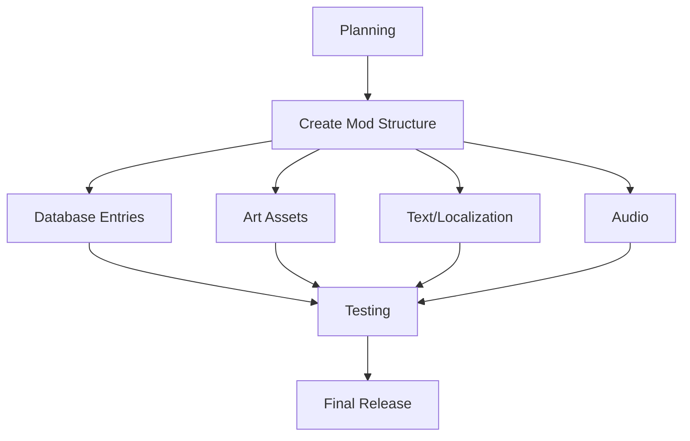

# Adding New Civilizations to Civilization VII

This comprehensive guide walks through the process of creating new civilizations for Civilization VII, including leaders, unique abilities, units, buildings, and all required assets.

## Table of Contents
- [Overview](#overview)
- [Planning Your Civilization](#planning-your-civilization)
- [Creating the Basic Mod Structure](#creating-the-basic-mod-structure)
- [Database Entries](#database-entries)
  - [Civilization Definition](#civilization-definition)
  - [Leader Definition](#leader-definition)
  - [Unique Abilities](#unique-abilities)
  - [Unique Units](#unique-units)
  - [Unique Buildings](#unique-buildings)
  - [Start Bias](#start-bias)
- [Art Assets](#art-assets)
  - [Leader Portraits](#leader-portraits)
  - [Civilization Icon](#civilization-icon)
  - [Unique Unit Models](#unique-unit-models)
  - [Unique Building Models](#unique-building-models)
- [Text and Localization](#text-and-localization)
- [Audio](#audio)
- [Testing and Debugging](#testing-and-debugging)
- [Example: Complete Custom Civilization](#example-complete-custom-civilization)
- [Advanced Topics](#advanced-topics)

## Overview

Creating a new civilization for Civilization VII involves:

1. Design of gameplay attributes
2. Database entries for gameplay mechanics
3. Art assets for visual representation
4. Text and localization for player-facing content
5. Audio for leader speeches and music



## Planning Your Civilization

Before starting development, plan your civilization's characteristics:

### Essential Elements
- **Civilization Name**: The historical civilization you're adding
- **Leader**: The historical figure who will lead your civilization
- **Unique Abilities**: Special bonuses for the civilization and leader
- **Unique Units**: Special units that replace standard units
- **Unique Building/District/Improvement**: Special infrastructure
- **Historical Focus**: What historical aspects to emphasize
- **Gameplay Style**: How the civilization is meant to be played

### Design Considerations
- **Balance**: How powerful are abilities compared to existing civilizations?
- **Uniqueness**: How different is the gameplay from existing civilizations?
- **Historical Accuracy**: How well does it represent the historical civilization?
- **Fun Factor**: Is it enjoyable and interesting to play?

## Creating the Basic Mod Structure

1. Create a new folder in your Civilization VII Mods directory with a descriptive name like `myciv-ottoman-empire`

2. Create the basic folder structure:
```
myciv-ottoman-empire/
├── myciv-ottoman-empire.modinfo
├── data/
│   ├── civilization.sql
│   ├── leader.sql
│   ├── unique_abilities.sql
│   ├── unique_units.sql
│   ├── unique_buildings.sql
│   └── text.sql
├── art/
│   ├── civilization/
│   ├── leader/
│   ├── units/
│   └── buildings/
└── audio/
    ├── leader_speeches/
    └── music/
```

3. Create the `.modinfo` file:

```xml
<?xml version="1.0" encoding="utf-8"?>
<Mod id="com.example.myciv-ottoman-empire" version="1" xmlns="ModInfo">
	<Properties>
		<Name>Ottoman Empire Civilization Pack</Name>
		<Description>Adds the Ottoman Empire civilization led by Suleiman the Magnificent.</Description>
		<Authors>Your Name</Authors>
		<Package>Mod</Package>
	</Properties>
	<Dependencies>
		<Mod id="base-standard" title="LOC_MODULE_BASE_STANDARD_NAME"/>
	</Dependencies>
	<ActionCriteria>
		<Criteria id="always">
			<AlwaysMet></AlwaysMet>
		</Criteria>
	</ActionCriteria>
	<ActionGroups>
		<ActionGroup id="new-civ" scope="game" criteria="always">
			<Properties>
				<LoadOrder>50</LoadOrder>
			</Properties>
			<Actions>
				<UpdateDatabase>
					<Item>data/civilization.sql</Item>
					<Item>data/leader.sql</Item>
					<Item>data/unique_abilities.sql</Item>
					<Item>data/unique_units.sql</Item>
					<Item>data/unique_buildings.sql</Item>
					<Item>data/text.sql</Item>
				</UpdateDatabase>
				<ImportFiles>
					<Items>
						<File>art/civilization/ottoman_icon.png</File>
						<File>art/leader/suleiman_portrait.png</File>
						<!-- More art files -->
					</Items>
				</ImportFiles>
			</Actions>
		</ActionGroup>
	</ActionGroups>
</Mod>
```

## Database Entries

The database entries define all gameplay aspects of your civilization.

### Civilization Definition

Create `data/civilization.sql`:

```sql
-- Add civilization type
INSERT INTO Types (Type, Kind)
VALUES ('CIVILIZATION_OTTOMAN', 'KIND_CIVILIZATION');

-- Add civilization info
INSERT INTO Civilizations (
	CivilizationType,
	Name,
	Description,
	Adjective,
	StartingCivilizationLevel
)
VALUES (
	'CIVILIZATION_OTTOMAN',
	'LOC_CIVILIZATION_OTTOMAN_NAME',
	'LOC_CIVILIZATION_OTTOMAN_DESCRIPTION',
	'LOC_CIVILIZATION_OTTOMAN_ADJECTIVE',
	'CIVILIZATIONLEVEL_FULL'
);

-- Set preferred religion (if applicable)
INSERT INTO CivilizationPreferredReligions (CivilizationType, ReligionType)
VALUES ('CIVILIZATION_OTTOMAN', 'RELIGION_ISLAM');

-- Set starting units
INSERT INTO CivilizationStartingUnits (CivilizationType, UnitType, Count)
VALUES
	('CIVILIZATION_OTTOMAN', 'UNIT_SETTLER', 1),
	('CIVILIZATION_OTTOMAN', 'UNIT_WARRIOR', 2),
	('CIVILIZATION_OTTOMAN', 'UNIT_SCOUT', 1);

-- Set starting technologies
INSERT INTO CivilizationStartingTechnologies (CivilizationType, TechnologyType)
VALUES
	('CIVILIZATION_OTTOMAN', 'TECH_MINING'),
	('CIVILIZATION_OTTOMAN', 'TECH_ANIMAL_HUSBANDRY');

-- Set starting civics
INSERT INTO CivilizationStartingCivics (CivilizationType, CivicType)
VALUES ('CIVILIZATION_OTTOMAN', 'CIVIC_CODE_OF_LAWS');

-- Set civilization colors
INSERT INTO CivilizationColors (CivilizationType, PrimaryColor, SecondaryColor)
VALUES ('CIVILIZATION_OTTOMAN', 'COLOR_OTTOMAN_PRIMARY', 'COLOR_OTTOMAN_SECONDARY');

INSERT INTO Colors (Type, Red, Green, Blue, Alpha)
VALUES
	('COLOR_OTTOMAN_PRIMARY', 204, 0, 0, 255),    -- Red
	('COLOR_OTTOMAN_SECONDARY', 255, 255, 255, 255); -- White
```

### Leader Definition

Create `data/leader.sql`:

```sql
-- Add leader type
INSERT INTO Types (Type, Kind)
VALUES ('LEADER_SULEIMAN', 'KIND_LEADER');

-- Add leader info
INSERT INTO Leaders (
	LeaderType,
	Name,
	InheritFrom,
	SceneLighting
)
VALUES (
	'LEADER_SULEIMAN',
	'LOC_LEADER_SULEIMAN_NAME',
	'LEADER_DEFAULT',
	'SCENE_LIGHTING_AFTERNOON'
);

-- Link leader to civilization
INSERT INTO CivilizationLeaders (LeaderType, CivilizationType, Type)
VALUES ('LEADER_SULEIMAN', 'CIVILIZATION_OTTOMAN', 'CIVILIZATION_LEADER_STANDARD');

-- Add leader portrait
INSERT INTO LeaderPortraits (LeaderType, PortraitType)
VALUES ('LEADER_SULEIMAN', 'PORTRAIT_LEADER_SULEIMAN');

-- Leader agenda
INSERT INTO Types (Type, Kind)
VALUES ('AGENDA_OTTOMAN_EXPANSIONIST', 'KIND_AGENDA');

INSERT INTO Agendas (AgendaType, Name, Description)
VALUES (
	'AGENDA_OTTOMAN_EXPANSIONIST',
	'LOC_AGENDA_OTTOMAN_EXPANSIONIST_NAME',
	'LOC_AGENDA_OTTOMAN_EXPANSIONIST_DESCRIPTION'
);

INSERT INTO LeaderAgendas (LeaderType, AgendaType)
VALUES ('LEADER_SULEIMAN', 'AGENDA_OTTOMAN_EXPANSIONIST');
```

### Unique Abilities

Create `data/unique_abilities.sql`:

```sql
-- Civilization Ability
INSERT INTO Types (Type, Kind)
VALUES ('TRAIT_CIVILIZATION_OTTOMAN_IMPERIAL_EXPANSION', 'KIND_TRAIT');

INSERT INTO Traits (
	TraitType,
	Name,
	Description
)
VALUES (
	'TRAIT_CIVILIZATION_OTTOMAN_IMPERIAL_EXPANSION',
	'LOC_TRAIT_CIVILIZATION_OTTOMAN_IMPERIAL_EXPANSION_NAME',
	'LOC_TRAIT_CIVILIZATION_OTTOMAN_IMPERIAL_EXPANSION_DESCRIPTION'
);

INSERT INTO CivilizationTraits (CivilizationType, TraitType)
VALUES ('CIVILIZATION_OTTOMAN', 'TRAIT_CIVILIZATION_OTTOMAN_IMPERIAL_EXPANSION');

-- Create modifier for faster city growth after conquest
INSERT INTO Modifiers (ModifierId, ModifierType)
VALUES (
	'MODIFIER_OTTOMAN_CONQUERED_CITY_GROWTH',
	'MODIFIER_PLAYER_CAPTURED_CITY_YIELD_CHANGE'
);

INSERT INTO ModifierArguments (ModifierId, Name, Value)
VALUES
	('MODIFIER_OTTOMAN_CONQUERED_CITY_GROWTH', 'YieldType', 'YIELD_FOOD'),
	('MODIFIER_OTTOMAN_CONQUERED_CITY_GROWTH', 'Amount', '3');

-- Attach modifier to trait
INSERT INTO TraitModifiers (TraitType, ModifierId)
VALUES ('TRAIT_CIVILIZATION_OTTOMAN_IMPERIAL_EXPANSION', 'MODIFIER_OTTOMAN_CONQUERED_CITY_GROWTH');

-- Leader Ability
INSERT INTO Types (Type, Kind)
VALUES ('TRAIT_LEADER_SULEIMAN_MAGNIFICENT', 'KIND_TRAIT');

INSERT INTO Traits (
	TraitType,
	Name,
	Description
)
VALUES (
	'TRAIT_LEADER_SULEIMAN_MAGNIFICENT',
	'LOC_TRAIT_LEADER_SULEIMAN_MAGNIFICENT_NAME',
	'LOC_TRAIT_LEADER_SULEIMAN_MAGNIFICENT_DESCRIPTION'
);

INSERT INTO LeaderTraits (LeaderType, TraitType)
VALUES ('LEADER_SULEIMAN', 'TRAIT_LEADER_SULEIMAN_MAGNIFICENT');

-- Create modifier for unique ability (example: combat bonus near capital)
INSERT INTO Modifiers (ModifierId, ModifierType)
VALUES (
	'MODIFIER_SULEIMAN_COMBAT_BONUS',
	'MODIFIER_PLAYER_UNITS_ADJUST_COMBAT_STRENGTH'
);

INSERT INTO ModifierArguments (ModifierId, Name, Value)
VALUES
	('MODIFIER_SULEIMAN_COMBAT_BONUS', 'Amount', '5'),
	('MODIFIER_SULEIMAN_COMBAT_BONUS', 'NearCapital', 'true');

-- Attach modifier to trait
INSERT INTO TraitModifiers (TraitType, ModifierId)
VALUES ('TRAIT_LEADER_SULEIMAN_MAGNIFICENT', 'MODIFIER_SULEIMAN_COMBAT_BONUS');
```

### Unique Units

Create `data/unique_units.sql`:

```sql
-- Janissary (replaces Musketman)
INSERT INTO Types (Type, Kind)
VALUES ('UNIT_OTTOMAN_JANISSARY', 'KIND_UNIT');

INSERT INTO Units (
	UnitType,
	Name,
	Description,
	BaseMoves,
	Combat,
	RangedCombat,
	Cost,
	Maintenance,
	PrereqTech,
	TraitType,
	MandatoryObsoleteTech
)
VALUES (
	'UNIT_OTTOMAN_JANISSARY',
	'LOC_UNIT_OTTOMAN_JANISSARY_NAME',
	'LOC_UNIT_OTTOMAN_JANISSARY_DESCRIPTION',
	2,                  -- Base Moves
	50,                 -- Combat
	60,                 -- Ranged Combat
	200,                -- Cost
	3,                  -- Maintenance
	'TECH_GUNPOWDER',   -- Prerequisite Tech
	'TRAIT_CIVILIZATION_UNIT_OTTOMAN_JANISSARY', -- Trait Type
	'TECH_REPLACEABLE_PARTS' -- Obsolete Tech
);

-- Create trait for the Janissary
INSERT INTO Types (Type, Kind)
VALUES ('TRAIT_CIVILIZATION_UNIT_OTTOMAN_JANISSARY', 'KIND_TRAIT');

INSERT INTO Traits (TraitType, Name)
VALUES ('TRAIT_CIVILIZATION_UNIT_OTTOMAN_JANISSARY', 'LOC_UNIT_OTTOMAN_JANISSARY_NAME');

-- Assign trait to civilization
INSERT INTO CivilizationTraits (CivilizationType, TraitType)
VALUES ('CIVILIZATION_OTTOMAN', 'TRAIT_CIVILIZATION_UNIT_OTTOMAN_JANISSARY');

-- Set unit replacement
INSERT INTO UnitReplaces (UnitType, ReplacesUnitType)
VALUES ('UNIT_OTTOMAN_JANISSARY', 'UNIT_MUSKETMAN');

-- Create Janissary ability
INSERT INTO UnitAbilities (UnitAbilityType, Name, Description)
VALUES (
	'ABILITY_OTTOMAN_JANISSARY',
	'LOC_ABILITY_OTTOMAN_JANISSARY_NAME',
	'LOC_ABILITY_OTTOMAN_JANISSARY_DESCRIPTION'
);

-- Attach ability to unit
INSERT INTO UnitAbilityAttachments (UnitAbilityType, UnitType)
VALUES ('ABILITY_OTTOMAN_JANISSARY', 'UNIT_OTTOMAN_JANISSARY');

-- Create modifier for Janissary ability (combat bonus when attacking)
INSERT INTO Modifiers (ModifierId, ModifierType)
VALUES (
	'MODIFIER_OTTOMAN_JANISSARY_ATTACK',
	'MODIFIER_UNIT_ADJUST_COMBAT_STRENGTH'
);

INSERT INTO ModifierArguments (ModifierId, Name, Value)
VALUES
	('MODIFIER_OTTOMAN_JANISSARY_ATTACK', 'Amount', '10'),
	('MODIFIER_OTTOMAN_JANISSARY_ATTACK', 'AttackingOnly', 'true');

-- Attach modifier to unit ability
INSERT INTO UnitAbilityModifiers (UnitAbilityType, ModifierId)
VALUES ('ABILITY_OTTOMAN_JANISSARY', 'MODIFIER_OTTOMAN_JANISSARY_ATTACK');
```

### Unique Buildings

Create `data/unique_buildings.sql`:

```sql
-- Grand Bazaar (replaces Market)
INSERT INTO Types (Type, Kind)
VALUES ('BUILDING_OTTOMAN_GRAND_BAZAAR', 'KIND_BUILDING');

INSERT INTO Buildings (
	BuildingType,
	Name,
	Description,
	PrereqTech,
	Cost,
	Maintenance,
	TraitType,
	Gold,
	AdjacentDistrict
)
VALUES (
	'BUILDING_OTTOMAN_GRAND_BAZAAR',
	'LOC_BUILDING_OTTOMAN_GRAND_BAZAAR_NAME',
	'LOC_BUILDING_OTTOMAN_GRAND_BAZAAR_DESCRIPTION',
	'TECH_CURRENCY',    -- Prerequisite Tech
	220,                -- Cost
	2,                  -- Maintenance
	'TRAIT_CIVILIZATION_BUILDING_OTTOMAN_GRAND_BAZAAR', -- Trait Type
	6,                  -- Gold
	'DISTRICT_COMMERCIAL_HUB' -- Adjacent District
);

-- Create trait for the Grand Bazaar
INSERT INTO Types (Type, Kind)
VALUES ('TRAIT_CIVILIZATION_BUILDING_OTTOMAN_GRAND_BAZAAR', 'KIND_TRAIT');

INSERT INTO Traits (TraitType, Name)
VALUES ('TRAIT_CIVILIZATION_BUILDING_OTTOMAN_GRAND_BAZAAR', 'LOC_BUILDING_OTTOMAN_GRAND_BAZAAR_NAME');

-- Assign trait to civilization
INSERT INTO CivilizationTraits (CivilizationType, TraitType)
VALUES ('CIVILIZATION_OTTOMAN', 'TRAIT_CIVILIZATION_BUILDING_OTTOMAN_GRAND_BAZAAR');

-- Set building replacement
INSERT INTO BuildingReplaces (BuildingType, ReplacesBuildingType)
VALUES ('BUILDING_OTTOMAN_GRAND_BAZAAR', 'BUILDING_MARKET');

-- Create modifiers for Grand Bazaar (additional trade route)
INSERT INTO Modifiers (ModifierId, ModifierType)
VALUES (
	'MODIFIER_OTTOMAN_GRAND_BAZAAR_TRADE',
	'MODIFIER_PLAYER_ADJUST_TRADE_ROUTE_CAPACITY'
);

INSERT INTO ModifierArguments (ModifierId, Name, Value)
VALUES ('MODIFIER_OTTOMAN_GRAND_BAZAAR_TRADE', 'Amount', '1');

-- Attach modifier to building
INSERT INTO BuildingModifiers (BuildingType, ModifierId)
VALUES ('BUILDING_OTTOMAN_GRAND_BAZAAR', 'MODIFIER_OTTOMAN_GRAND_BAZAAR_TRADE');
```

### Start Bias

Control where your civilization tends to spawn on maps:

```sql
-- Add start bias
INSERT INTO StartBiasTerrains (CivilizationType, TerrainType, Tier)
VALUES
	('CIVILIZATION_OTTOMAN', 'TERRAIN_COAST', 2),
	('CIVILIZATION_OTTOMAN', 'TERRAIN_PLAINS', 3);

INSERT INTO StartBiasFeatures (CivilizationType, FeatureType, Tier)
VALUES ('CIVILIZATION_OTTOMAN', 'FEATURE_FLOODPLAINS', 3);

INSERT INTO StartBiasResources (CivilizationType, ResourceType, Tier)
VALUES ('CIVILIZATION_OTTOMAN', 'RESOURCE_HORSES', 3);
```

## Art Assets

### Leader Portraits

Leader portraits require several files:
- Neutral expression
- Speaking expressions
- Background scene

Place these files in `art/leader/` and reference them in your SQL:

```sql
INSERT INTO LeaderPortraitAssetDependencies (PortraitType, AssetName)
VALUES
	('PORTRAIT_LEADER_SULEIMAN', 'art/leader/suleiman_neutral.png'),
	('PORTRAIT_LEADER_SULEIMAN', 'art/leader/suleiman_background.png'),
	('PORTRAIT_LEADER_SULEIMAN', 'art/leader/suleiman_speaking_a.png'),
	('PORTRAIT_LEADER_SULEIMAN', 'art/leader/suleiman_speaking_b.png');
```

### Civilization Icon

Create a distinctive civilization icon:
- Main civilization icon (used in game menus)
- Atlas-ready versions in multiple sizes

Place these in `art/civilization/` and reference them:

```sql
INSERT INTO CivilizationIcons (CivilizationType, IconType, IconName)
VALUES
	('CIVILIZATION_OTTOMAN', 'ICON_CIVILIZATION_LARGE', 'art/civilization/ottoman_icon_128.png'),
	('CIVILIZATION_OTTOMAN', 'ICON_CIVILIZATION_MEDIUM', 'art/civilization/ottoman_icon_64.png'),
	('CIVILIZATION_OTTOMAN', 'ICON_CIVILIZATION_SMALL', 'art/civilization/ottoman_icon_32.png');
```

### Unique Unit Models

For unique units, you need 3D models and textures, which require specialized tools to create. For simple mods, you might adapt existing assets:

1. Create a new icon for the unique unit:
```sql
INSERT INTO UnitIcons (UnitType, IconType, IconName)
VALUES
	('UNIT_OTTOMAN_JANISSARY', 'ICON_UNIT_LARGE', 'art/units/janissary_icon_128.png'),
	('UNIT_OTTOMAN_JANISSARY', 'ICON_UNIT_MEDIUM', 'art/units/janissary_icon_64.png'),
	('UNIT_OTTOMAN_JANISSARY', 'ICON_UNIT_SMALL', 'art/units/janissary_icon_32.png');
```

2. For 3D models, reference existing models with modifications or use your custom models if available.

### Unique Building Models

Similar to units, buildings require specialized 3D modeling:

```sql
INSERT INTO BuildingIcons (BuildingType, IconType, IconName)
VALUES
	('BUILDING_OTTOMAN_GRAND_BAZAAR', 'ICON_BUILDING_LARGE', 'art/buildings/grand_bazaar_icon_128.png'),
	('BUILDING_OTTOMAN_GRAND_BAZAAR', 'ICON_BUILDING_MEDIUM', 'art/buildings/grand_bazaar_icon_64.png'),
	('BUILDING_OTTOMAN_GRAND_BAZAAR', 'ICON_BUILDING_SMALL', 'art/buildings/grand_bazaar_icon_32.png');
```

## Text and Localization

Create `data/text.sql` to add all text elements shown to players:

```sql
-- Civilization and leader names
INSERT OR REPLACE INTO LocalizedText (Tag, Language, Text)
VALUES
	-- Civilization
	('LOC_CIVILIZATION_OTTOMAN_NAME', 'en_US', 'Ottoman Empire'),
	('LOC_CIVILIZATION_OTTOMAN_DESCRIPTION', 'en_US', 'The Ottoman Empire was one of history's most powerful and long-lasting empires, spanning over 600 years from the late 13th century until the early 20th century.'),
	('LOC_CIVILIZATION_OTTOMAN_ADJECTIVE', 'en_US', 'Ottoman'),
	
	-- Leader
	('LOC_LEADER_SULEIMAN_NAME', 'en_US', 'Suleiman the Magnificent'),
	
	-- Unique Ability Names and Descriptions
	('LOC_TRAIT_CIVILIZATION_OTTOMAN_IMPERIAL_EXPANSION_NAME', 'en_US', 'Imperial Expansion'),
	('LOC_TRAIT_CIVILIZATION_OTTOMAN_IMPERIAL_EXPANSION_DESCRIPTION', 'en_US', 'Conquered cities receive +3 Food per turn and do not lose Population. +20% Production toward districts in conquered cities.'),
	
	('LOC_TRAIT_LEADER_SULEIMAN_MAGNIFICENT_NAME', 'en_US', 'Lord of the Horizons'),
	('LOC_TRAIT_LEADER_SULEIMAN_MAGNIFICENT_DESCRIPTION', 'en_US', 'Units gain +5 Combat Strength when fighting near the Capital. Government Plaza buildings provide an additional +1 of their base yield.'),
	
	-- Unique Units
	('LOC_UNIT_OTTOMAN_JANISSARY_NAME', 'en_US', 'Janissary'),
	('LOC_UNIT_OTTOMAN_JANISSARY_DESCRIPTION', 'en_US', 'Ottoman unique unit that replaces the Musketman. Stronger than the Musketman, with a +10 Combat Strength bonus when attacking.'),
	
	('LOC_ABILITY_OTTOMAN_JANISSARY_NAME', 'en_US', 'Elite Infantry'),
	('LOC_ABILITY_OTTOMAN_JANISSARY_DESCRIPTION', 'en_US', '+10 Combat Strength when attacking.'),
	
	-- Unique Buildings
	('LOC_BUILDING_OTTOMAN_GRAND_BAZAAR_NAME', 'en_US', 'Grand Bazaar'),
	('LOC_BUILDING_OTTOMAN_GRAND_BAZAAR_DESCRIPTION', 'en_US', 'Ottoman unique building that replaces the Market. Provides +6 Gold instead of +3, and grants an additional Trade Route capacity.'),
	
	-- Agenda
	('LOC_AGENDA_OTTOMAN_EXPANSIONIST_NAME', 'en_US', 'Empire Builder'),
	('LOC_AGENDA_OTTOMAN_EXPANSIONIST_DESCRIPTION', 'en_US', 'Always tries to expand their empire. Respects other civilizations that control large territories but dislikes those with small empires.');
```

## Audio

### Leader Speeches

For a complete experience, leaders need voice lines for different diplomatic scenarios. Professional voice acting is ideal, but text-to-speech can work for hobbyist mods:

1. Create audio files for different situations (greetings, declarations of war, etc.)
2. Place them in `audio/leader_speeches/`
3. Reference them in SQL:

```sql
INSERT INTO LeaderSpeechAudio (LeaderType, ScenarioType, AudioFile)
VALUES
	('LEADER_SULEIMAN', 'FIRST_MEET', 'audio/leader_speeches/suleiman_first_meet.wav'),
	('LEADER_SULEIMAN', 'DECLARE_WAR', 'audio/leader_speeches/suleiman_declare_war.wav'),
	('LEADER_SULEIMAN', 'MAKE_PEACE', 'audio/leader_speeches/suleiman_make_peace.wav');
```

### Music

Custom civilization music enhances the experience:

1. Create or acquire music tracks for your civilization
2. Place them in `audio/music/`
3. Reference them in SQL:

```sql
INSERT INTO CivilizationMusic (CivilizationType, MusicType, AudioFile)
VALUES
	('CIVILIZATION_OTTOMAN', 'AMBIENT', 'audio/music/ottoman_ambient.mp3'),
	('CIVILIZATION_OTTOMAN', 'PEACE', 'audio/music/ottoman_peace.mp3'),
	('CIVILIZATION_OTTOMAN', 'WAR', 'audio/music/ottoman_war.mp3');
```

## Testing and Debugging

1. **In-Game Testing**:
   - Enable your mod in the Additional Content menu
   - Start a game with your civilization
   - Check all unique elements function correctly

2. **Common Issues**:
   - Missing art assets: Check file paths
   - Database errors: Check SQL syntax
   - Balance issues: Adjust numbers as needed

3. **Debug Tools**:
   - Enable the in-game console for debugging
   - Use SQL debugging tools to check database entries

## Example: Complete Custom Civilization

For a fully working example, see the accompanying sample mod `ottoman-empire-example` with all necessary files.

## Advanced Topics

### Multiple Leaders for One Civilization

You can add multiple leaders to the same civilization:

```sql
-- Add another leader for the Ottoman Empire
INSERT INTO Types (Type, Kind)
VALUES ('LEADER_MEHMED', 'KIND_LEADER');

INSERT INTO Leaders (LeaderType, Name, InheritFrom, SceneLighting)
VALUES ('LEADER_MEHMED', 'LOC_LEADER_MEHMED_NAME', 'LEADER_DEFAULT', 'SCENE_LIGHTING_AFTERNOON');

INSERT INTO CivilizationLeaders (LeaderType, CivilizationType, Type)
VALUES ('LEADER_MEHMED', 'CIVILIZATION_OTTOMAN', 'CIVILIZATION_LEADER_STANDARD');

-- Add unique ability for this leader
INSERT INTO Types (Type, Kind)
VALUES ('TRAIT_LEADER_MEHMED_CONQUEROR', 'KIND_TRAIT');

INSERT INTO Traits (TraitType, Name, Description)
VALUES (
	'TRAIT_LEADER_MEHMED_CONQUEROR',
	'LOC_TRAIT_LEADER_MEHMED_CONQUEROR_NAME',
	'LOC_TRAIT_LEADER_MEHMED_CONQUEROR_DESCRIPTION'
);

INSERT INTO LeaderTraits (LeaderType, TraitType)
VALUES ('LEADER_MEHMED', 'TRAIT_LEADER_MEHMED_CONQUEROR');
```

### Custom Victory Conditions

You can create civilization-specific victory conditions:

```sql
-- Add a new victory condition
INSERT INTO VictoryConditions (Type, Name, Description, Icon)
VALUES (
	'VICTORY_OTTOMAN_IMPERIAL',
	'LOC_VICTORY_OTTOMAN_IMPERIAL_NAME',
	'LOC_VICTORY_OTTOMAN_IMPERIAL_DESCRIPTION',
	'ICON_VICTORY_OTTOMAN_IMPERIAL'
);

-- Add requirements for the victory
INSERT INTO VictoryRequirements (VictoryType, RequirementType, Value)
VALUES
	('VICTORY_OTTOMAN_IMPERIAL', 'REQUIREMENT_CITIES_CONTROLLED', '20'),
	('VICTORY_OTTOMAN_IMPERIAL', 'REQUIREMENT_WONDERS_BUILT', '5');

-- Make it exclusive to Ottoman
INSERT INTO ExclusiveVictories (VictoryType, CivilizationType)
VALUES ('VICTORY_OTTOMAN_IMPERIAL', 'CIVILIZATION_OTTOMAN');
```

## Additional Resources

- [Database Modding Guide](./database-modding.md) - For detailed database structure information
- [Asset Creation Guide](./asset-creation.md) - For creating civilization art assets
- [Gameplay Modding Guide](./gameplay-modding.md) - For implementing unique gameplay mechanics
- [New Civilization Mod Template](./templates/new-civilization-mod/) - A ready-to-use template for creating a new civilization

---

*Creating a new civilization is one of the most rewarding modding experiences. Share your creations with the community and leave your mark on history!* 