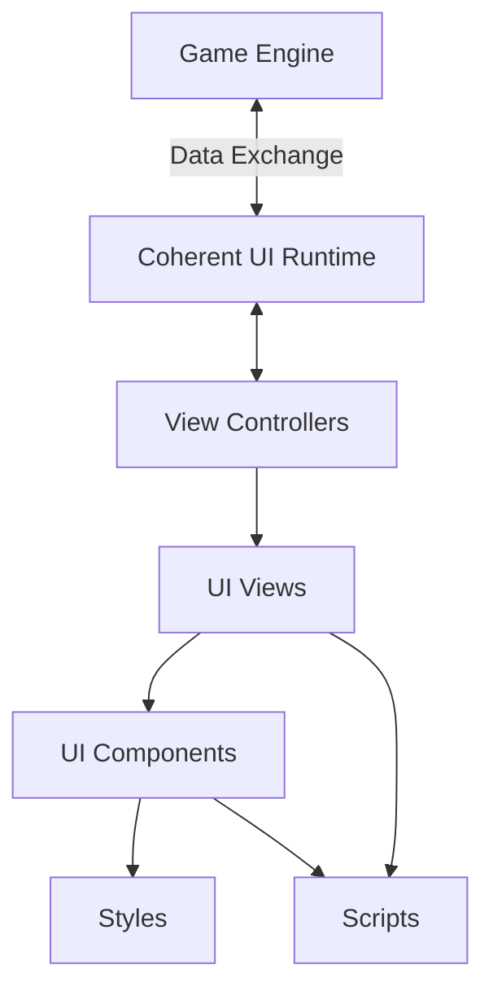
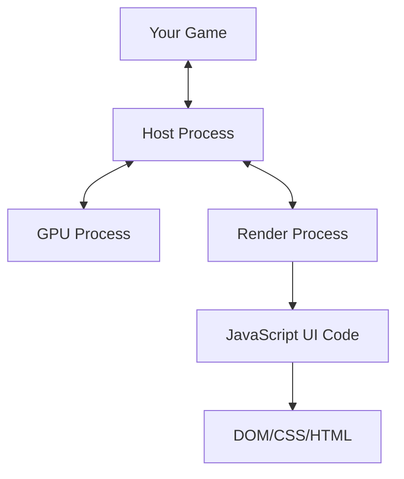

# UI Modding in Civilization VII

This guide explains how to modify the Civilization VII user interface using Coherent UI, a powerful middleware that allows for modern web technologies to be used in game UI development.

## Table of Contents
- [Introduction to Coherent UI](#introduction-to-coherent-ui)
- [UI Architecture Overview](#ui-architecture-overview)
- [Basic UI Modding Workflow](#basic-ui-modding-workflow)
- [UI File Structure](#ui-file-structure)
- [Replacing UI Elements](#replacing-ui-elements)
- [Styling UI Elements](#styling-ui-elements)
- [Adding UI Functionality](#adding-ui-functionality)
- [Communication Between UI and Game](#communication-between-ui-and-game)
- [Common UI Modding Patterns](#common-ui-modding-patterns)
- [Debugging UI Mods](#debugging-ui-mods)
- [Advanced UI Techniques](#advanced-ui-techniques)
- [Examples](#examples)
- [Coherent UI Architecture](#coherent-ui-architecture)
- [Related Documentation](#related-documentation)

## Introduction to Coherent UI

Civilization VII uses Coherent UI for its user interface. Coherent UI allows game developers and modders to use web technologies (HTML, CSS, and JavaScript) to create and modify game interfaces.

### Key Features
- **Web Standards**: Uses HTML5, CSS3, and modern JavaScript
- **Performance**: Optimized for games with minimal overhead
- **Integration**: Easy communication between game and UI
- **Debugging**: Built-in developer tools

**Related Topic:** For more information on Coherent UI, see the [Coherent UI README](./coherent-ui-readme.md).

## UI Architecture Overview

The Civilization VII UI consists of:

1. **Views**: Individual UI screens/windows
2. **Components**: Reusable UI elements
3. **Styles**: Visual appearance definitions
4. **Scripts**: Behavior and functionality



> **See Also:** For information on how UI interacts with game data, see the [Database Modding Guide](./database-modding.md) for details on the underlying data structure.

## Basic UI Modding Workflow

1. **Identify the UI element** you want to modify
2. **Locate the original file** in the game's UI directory
3. **Create a copy** in your mod's UI directory
4. **Make your changes**
5. **Register the changes** in your `.modinfo` file
6. **Test** your modifications in-game

## UI File Structure

Typical UI mod structure:
```
YourMod/
├── ui/
│   ├── Panels/
│   │   └── CustomPanel.xml
│   ├── Views/
│   │   └── CustomView.xml
│   ├── Components/
│   │   └── CustomComponent.xml
│   ├── Styles/
│   │   └── CustomStyle.css
│   └── Scripts/
│       └── CustomLogic.js
└── YourMod.modinfo
```

> **Related Topic:** For more information on mod file organization, see the [Mod Structure Guide](./mod-structure.md).

## Replacing UI Elements

To replace a UI element, you need to:

1. Create the same file structure in your mod as in the original game
2. Add a `ReplaceUIScript` action in your `.modinfo` file:

```xml
<ReplaceUIScript id="unique-identifier">
	<File>ui/Panels/CustomPanel.xml</File>
</ReplaceUIScript>
```

### Example: Replacing a Panel

Original game panel:
```xml
<Panel>
	<Container ID="CityInfoPanel">
		<!-- Original content -->
	</Container>
</Panel>
```

Your modified panel:
```xml
<Panel>
	<Container ID="CityInfoPanel">
		<!-- Your modifications -->
		<Stack ID="ExtraInfoStack">
			<!-- Additional elements -->
		</Stack>
	</Container>
</Panel>
```

## Styling UI Elements

Civilization VII uses CSS for styling UI elements. To modify styles:

1. Create a CSS file in your mod's `ui/Styles/` directory
2. Register it in your `.modinfo` file:

```xml
<AddUIScript id="custom-styles">
	<File>ui/Styles/CustomStyle.css</File>
</AddUIScript>
```

### Example: Custom CSS

```css
.CityNameLabel {
	font-size: 24px;
	color: #FFD700;
	text-shadow: 1px 1px 2px rgba(0, 0, 0, 0.7);
}

.ResourceIcon {
	width: 32px;
	height: 32px;
	margin: 4px;
}
```

> **See Also:** For asset considerations when styling UI, check the [Asset Creation Guide](./asset-creation.md#ui-assets).

## Adding UI Functionality

To add new functionality to the UI:

1. Create a JavaScript file in your mod's `ui/Scripts/` directory
2. Register it in your `.modinfo` file:

```xml
<AddUIScript id="custom-script">
	<File>ui/Scripts/CustomLogic.js</File>
</AddUIScript>
```

### Example: Custom JavaScript

```javascript
(function() {
	// Add a click handler to a button
	UIEvents.on("CityViewButton", "click", function() {
		// Do something when the button is clicked
		GameEvents.SendMessage("OpenCityView");
	});
	
	// Listen for game events
	GameEvents.RegisterListener("CityProductionCompleted", function(data) {
		// Update UI when production is completed
		updateProductionQueue(data);
	});
	
	function updateProductionQueue(data) {
		// Update the production queue display
		const queueElement = document.getElementById("ProductionQueue");
		// Update logic here
	}
})();
```

## Communication Between UI and Game

Coherent UI provides several methods for UI-Game communication:

### Game to UI
```javascript
// In the game code (not directly accessible to modders)
UI.Call("functionName", parameter1, parameter2);

// In your JavaScript
window.functionName = function(param1, param2) {
	// Handle the call from the game
};
```

### UI to Game
```javascript
// In your JavaScript
GameEvents.SendMessage("EventName", { data: "value" });

// In the game code (not directly accessible to modders)
// The game has event handlers for these messages
```

> **Related Topic:** For advanced interaction with game systems, see the [Advanced Topics Guide](./advanced-topics.md#event-system-integration).

## Common UI Modding Patterns

### Adding New Information
```javascript
function enhanceUnitPanel() {
	const unitPanel = document.getElementById("UnitPanel");
	if (!unitPanel) return;
	
	const statsDiv = document.createElement("div");
	statsDiv.className = "UnitExtendedStats";
	statsDiv.innerHTML = `
		<span class="StatLabel">Combat Efficiency:</span>
		<span class="StatValue" id="CombatEfficiency">--</span>
	`;
	
	unitPanel.appendChild(statsDiv);
}
```

### Modifying Existing Information
```javascript
function improveResourceTooltip() {
	const tooltips = document.querySelectorAll(".ResourceTooltip");
	
	tooltips.forEach(tooltip => {
		// Add additional information
		const extraInfo = document.createElement("div");
		extraInfo.className = "ExtraTooltipInfo";
		extraInfo.textContent = "Click to see more details";
		tooltip.appendChild(extraInfo);
	});
}
```

### Creating New UI Elements
```javascript
function createCustomPanel() {
	// Create container
	const panel = document.createElement("div");
	panel.id = "CustomInfoPanel";
	panel.className = "InfoPanel";
	
	// Add content
	panel.innerHTML = `
		<div class="PanelHeader">
			<span class="Title">Custom Information</span>
			<button class="CloseButton">X</button>
		</div>
		<div class="PanelContent">
			<!-- Panel content -->
		</div>
	`;
	
	// Add to document
	document.body.appendChild(panel);
	
	// Add event handlers
	panel.querySelector(".CloseButton").addEventListener("click", function() {
		panel.style.display = "none";
	});
}
```

## Debugging UI Mods

Civilization VII includes a built-in UI debugger based on Chrome Developer Tools. To enable it:

1. Enable the in-game console (see the "HowToEnableIngameConsole" documentation)
2. Press F12 while in-game to open the developer tools
3. Use the Elements tab to inspect UI elements
4. Use the Console tab to run JavaScript and see errors
5. Use the Network tab to monitor communication

### Common Debugging Techniques

- Use `console.log()` to output debug information
- Add temporary styling to highlight elements
- Check for JavaScript errors in the console
- Use breakpoints to pause execution

> **See Also:** For troubleshooting UI-specific issues, refer to the [Troubleshooting Guide](./troubleshooting.md#ui-issues).

## Advanced UI Techniques

### UI Animation
```css
@keyframes pulse {
	0% { transform: scale(1); }
	50% { transform: scale(1.1); }
	100% { transform: scale(1); }
}

.PulsingButton {
	animation: pulse 2s infinite;
}
```

### Dynamic Content Loading
```javascript
async function loadDataForPanel() {
	// Fetch data from the game
	const data = await GameEvents.RequestData("GetCityData");
	
	// Update UI with the data
	const cityPanel = document.getElementById("CityPanel");
	if (!cityPanel) return;
	
	// Clear existing content
	cityPanel.innerHTML = "";
	
	// Add new content based on data
	data.forEach(city => {
		const cityElement = document.createElement("div");
		cityElement.className = "CityListItem";
		cityElement.textContent = city.name;
		cityPanel.appendChild(cityElement);
	});
}
```

### Custom Controls
```javascript
class CustomSlider {
	constructor(container, min, max, value, onChange) {
		this.container = container;
		this.min = min;
		this.max = max;
		this.value = value;
		this.onChange = onChange;
		
		this.render();
		this.attachEvents();
	}
	
	render() {
		this.container.innerHTML = `
			<div class="SliderTrack">
				<div class="SliderFill" style="width: ${this.getPercentage()}%"></div>
				<div class="SliderHandle" style="left: ${this.getPercentage()}%"></div>
			</div>
			<div class="SliderValue">${this.value}</div>
		`;
	}
	
	getPercentage() {
		return ((this.value - this.min) / (this.max - this.min)) * 100;
	}
	
	attachEvents() {
		// Implement slider interaction
	}
	
	setValue(value) {
		this.value = Math.max(this.min, Math.min(this.max, value));
		this.render();
		this.onChange(this.value);
	}
}
```

## Coherent UI Architecture

Civilization VII uses Coherent UI as its UI middleware solution. Understanding the architecture is essential for efficient UI modding.

### Multiprocess Architecture

Coherent UI in Civilization VII operates with a multiprocess architecture:

1. **Host Process**: Communicates between your game and other Coherent UI processes
2. **Render Process**: Handles view layout and JavaScript execution (one per view)
3. **GPU Process**: Manages drawing views on the GPU

This architecture provides isolation and stability - if one UI view crashes, it won't affect the rest of your game or other UI views.

### Thread Safety Considerations

Coherent UI is **not** thread-safe, except for specifically designated parts. When working with UI mods:

1. All view manipulations must happen on the same thread
2. Events must be triggered from the main thread
3. Rendering operations can be performed on a separate thread
4. Use thread-safe communication mechanisms between UI and render threads



### Asynchronous Design

Most operations in Coherent UI are asynchronous. Your code should:

1. Use callbacks for operations that need to wait for results
2. Avoid blocking the main thread with long-running operations
3. Handle UI updates through event listeners
4. Be prepared for operations to complete in a later frame

## Examples

### Example 1: Enhanced Unit Panel
This mod adds additional information to the unit panel.

**ui/Panels/UnitPanel.xml**:
```xml
<Panel>
	<Container ID="UnitPanelContainer">
		<!-- Original Content -->
		
		<!-- Added Content -->
		<Stack ID="UnitExtendedInfo">
			<Label ID="UnitExperienceLabel" String="Experience: {0}" />
			<Label ID="UnitKillsLabel" String="Kills: {0}" />
			<Label ID="UnitHealthLabel" String="Health: {0}/{1}" />
		</Stack>
	</Container>
</Panel>
```

**ui/Scripts/UnitPanel.js**:
```javascript
(function() {
	// Update extended info when unit is selected
	GameEvents.RegisterListener("UnitSelected", function(data) {
		updateExtendedInfo(data);
	});
	
	function updateExtendedInfo(unitData) {
		document.getElementById("UnitExperienceLabel").textContent = 
			`Experience: ${unitData.experience}`;
		document.getElementById("UnitKillsLabel").textContent = 
			`Kills: ${unitData.kills}`;
		document.getElementById("UnitHealthLabel").textContent = 
			`Health: ${unitData.currentHealth}/${unitData.maxHealth}`;
	}
})();
```

### Example 2: Custom Resource Tooltip
This mod enhances resource tooltips with additional information.

**ui/Components/ResourceTooltip.xml**:
```xml
<Container ID="ResourceTooltipContainer">
	<Stack Orientation="Vertical">
		<!-- Original Content -->
		
		<!-- New Content -->
		<Container ID="ExtendedResourceInfo">
			<Label ID="ResourceImprovement" String="LOC_RESOURCE_IMPROVEMENT" />
			<Label ID="ResourceYields" String="LOC_RESOURCE_YIELDS" />
			<Label ID="ResourceHistory" String="LOC_RESOURCE_HISTORY" />
		</Container>
	</Stack>
</Container>
```

**ui/Scripts/ResourceTooltip.js**:
```javascript
(function() {
	// Register for resource tooltip events
	UIEvents.on("ResourceIcon", "mouseover", function(event) {
		const resourceId = event.target.getAttribute("data-resource-id");
		if (resourceId) {
			loadResourceDetails(resourceId);
		}
	});
	
	async function loadResourceDetails(resourceId) {
		const data = await GameEvents.RequestData("GetResourceDetails", { resourceId });
		
		document.getElementById("ResourceImprovement").textContent = 
			`Improvement: ${data.improvementName}`;
		document.getElementById("ResourceYields").textContent = 
			`Yields: ${formatYields(data.yields)}`;
		document.getElementById("ResourceHistory").textContent = 
			`${data.flavorText}`;
	}
	
	function formatYields(yields) {
		return Object.entries(yields)
			.map(([type, amount]) => `${amount} ${type}`)
			.join(", ");
	}
})();
```

## Related Documentation

For more information on topics related to UI modding, refer to these guides:

- [Advanced Topics](./advanced-topics.md) - For event system integration and performance optimization
- [Troubleshooting](./troubleshooting.md#ui-issues) - For resolving common UI issues
- [Asset Creation](./asset-creation.md#ui-assets) - For creating UI-specific assets
- [Database Modding](./database-modding.md) - For understanding the data that UI displays
- [Mod Structure](./mod-structure.md) - For organizing UI files within your mod
- [Gameplay Modding](./gameplay-modding.md) - For connecting UI to gameplay features

## Additional Resources

- [CSS Styling Guide](./css-styling-guide.md) - Detailed guide on styling UI elements
- [UI Component Reference](./ui-component-reference.md) - Reference for built-in UI components
- [Coherent UI Documentation](./coherent-ui-readme.md) - Information on the UI framework
- [UI Enhancement Mod Template](./templates/ui-enhancement-mod/) - A ready-to-use template for UI modifications
- [UI Lens Mod Template](./templates/ui-lens-mod/) - A ready-to-use template for creating custom map lenses

## Conclusion

UI modding in Civilization VII allows for extensive customization of the game's interface. By leveraging the power of Coherent UI with HTML, CSS, and JavaScript, modders can create everything from simple visual tweaks to complex new interface systems.

### Additional Resources

- [Coherent UI Documentation](./coherent-ui-readme.md)
- [UI Component Reference](./ui-component-reference.md)
- [Game Event Reference](./game-event-reference.md)
- [CSS Styling Guide](./css-styling-guide.md)

---

*Remember to make backups of your work and test your mods thoroughly!*

*With UI modding, you can create a more personalized and efficient Civilization VII experience!* 